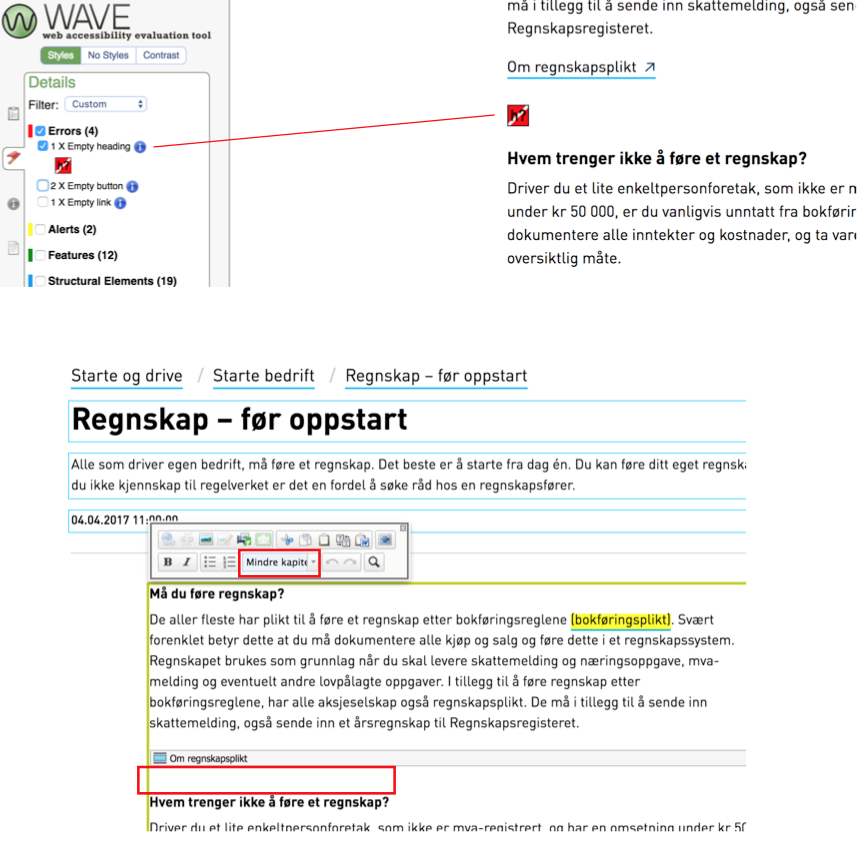

På Difis nettsider kan du sortere UU-krav etter [ansvarsområde innhold](https://uu.difi.no/krav-og-regelverk/wcag-20-standarden). Her får du en god oversikt på hva du må passe på når det kommer til tekst, bilder og video.

## Hjelpemiddel 
For å oppdage feil i innholdstrukturen kan det være nyttig å benytte “Wave” som er et utvidelsesverktøy til chrome.

[Last ned Wave til chrome](https://chrome.google.com/webstore/detail/wave-evaluation-tool/jbbplnpkjmmeebjpijfedlgcdilocofh), installer og ikonet vil dukke opp øverst til høyre i nettleseren.

I eksempelet under ser vi hjelp av Wave at det uheldigvis er blitt lagt inn en tom overskrift i episerver som egentlig ikke skulle vært der. For å fjerne den igjen må vi markere den tomme linjen i epi, og fjerne “Mindre kapittel Heading” som style.

