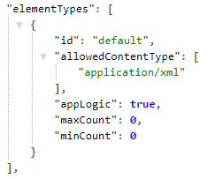

## Error when trying to deploy an app to any environment (AT21, AT23)
Introduced with issue: [#1158](https://github.com/Altinn/altinn-studio/issues/1158) which was implemented in relation with issue [#2757](https://github.com/Altinn/altinn-studio/issues/2757)

### Errors
When deploying your app to an environment (AT21, AT23) and you get an error box appearing from the "Deploy new version"-button with a 404 statuscode, it could mean that the server can't find the Authorization folder and policy.xml residing within.

### How to fix
Make sure the Gitea repository connected to the relevant app contains (on the root level) a folder named Authorization and the folder contains a file named policy.xml.

If there is no folder named Authorization, add the folder and within the folder, add policy.xml. Inside the policy.xml file, you need to change {org} to the relevant organisation and {app} to the relevant application name.

Here is the [policy.xml](policy.xml).

If you have a folder named Authorization but there is no policy.xml file within it, add the file with the procedure described above.

## Breaking change: data element validation returns an internal server error to app frontend

Introduced with issue: [#2457](https://github.com/Altinn/altinn-studio/issues/2457)

Old apps created in Altinn Studio had no connection between the current process task and the date element it was allowed to change data on.
This caused a `System.NullReferenceException` error in the  AltinnCore.Runtime.RestControllers.ValidateController.ValidateData endpoint when running validtions against the data element.

### How to fix
Log onto the altinn.studio and access the application metadata file: https://altinn.studio/repos/{org}/{app}/src/branch/master/Metadata/applicationmetadata.json

In the `elementTypes` object, locate the object with the id `default`. This looks something like this:

```json
{
    "id":"default",
    "allowedContentType":["application/xml"],
    "appLogic":true,
    "maxCount":0,
    "minCount":0
}
```

This object should be extended with the following property `"task":"FormFilling_1",`. After this is added, the object should look like this

```json
{
    "id":"default",
    "allowedContentType":["application/xml"],
    "appLogic":true,
    "task": "FormFilling_1",
    "maxCount":0,
    "minCount":0
}
```

## Breaking change: Deploy fails with error "The current .NET SDK does not support targeting .NET Core 3.0"
Introduced with issue: [#2762](https://github.com/Altinn/altinn-studio/issues/2762)

When an application is deployed the latest Runtime image is copied from Azure Container Registery. As this image will be based
on ASP.NET Core 3.0 the application must also specify that it should run on the same version. For all applications created before 
21.10.2019 the specified version in .ASP.NET Core 2.2, and this must be changed.

### How to fix
Log onto altinn.studio and access the Dockerfile using this url: https://altinn.studio/repos/{org}/{app}/src/branch/master/Dockerfile
Edit line 9 from ```FROM microsoft/dotnet:2.2-aspnetcore-runtime AS final``` to ``` FROM mcr.microsoft.com/dotnet/core/aspnet:3.0-alpine AS final```

The complete dockerfile should now look like the example below.

```
#altinn-runtime with sdk
FROM altinntjenestercontainerregistry.azurecr.io/altinn-runtime:latest AS build
WORKDIR /AltinnService/
COPY AltinnService.csproj ./
COPY Implementation/* ./
COPY Model/*.cs ./
RUN dotnet publish -o publish/

FROM mcr.microsoft.com/dotnet/core/aspnet:3.0-alpine AS final
WORKDIR /app

#copy altinn-runtime app
COPY --from=build /app .

#copy service
WORKDIR /AltinnService/bin/
COPY --from=build /AltinnService/publish/AltinnService* ./
WORKDIR /AltinnService/
COPY . .
WORKDIR /app

#entrypoint
ENTRYPOINT ["dotnet", "AltinnCore.Runtime.dll"]
```

## Breaking change: Added parameter to identify form data in applicationMetadata file
Introduced with issue: [#2592](https://github.com/Altinn/altinn-studio/issues/2592)

When posting data to an instance the element type should be specified. default is currently used to identify form data, 
and in application metadata there is a boolean to indicate that elements of thios type are form data. 
This will cause POST requests to https://{{appOwner}}.apps.{{platformUrl}}/{{appOwner}}/{{appName}}/instances/{{instanceOwnerId}}/{{instanceId}}/data?elementType=default
to fail if application metadata has not been updated.

### How to fix
Set appLogic equal to true for element type with id 'default'.
Log onto altinn.studio and access the metadata file using this url: https://altinn.studio/repos/{org}/{app}/src/branch/master/Metadata/applicationmetadata.json
Edit the default element type in the metadata to match the example below


## Breaking change: Url for application repository is updated.
Introduced with issue: [#2029](https://github.com/Altinn/altinn-studio/issues/2029)

It is no longer possible to access repositories in Gitea through https://altinn.studio/{org}/{app}.
This is due to changes made in backend routing with release v2019.27, url to Gitea and the application repositories now requires a /repos.

### How to fix
To access your repository go to: https://altinn.studio/repos/{org}/{app}

## Error -The type or namespace name *
Introduced with issue: [#875](https://github.com/Altinn/altinn-studio/issues/875)

### Errors

When compiling C# files for a given service application the following errors occurs:

- ServiceImplementation.cs - The type or namespace name 'IPlatformServices' could not be found (are you missing a using directive or an assembly reference?)
- ServiceImplementation.cs - The type or namespace name 'IServiceImplementation' could not be found (are you missing a using directive or an assembly reference?)
- ServiceImplementation.cs - The type or namespace name 'RequestContext' could not be found (are you missing a using directive or an assembly reference?)
- ServiceImplementation.cs - The type or namespace name 'ServiceContext' could not be found (are you missing a using directive or an assembly reference?)
- ServiceImplementation.cs - The type or namespace name 'StartServiceModel' could not be found (are you missing a using directive or an assembly reference?)
- ValidationHandler.cs - The type or namespace name 'RequestContext' could not be found (are you missing a using directive or an assembly reference?)

### How to fix

Make the following updates to the application repo (https://altinn.studio/{org}/{app}):

- /AltinnService.csproj (update to latest nuget package)


- Implementation/ServiceImplementation.cs


- Implementation/Validation/ValidationHandler.cs


## Error - 'ServiceImplementation' does not implement interface member *
Introduced with issue: [#142](https://github.com/Altinn/altinn-studio/issues/142) and [#875](https://github.com/Altinn/altinn-studio/issues/875).

### Errors

When compiling C# files for a given app the following errors occurs:

- ServiceImplementation.cs - Error - 'ServiceImplementation' does not implement interface member 'IServiceImplementation.SetContext(RequestContext, ServiceContext, StartServiceModel, ModelStateDictionary)'
- ServiceImplementation.cs - Error - 'ServiceImplementation' does not implement interface member 'IServiceImplementation.SetContext(RequestContext)'

### How to fix

Make the following updates to the application repo (https://altinn.studio/{org}/{app}):

- /AltinnService.csproj (update to latest nuget package)


- Implementation/ServiceImplementation.cs


## Breaking change: Change storage format of form layout

After we have rewritten the runtime react application, we will also introduce a new format the layout is saved as.
This change will be pushed in the transition between May and June 2019.

### How to fix

If you don't want to end up with a empty layout un the UI-editor, send a <a href="mailto:extmgm@brreg.no">mail</a> with the name of the organization and the repo-name.
And an admin will convert your formLayout.json to the new format.

## Cannot deserialize the current JSON object
Introduced with [issue #991](https://github.com/Altinn/altinn-studio/issues/142).

Cannot deserialize the current JSON object (e.g. {"name":"value"}) into type 'System.Collections.Generic.List'1[AltinnCore.Common.Models.Data]'
because the type requires a JSON array (e.g. [1,2,3]) to deserialize correctly....

### Errors

Error when trying to test app:


- ServiceImplementation.cs - Error - 'ServiceImplementation' does not implement interface member 'IServiceImplementation.SetContext(RequestContext, ServiceContext, StartServiceModel, ModelStateDictionary)'
- ServiceImplementation.cs - Error - 'ServiceImplementation' does not implement interface member 'IServiceImplementation.SetContext(RequestContext)'

### How to fix

Make the following updates to the application repo (https://altinn.studio/{org}/{app}):

- Delete all files under the 'Testdataforparty', this has to be done by deleting one by one file:


- or you can clone your app by using git clone, then remove the files from the clone folder, git add to specify which files to check in, git commit -m to commit and git push to push changes to master (git clone urlToApp):


- if help is needed send a <a href="mailto:extsbu@brreg.no">mail</a> with the name of the organisation and the repo-name.

## Error when trying to open an archived instance in message box
Introduced with issue: [#1771](https://github.com/Altinn/altinn-studio/issues/1771).

### Errors
When opening an archived instance instanciated before the 24.06.2019, the following error message is prompted:


### How to fix
There is no fix for this breaking change. New instances of the app must be instanciated. 
