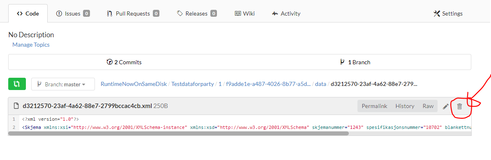
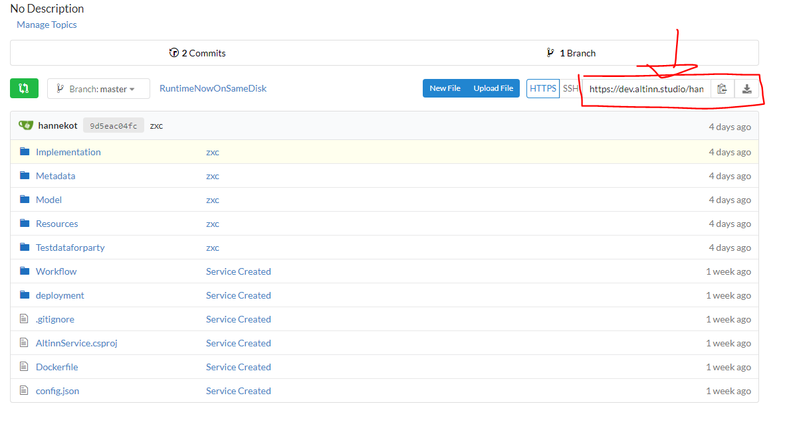

## Breaking change: Url for application repository is updated.
Introduced with issue: [#2029](https://github.com/Altinn/altinn-studio/issues/2029)

It is no longer possible to access repositories in Gitea through http://altinn.studio/{organizationShortName}/{appName}.
This is due to changes made in backend routing with release v2019.27, url to Gitea and the application repositories now requires a /repos.

### How to fix
To access your repository go to: http://altinn.studio/repos/{org}/app

## Error -The type or namespace name *
Introduced with issue: [#875](https://github.com/Altinn/altinn-studio/issues/875)

### Errors

When compiling C# files for a given service application the following errors occurs:

- ServiceImplementation.cs - The type or namespace name 'IPlatformServices' could not be found (are you missing a using directive or an assembly reference?)
- ServiceImplementation.cs - The type or namespace name 'IServiceImplementation' could not be found (are you missing a using directive or an assembly reference?)
- ServiceImplementation.cs - The type or namespace name 'RequestContext' could not be found (are you missing a using directive or an assembly reference?)
- ServiceImplementation.cs - The type or namespace name 'ServiceContext' could not be found (are you missing a using directive or an assembly reference?)
- ServiceImplementation.cs - The type or namespace name 'StartServiceModel' could not be found (are you missing a using directive or an assembly reference?)
- ValidationHandler.cs - The type or namespace name 'RequestContext' could not be found (are you missing a using directive or an assembly reference?)

### How to fix

Make the following updates to the application repo (https://altinn.studio/{organizationShortName}/{appName}):

- /AltinnService.csproj (update to latest nuget package)

- Implementation/ServiceImplementation.cs

- Implementation/Validation/ValidationHandler.cs

## Error - 'ServiceImplementation' does not implement interface member *
Introduced with issue: [#142](https://github.com/Altinn/altinn-studio/issues/142) and [#875](https://github.com/Altinn/altinn-studio/issues/875).

### Errors

When compiling C# files for a given app the following errors occurs:

- ServiceImplementation.cs - Error - 'ServiceImplementation' does not implement interface member 'IServiceImplementation.SetContext(RequestContext, ServiceContext, StartServiceModel, ModelStateDictionary)'
- ServiceImplementation.cs - Error - 'ServiceImplementation' does not implement interface member 'IServiceImplementation.SetContext(RequestContext)'

### How to fix

Make the following updates to the application repo (https://altinn.studio/{organizationShortName}/{appName}):

- /AltinnService.csproj (update to latest nuget package)

- Implementation/ServiceImplementation.cs

## Breaking change: Change storage format of form layout

After we have rewritten the runtime react application, we will also introduce a new format the layout is saved as.
This change will be pushed in the transition between May and June 2019.

### How to fix

If you don't want to end up with a empty layout un the UI-editor, send a <a href="mailto:extmgm@brreg.no">mail</a> with the name of the organization and the repo-name.
And an admin will convert your formLayout.json to the new format.

## Cannot deserialize the current JSON object
Introduced with [issue #991](https://github.com/Altinn/altinn-studio/issues/142).

Cannot deserialize the current JSON object (e.g. {"name":"value"}) into type 'System.Collections.Generic.List'1[AltinnCore.Common.Models.Data]'
because the type requires a JSON array (e.g. [1,2,3]) to deserialize correctly....

### Errors

Error when trying to test app:

- ServiceImplementation.cs - Error - 'ServiceImplementation' does not implement interface member 'IServiceImplementation.SetContext(RequestContext, ServiceContext, StartServiceModel, ModelStateDictionary)'
- ServiceImplementation.cs - Error - 'ServiceImplementation' does not implement interface member 'IServiceImplementation.SetContext(RequestContext)'

### How to fix

Make the following updates to the application repo (https://altinn.studio/{organizationShortName}/{appName}):

- Delete all files under the 'Testdataforparty', this has to be done by deleting one by one file:

- or you can clone your app by using git clone, then remove the files from the clone folder, git add to specify which files to check in, git commit -m to commit and git push to push changes to master (git clone urlToService):

- if help is needed send a <a href="mailto:extsbu@brreg.no">mail</a> with the name of the organization and the repo-name.

## Error when trying to open an archived instance in message box
Introduced with issue: [#1771](https://github.com/Altinn/altinn-studio/issues/1771).

### Errors
When opening an archived instance instanciated before the 24.06.2019, the following error message is prompted:

### How to fix
There is no fix for this breaking change. New instances of the app must be instanciated. 