Notifications are categorized into five types based on address lookup:
1. **Notification to provided email or mobile number**
2. **Standalone notification to national identity number**
3. **Standalone notification to organization number**
4. **Notification associated with a resource to national identity number**
5. **Notification associated with a resource to organization number**

## 1. Notification to provided email or mobile number

For notifications sent to a specified email address or mobile number:
- The service owner is responsible for providing accurate and verified recipient contact details.
- Notifications will be delivered to the specified contact points only if the details are successfully validated during the notification order process.

### Data Integrity
The service owner is fully responsible for ensuring that all recipient contact information submitted to Altinn Notifications is accurate, complete, and up-to-date.

## 2. Standalone notification to national identity number

A notification sent to a national identity number without any associated resource is referred to as a standalone notification.

Altinn Notifications utilizes the **Contact and Reservation Register (KRR)** to obtain the recipient's contact details.
If valid contact information is available, the system will identify an email address and/or mobile number based on the chosen notification channel.

If the provided national identity number is incorrect or cannot be matched:
- The notification will not be sent.
- The failure will be logged with an error status, such as "recipient not identified" or "missing contact details."

### Process Details

{}
**Reservation against electronic communication**  
End users can opt out of electronic communication through the Contact and Reservation Register (KRR).
In such cases, their contact details will not be used unless the service owner explicitly overrides the reservation.
This override is only permissible if the nature of the notification justifies it.

When an end user has opted out and the service owner does not override the reservation, no contact details will be exposed or used.
Instead, the lookup result will indicate the reservation status and display only the user's national identity number.

Service owners must evaluate whether overriding the reservation is appropriate and consistent with the notification's purpose.
{}

### Populating KRR

End users can manage their contact details and communication preferences, 
including reservations against electronic communication,
by accessing [their profile on the KRR website](https://minprofil.kontaktregisteret.no/).

### Data Integrity

During registration in the Contact and Reservation Register (KRR),
basic validation ensures users provide valid mobile numbers and email addresses.
Additionally, users are prompted every 90 days during login through ID-porten to confirm or update their contact details.

Contact details that have not been confirmed or updated within the last 18 months will not be included in the lookup service.

## 3. Standalone notification to organization number

When notifications are sent to an organization number without any associated resource, it is referred to as a standalone notification.

Altinn uses the **Notification Addresses for Businesses** registry to identify the recipient's contact details.
This may include a list of email addresses and/or mobile numbers, depending on the chosen notification channel.

It is important to note that Altinn does not validate the accuracy of the contact details retrieved from this registry.
If the provided data is inaccurate or incomplete, the notification will not be sent and will instead fail with the status "invalid contact point."

### Process Details

### Populating Notification addresses for businesses
Organizations can manage their official contact details by logging into their organization's profile in the [Altinn portal](https://www.altinn.no).

Multiple email addresses and mobile numbers can be registered for an organization to ensure notifications are sent to the correct contact points.

### Data Integrity
Affiliates of the organization are responsible for keeping their contact information up-to-date to ensure notifications are received correctly.
Basic validation in the Altinn portal ensures that valid mobile numbers and email addresses are provided.
Additionally, contact points must be accepted by Brønnøysundregistrene before they are made available through the lookup service.

Affiliates are prompted every 90 days to confirm or update their contact information via the Altinn portal to maintain accurate and current details.

## 4. Notification associated with a resource to national identity number
In this scenario, Altinn does not look up additional recipients if the recipient is a person identified by 
national identity number. 
Therefore, only their KRR contact details are relevant to retrieve.

Please reference [Standalone notification to national identity number](#2-standalone-notification-to-national-identity-number)
for relevant details.

## 5. Notification associated with a resource to organization number
In this scenario, Altinn uses both the **Notification Addresses for Businesses** registry
and end users' **personal contact information for enterprises** to determine the addresses to notify.
However, before notifications are sent, the list of recipients is filtered based on the resource's authorization policy.
Only individuals authorized to access the resource will receive a notification.

Altinn checks authorization when the order is placed and again just before the notification is sent.
This ensures that all recipients are authorized at the time the notification is actually sent,
regardless of how much time has passed since the order was placed.

### Process details

### Populating data sources
__Notification addresses to apply in public administration__

Please revisit [the previous section covering populating Notification addresses for businesses](#populating-notification-addresses-for-businesses)

__Personal contact information for enterprises__

Users affiliated with an organization can register their personal contact details through
the organization’s profile on the Altinn portal. Each user can register one email address and one mobile number.

In addition to specifying contact information, the end user can opt to
receive notifications only for specific services and/or resources.

### Data Integrity

__Notification addresses to apply in public administration__

Please revisit [the previous section covering data integrity of notification addresses to apply in public administration](#data-integrity-2)

__Personal contact information for enterprises__

End users are free to input their preferred contact details, which are subject to basic validation.
Affiliates of the organization are prompted every 90 days to confirm or update their contact information through the Altinn Portal.