In relation to address lookup, we categorize notifications into five distinct types:
1. **Notification to provided email or mobile number**  
2. **Stand alone notification to national identity number**  
3. **Stand alone notification to organization number**  
4. **Notification associated with a resource to national identity number**  
5. **Notification associated with a resource to organization number**  

## 1. Notification to provided email or mobile number
For notifications sent to a provided email address or mobile number,
the service owner must identify and provide the recipient's contact details.
Notifications will be sent to the specified contact points,
provided they are successfully validated at the time the notification order is placed.

### Data Integrity
The service owner is responsible for ensuring the integrity of the data provided to Altinn Notifications.

## 2. Stand alone notification to national identity number
When a notification is sent to a national identity number without resource association, 
it is called a stand alone notification.
Altinn Notifications utilizes the **Contact and Reservation Register (KRR)** to identify the recipient's contact details. 
If contact points exist, this results in obtaining an email address and/or mobile number,
depending on the notification channel. 
However, if the national identity number provided is incorrect, 
the notification will not be sent and will instead fail with an error status, indicating "recipient not identified"
or "missing contact details".

### Process Details

{}
**A note on reservation from electronic communication**

End users can reserve themselves against electronic communication in KRR, 
but a service owner can choose to ignore this flag if the nature of the notification permits them to. 
In the case a user has reserved themselves and the service owner has not overridden this,
no contact details will ever be exposed to the end user. 
Rather, the lookup result will specify the national identity number of the reserved individual.
{}

### Populating KRR
End users can manage their contact details and communication preferences, 
including reservations against online communication,
by accessing [their profile on the KRR website](https://minprofil.kontaktregisteret.no/).

### Data Integrity

Basic validation during registration in KRR ensures that users provide a valid mobile number and email address.
In addition to this, the user is prompted during login in ID-porten every 90 days to confirm or update their contact details. 
Contact details that have not been confirmed or updated in the last 18 months are not provided through the lookup service.

## 3. Stand alone notification to organization number

When notifications sent to an organization number without resource association
it is called a stand alone notification. 
Altinn uses the registry of **Notification addresses to apply in public administration** to identify the
contact details of the recipient. 
This can include a list of email addresses and/or mobile numbers, depending on the notification channel. 
It is important to note that Altinn does not validate the accuracy of the details from this registry.
If the data is inaccurate or incomplete, the notification will not be sent and will instead fail with a 
status indicating "invalid contact point".

### Process Details

### Populating Notification addresses to apply in public administration
Organizations can manage their official contact details for public administration by logging into 
their organization’s profile in the [Altinn portal](https://www.altinn.no). 
It is possible to register multiple email addresses and mobile numbers for an organization. 

### Data Integrity
The affiliates of the organization must ensure the contact information is up-to-date to receive notifications appropriately. 
Basic validation in the Altinn portal ensures that users provide a valid mobile number and email address,
and the contact points bust be accepted by Brønnøysundregistrene before they are made available through the lookup service.

Affiliates of the organization are prompted every 90 days to confirm or update the contact information 
through the Altinn Portal.

## 4. Notification associated with a resource to national identity number
In this scenario, Altinn does not look up additional recipients if the recipient is a person identified by 
national identity number. 
Therefore, only their KRR contact details are relevant to retrieve.

Please reference [Stand alone notification to national identity number](#2-stand-alone-notification-to-national-identity-number)
for relevant details.

## 5. Notification associated with a resource to organization number
In this scenario, Altinn uses both the registry of  **Notification addresses to apply in public administration** 
and end users' **personal contact information for enterprises** to determine the addresses to notify. 
However, before notifications are sent, the list of recipients is filtered based on the authorization policy of the resource. 
Only individuals authorized to access the resource will receive a notification. 

Altinn checks authorization when the order is placed and again just before the notification is sent. 
Thus, one can trust that all recipients are authorized when the notification is actually sent, 
regardless of how much time has passed since the order was placed.

### Process details

### Populating data sources
__Notification addresses to apply in public administration__

Please revisit [the previous section covering populating Notification addresses to apply in public administration](#populating-notification-addresses-to-apply-in-public-administration)

__Personal contact information for enterprises__

Users affiliated with an organization can register their personal contact details through the organization’s profile on the Altinn portal. 
One email address and one mobile number can be registered per user.

In addition to specifying contact information the end user can opt to only receive notifications
regarding specific services and/or resources.

### Data Integrity

__Notification addresses to apply in public administration__

Please revisit [the previous section covering data integrity of notification addresses to apply in public administration](#data-integrity-2)

__Personal contact information for enterprises__

End user is free to input the contact details they wish and the input is subject to basic validation. 
Affiliates of the organization are prompted every 90 days to confirm or update the contact information 
through the Altinn Portal.