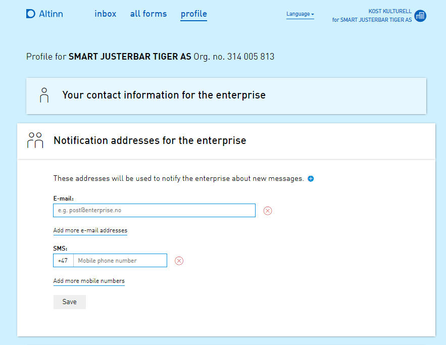

Varslinger er kategorisert i fem typer basert på adresseoppslag:
1. **Varsel til oppgitt e-post eller mobilnummer**
2. **Frittstående varsel til fødselsnummer**
3. **Frittstående varsel til organisasjonsnummer**
4. **Varsel knyttet til en ressurs til fødselsnummer**
5. **Varsel knyttet til en ressurs til organisasjonsnummer**

## 1. Varsel til oppgitt e-post eller mobilnummer

For varsler sendt til en spesifisert e-postadresse eller mobilnummer:
- Tjenesteeier er ansvarlig for å oppgi nøyaktige og verifiserte kontaktdetaljer for mottakeren.
- Varsler vil kun bli levert til de spesifiserte kontaktpunktene dersom detaljene blir validert under bestillingsprosessen.

### Dataintegritet
Tjenesteeier er fullt ut ansvarlig for å sikre at all kontaktinformasjon for mottakere som sendes til Altinn Varslinger er nøyaktig, komplett og oppdatert.

## 2. Frittstående varsel til fødselsnummer

Et varsel sendt til et fødselsnummer uten noen tilknyttet ressurs blir referert til som et frittstående varsel.

Altinn Varslinger benytter **Kontakt- og reservasjonsregisteret (KRR)** for å hente mottakerens kontaktdetaljer.
Hvis gyldig kontaktinformasjon er tilgjengelig, vil systemet identifisere en e-postadresse og/eller et mobilnummer basert på valgt varslingskanal.

Hvis det oppgitte fødselsnummeret er feil eller ikke kan matches:
- Varselet vil ikke bli sendt.
- Feilen vil bli logget med en feilstatus, som "mottaker ikke identifisert" eller "manglende kontaktdetaljer."

### Prosessdetaljer

{}
**Reservasjon mot elektronisk kommunikasjon**
Sluttbrukere kan reservere seg mot elektronisk kommunikasjon gjennom Kontakt- og reservasjonsregisteret (KRR).
I slike tilfeller vil ikke deres kontaktdetaljer bli brukt med mindre tjenesteeier eksplisitt overstyrer reservasjonen.
Denne overstyringen er kun tillatt dersom varslets art rettferdiggjør det.

Når en sluttbruker har reservert seg og tjenesteeier ikke overstyrer reservasjonen, vil ingen kontaktdetaljer bli eksponert eller brukt.
I stedet vil oppslagsresultatet indikere reservasjonsstatusen og kun vise brukerens fødselsnummer.

Tjenesteeiere må vurdere om overstyring av reservasjonen er hensiktsmessig og i tråd med varslets formål.
{}

### Fylle ut KRR

Sluttbrukere kan administrere sine kontaktdetaljer og kommunikasjonspreferanser,
inkludert reservasjoner mot elektronisk kommunikasjon,
ved å gå inn på [sin profil på KRR-nettstedet](https://minprofil.kontaktregisteret.no/).

### Dataintegritet

Under registrering i Kontakt- og reservasjonsregisteret (KRR),
sikrer grunnleggende validering at brukere oppgir gyldige mobilnumre og e-postadresser.
I tillegg blir brukere spurt hver 90. dag under innlogging via ID-porten om å bekrefte eller oppdatere sine kontaktdetaljer.

Kontaktdetaljer som ikke har blitt bekreftet eller oppdatert de siste 18 månedene, vil ikke bli inkludert i oppslagstjenesten.

## 3. Frittstående varsel til organisasjonsnummer

Når varsler sendes til et organisasjonsnummer uten noen tilknyttet ressurs, blir det referert til som et frittstående varsel.

Altinn bruker registeret **Varslingsadresser for virksomheter** for å identifisere mottakerens kontaktdetaljer.
Dette kan inkludere en liste over e-postadresser og/eller mobilnumre, avhengig av valgt varslingskanal.

Det er viktig å merke seg at Altinn ikke validerer nøyaktigheten av kontaktdetaljene som hentes fra dette registeret.
Hvis de oppgitte dataene er unøyaktige eller ufullstendige, vil ikke varselet bli sendt og vil i stedet feile med statusen "ugyldig kontaktpunkt."

### Prosessdetaljer

### Fylle ut Varslingsadresser for virksomheter
Virksomheter kan administrere sine offisielle kontaktdetaljer ved å logge inn på sin organisasjonsprofil i [Altinn-portalen](https://www.altinn.no).

Flere e-postadresser og mobilnumre kan registreres for en organisasjon for å sikre at varsler blir sendt til de riktige kontaktpunktene.

### Dataintegritet
Tilknyttede personer i organisasjonen er ansvarlige for å holde kontaktinformasjonen sin oppdatert for å sikre at varsler blir mottatt korrekt.
Grunnleggende validering i Altinn-portalen sikrer at gyldige mobilnumre og e-postadresser blir oppgitt.
I tillegg må kontaktpunkter godkjennes av Brønnøysundregistrene før de blir tilgjengelige gjennom oppslagstjenesten.

Tilknyttede personer blir spurt hver 90. dag om å bekrefte eller oppdatere sin kontaktinformasjon via Altinn-portalen for å opprettholde nøyaktige og oppdaterte detaljer.

## 4. Varsel knyttet til en ressurs til fødselsnummer
I dette scenarioet slår ikke Altinn opp flere mottakere hvis mottakeren er en person identifisert med
fødselsnummer.
Derfor er det kun deres KRR-kontaktdetaljer som er relevante å hente.

Vennligst se [Frittstående varsel til fødselsnummer](#2-frittstående-varsel-til-fødselsnummer)
for relevante detaljer.

## 5. Varsel knyttet til en ressurs til organisasjonsnummer
I dette scenarioet bruker Altinn både registeret **Varslingsadresser for virksomheter**
og sluttbrukeres **personlige kontaktinformasjon for virksomheter** for å bestemme adressene som skal varsles.
Før varsler sendes, blir imidlertid listen over mottakere filtrert basert på ressursens autorisasjonspolicy.
Kun personer som er autorisert til å få tilgang til ressursen, vil motta et varsel.

Altinn sjekker autorisasjon når bestillingen blir lagt inn og igjen rett før varselet sendes.
Dette sikrer at alle mottakere er autorisert på det tidspunktet varselet faktisk sendes,
uavhengig av hvor lang tid som har gått siden bestillingen ble lagt inn.

### Prosessdetaljer

### Fylle ut datakilder
__Varslingsadresser som skal brukes i offentlig forvaltning__

Vennligst se [forrige avsnitt som dekker utfylling av Varslingsadresser for virksomheter](#fylle-ut-varslingsadresser-for-virksomheter)

__Personlig kontaktinformasjon for virksomheter__

Brukere tilknyttet en organisasjon kan registrere sine personlige kontaktdetaljer gjennom
organisasjonens profil på Altinn-portalen. Hver bruker kan registrere én e-postadresse og ett mobilnummer.

I tillegg til å spesifisere kontaktinformasjon, kan sluttbrukeren velge å
motta varsler kun for spesifikke tjenester og/eller ressurser.

### Dataintegritet

__Varslingsadresser som skal brukes i offentlig forvaltning__

Vennligst se [forrige avsnitt som dekker dataintegritet for varslingsadresser som skal brukes i offentlig forvaltning](#dataintegritet-2)

__Personlig kontaktinformasjon for virksomheter__

Sluttbrukere kan fritt legge inn sine foretrukne kontaktdetaljer, som er underlagt grunnleggende validering.
Tilknyttede personer i organisasjonen blir spurt hver 90. dag om å bekrefte eller oppdatere sin kontaktinformasjon gjennom Altinn-portalen.