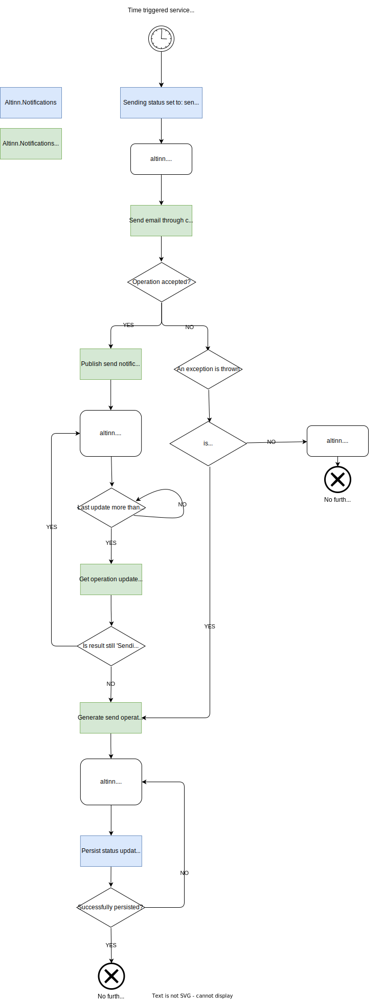
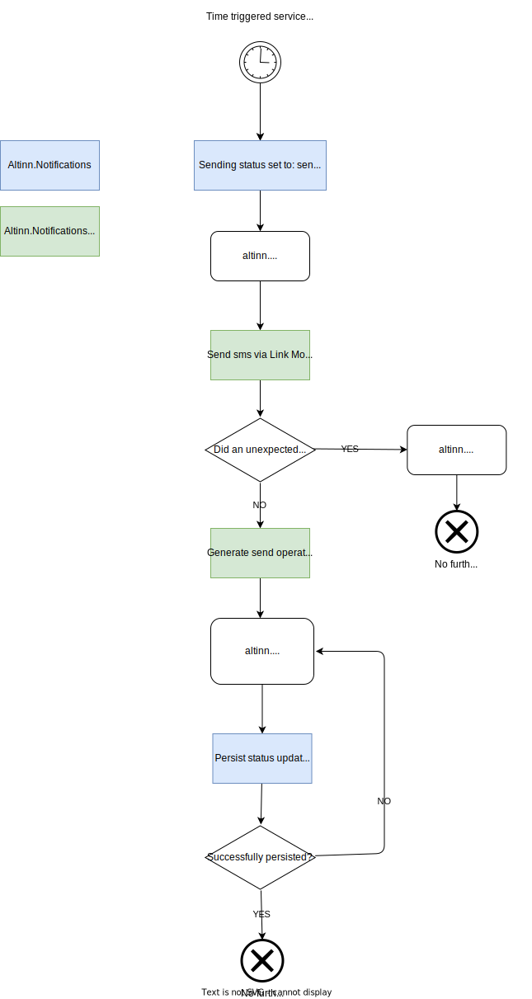

## System architecture illustration
The solution is supported by multiple cron jobs running in the same Kubernetes cluster, a Kafka server and an instance of 
[Azure Communication services](https://learn.microsoft.com/en-us/azure/communication-services/overview).

The following diagram illustrates the overall data flow.

## Process flow between microservices and Kafka topics

{}

{}

{}

{}

{}

{}

## System and service dependencies 
### Internal

- **Altinn Authorization**: used to authorize access to endpoints
- **Altinn Profile**: used to retrieve recipient information 
- **Altinn Register**: used to retrieve recipient information

{}
The number of internal dependencies for Notifications is currently quite limited, 
but during 2024 we expect the services below to be utilized by Notifications. 
- **Altinn Storage**: used to retrieve status for Altinn app instances to evaluate send conditions
{}

### External
- [**Azure Kubernetes Services**](https://azure.microsoft.com/en-us/products/kubernetes-service): hosts the docker containers for microservices and cron jobs 
  in a fully managed Kubernetes cluster
- [**Kafka on Confluent cloud**](https://www.confluent.io/): hosts the kafka cluster the microservices consumes and produces messages to. Say something about why we use kafka vs something else. E.g. storage queues
- [**PostgreSQL**](https://www.postgresql.org/): used for storage
- [**Azure Communication Services**](https://azure.microsoft.com/en-us/products/communication-services): used to send emails
- [**Azure Event Grid**](https://azure.microsoft.com/en-us/products/event-grid): used to subscribe to status updates for sent emails
- [**LINK Mobility**](https://www.linkmobility.com/) used to send sms
- [**Maskinporten**](https://www.digdir.no/felleslosninger/maskinporten/869) used to generate tokens for external REST API requests
