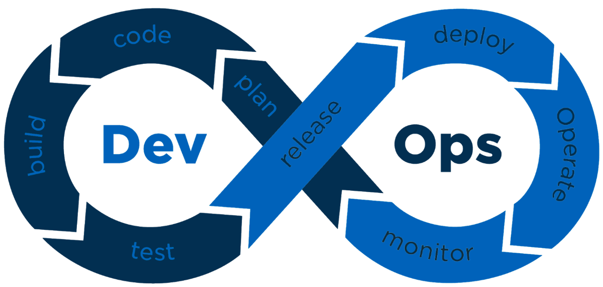

## Methodology

DigDir follows a secure development methodology for the development and operation of Altinn 3
where security is an important element in every phase of the process.
Each DevOps team has a Security Champion/Security Coordinator with special focus on security in the team.
The Security Coordinator also participates in the security group in the BOD department at DigDir where issues and areas are discussed.
The development process is continuously improved.

To be able to put the developers in focus, the use of security tools and automation is preferred where possible.
This includes integration with [security tools](/community/contributing/handbook/securecoding/) in the build and deploy processes where identified security flaws stop the processes.

Altinn has several important architecture principles that support security:

- Open source
  - Promotes openness and the possibility for service owners and others to quality-assure the source code
- Use known, modern, and popular frameworks and technologies
- Prefer standards rather than creating something themselves
- Isolation
- Prefer managed services (PaaS) over IaaS services
- Defense in depth

More information about the principles can be found at https://docs.altinn.studio/principles/

## Third-party vendors/Supply chains

Altinn 3 is based on open source code and uses several third-party libraries.
These libraries, in turn, use other libraries, which again use other libraries, and so on.
This creates long supply chains that are difficult to oversee and control.
There will also be different developers/teams/organizations behind the libraries.
Transfer of ownership of a library can also be transferred to a person/team with a completely different motivation than the original owner.
There have been examples where owners have withdrawn the library, which has led to downtime for many websites,
or new owners have introduced functionality with malicious intent.

Maintaining a manual overview of these libraries would be an insurmountable task.
Therefore, DigDir uses "Dependabot" and "Github Advanced Security" to monitor third-party libraries for updates and vulnerabilities.

{}
⚠ Service owners must monitor and update their use of third-party libraries for their apps themselves.
Altinn will consider the possibility of offering this functionality later.
{}

