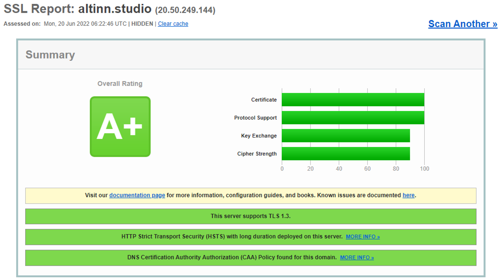
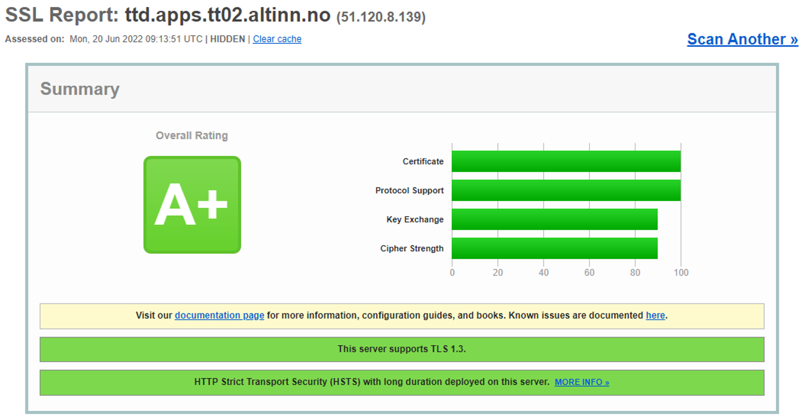

DigDir adheres to "NSM Cryptographic Recommendations" (National Security Authority, 2022). Data is encrypted at rest and in transit.

NSM's "Frequently Asked Questions about Cloud and Service Outsourcing" (National Security Authority, 2022)
discusses the use of encryption to protect against cloud providers.
DigDir relies on NSM's conclusion and has decided not to use security enclaves (SGX) or external HSM solutions during processing after evaluating complexity, solution, and risk.
Service owners must make a similar assessment.

For encryption at rest, Azure Storage Encryption and Azure Disk Encryption are used.
The encryption algorithm for these mechanisms is AES-256.
The encryption keys used are mainly managed by Microsoft/Azure due to the complexity and risk of managing encryption keys.

HTTP traffic is encrypted with TLS 1.2 (TLS 1.3 where available).
Qualys SSL Labs (Qualys, 2022) is a tool that checks and grades the SSL/TLS setup of websites.
Figures 3 and 4 show the results of altinn.studio and an Altinn.Apps cluster.

Known and production-ready libraries are used for encryption in the applications.
Altinn does not develop its own cryptographic algorithms/implementations.

