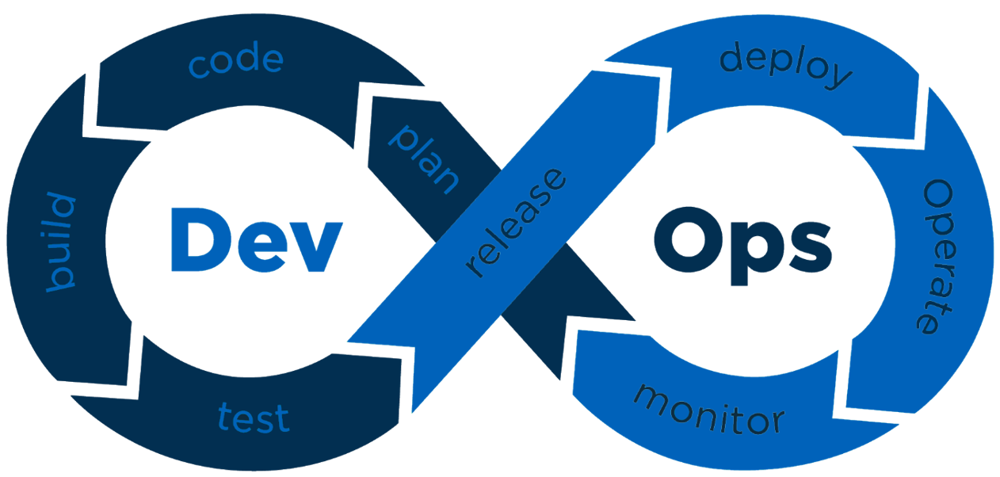

## Metodikk

Digdir følger sikker utviklingsmetodikk for utvikling og drift av Altinn 3, der sikkerhet er et viktig element i hver fase av prosessen.
Hvert DevOps-team har en Security Champion/Sikkerhetskoordinator med spesielt fokus for sikkerhet i teamet.
Sikkerhetskoordinatoren deltar også i faggruppen sikkerhet i avdelingen BOD i Digdir, der problemstillinger og områder diskuteres.
Utviklingsprosessen blir kontinuering forbedret.

For å kunne sette utviklerne i fokus foretrekkes bruk av sikkerhetsverktøy og automatisering der dette er mulig.
Dette er f.eks. integrasjon med [sikkerhetsverktøy](/community/contributing/handbook/securecoding/) i
bygge- og deployprosessene der identifiserte sikkerhetsfeil stopper prosessene.

Altinn har flere viktige arkitekturprinsipper som understøtter sikkerhet:

- Åpen kildekode
  - Fremmer åpenhet og mulighet for at tjenesteeiere og andre kan kvalitetssikre kildekoden
- Skal benytte kjente, moderne og populære rammeverk og teknologier
- Å foretrekke standarder enn å lage noe selv
- Isolasjon
- Å foretrekke administrerte tjenester (PaaS) fremfor IaaS-tjenester
- Sikkerhet i dybden

Mer informasjon om prinsippene finnes på https://docs.altinn.studio/principles/

## Tredjepartsleverandører og leverandørkjeder

Altinn 3 er basert på åpen kildekode og benytter flere tredjepartsbiblioteker og produkter.
Disse bibliotekene benytter andre biblioteker igjen, som igjen benytter andre biblioteker osv.
Dette gjør at man får lange leverandørkjeder som det er vanskelig å ha oversikt og kontroll på.
Det vil også være forskjellige utviklere/team/organisasjoner som står bak bibliotekene.
Overføring av eierskap til et bibliotek kan også overføres til en person/team med en helt annen motivasjon enn opprinnelig eier.
Det har vært eksempler der eiere har trukket tilbake biblioteket som har ført til nedetid hos mange nettsteder
eller nye eiere har innført funksjonalitet med ondsinnede hensikter. 

Å vedlikeholde en manuell oversikt over disse bibliotekene vil være en uoverkommelig oppgave.
Digdir benytter derfor «Dependabot» og annen [GitHub sikkerhetsfunksjonalitet](https://docs.github.com/en/code-security/getting-started/github-security-features)
for å overvåke tredjepartsbibliotekene for oppdateringer og sårbarheter,
i tillegg til at vi har egne rutiner for kontinuerlig patching og vurdering av avhengigheter.

{}
⚠ Tjenesteeiere må selv overvåke og oppdatere egen bruk av tredjepartsbiblioteker i sine egne apper.
{}
