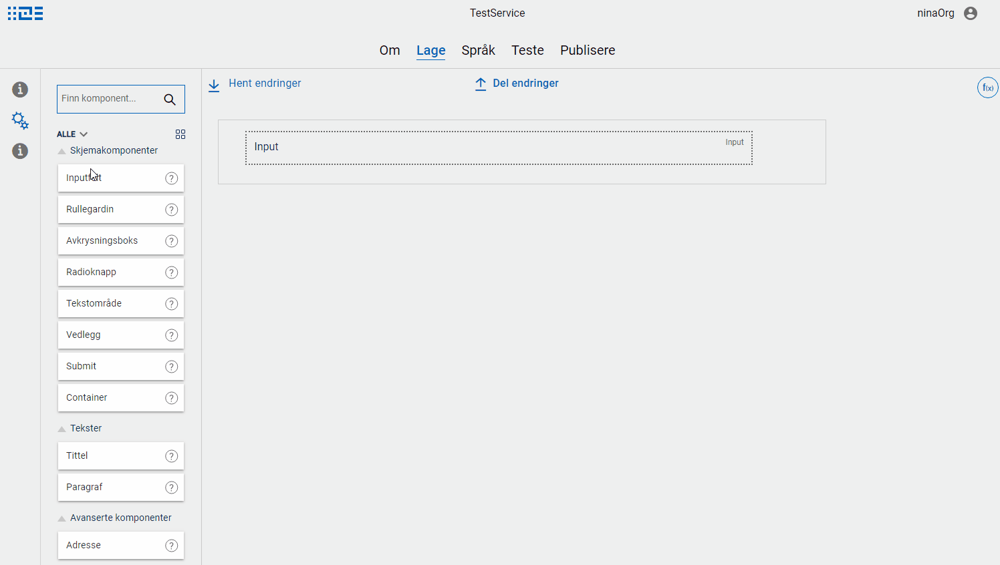

The possibility to effectly build a user friendly user interface for an app, is an essential feature for Altinn Studio.
This is one of the more complex functionalities developed as part of Altinn Studio. 

The UI-designer has the following functionality:

- Define a **detailed layout** (responsive design)
  - Add reusable [form components](#components)
    - Configure form components
      - Connection to **data model**
      - Connection to **texts/translations**
- Define/configure connections to **external API**
- Define/configure rules for [validation](#validation), [calculation](#calculation) and [dynamics](#dynamics)

See all issues related to Altinn Studio and UI-designer on [Github](https://github.com/Altinn/altinn-studio/labels/ui-editor)

## Form components

The form components are reusable components that are used to build the user interface of the service.
Examples include input fields and title components. See a list of all available form components [here](/ui-components/).

It is also possible to define custom components and use this in the service. 
