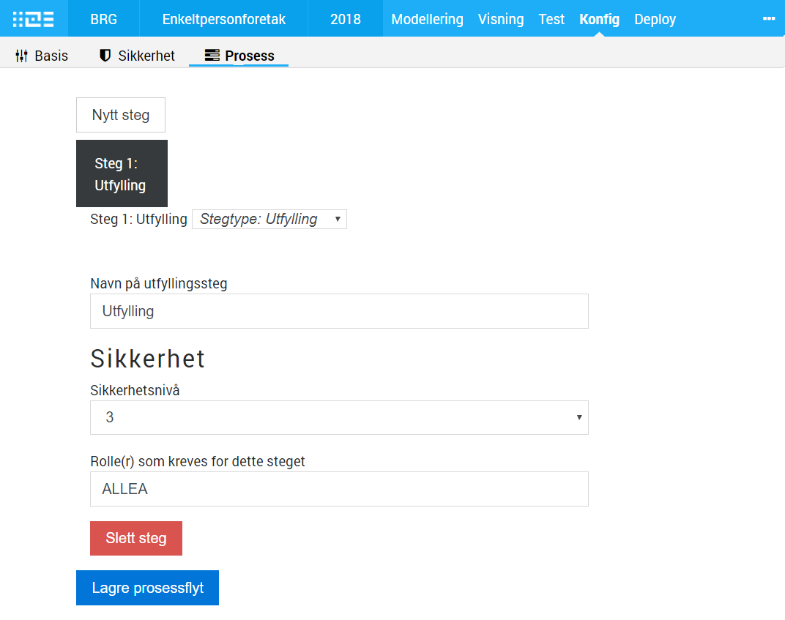

See all issues related to Altinn Studio and workflow on [Github](https://github.com/Altinn/altinn-studio/issues?q=is%3Aissue+is%3Aopen+label%3Aworkflow).

## Definere arbeidsflyt

Definere arbeidsflyt for en app. Må være **MYE** kraftigere og mer fleksibel enn det som finnes i dagens løsning.
Målsettingen er å muliggjøre at vi kan **fjerne** de ulike [tjenestetypene i dagens løsning](https://altinn.github.io/docs/tul/tjenestetyper/).

Tanken er at hvis man både kan gjøre henting av data (innsyn) og ta i mot meldinger, og gjøre en eller flere arkivering, så faller behovet for
tjenestetyper bort. Behovet for samhandlingstjenesten forsvinner også.

En annen veldig spennende tanke er at dette også åpner opp for å "koble sammen" dialogen for brukeren, siden det da per. def ikke er noe å koble sammen.
Hele dialogen er bare ulike steg i den samme appen, og siden man også kan legge til API'er på en 3.0-app, så åpner det opp
for at tjenesteeier modellerer flyten istedenfor at den må passe inn i et mønster som er bestemt av Altinn.

Stegene i en arbeidsflyt skal også være del av selve appen som deployes, og ikke kjøre i plattformen slik som i dag.
Dette åpner opp for stor grad av tilpasninger, gjør at hele flyten kan enhetstestes, og gjør at appen i større grad blir immun
mot påvirkning fra endringer i plattformen. En naturlig vei å gå vil være å benytte de samme mekanismene for å kunne gjenbruke og (re)definere
arbeidsflyt og UI per steg, som for UI for appene. Og da er vi veldig nærme det at arbeidsflyt ikke er noe eget, det er det samme som 
flyten internt i et skjema.

Eksempler på steg: 

- Signering
- Hente prefill, gjøre oppslag mot eksterne data
- Gjøre eksterne valideringer via API
- Motta melding via API
- Gjøre ekstern signering
- Egendefinerte steg, med UX

