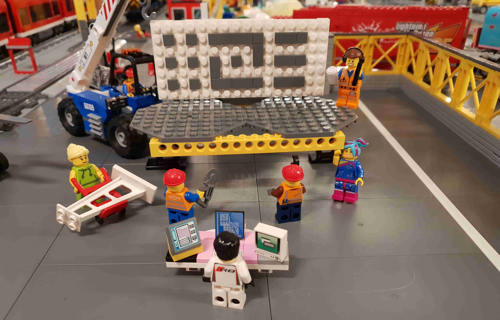

Altinn Studio is the next generation Altinn application development and hosting solution.
All you need for testing Studio is to [register an account](../app/getting-started/first-time-setup).

Altinn 3 have an open backlog on GitHub and the code is open source. Everybody can [create bugs], [request features] or [ask questions].

[Altinn Studio]: https://altinn.studio
[open backlog]: https://github.com/altinn/altinn-studio/issues/
[milestones]: https://github.com/altinn/altinn-studio/milestones?direction=asc&sort=due_date&state=open
[create bugs]: https://github.com/Altinn/altinn-studio/issues/new?template=bug_report.md
[request features]: https://github.com/Altinn/altinn-studio/issues/new?template=feature_request.md
[ask questions]: https://github.com/Altinn/altinn-studio/issues/new?template=question.md
[GitHub]: https://github.com/altinn/altinn-studio
[the code]: https://github.com/altinn/altinn-studio

