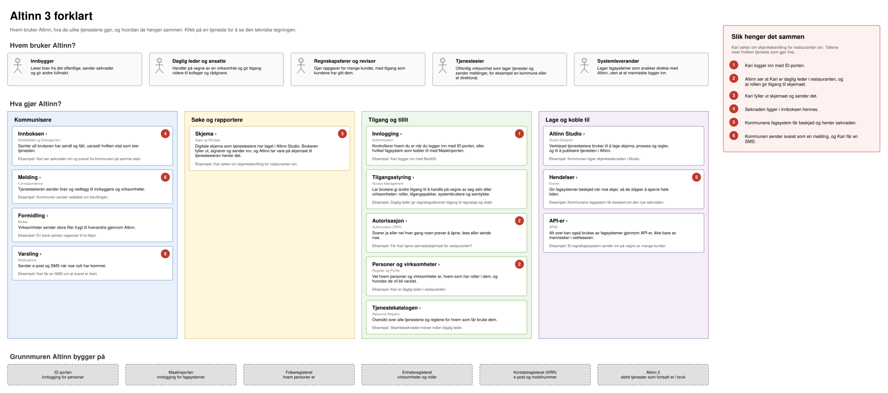

Tegningene på denne siden viser Altinn 3 på tre nivåer:

- [Altinn forklart](#altinn-forklart) er for deg som er ny. Den viser hvem som bruker Altinn, hva tjenestene gjør, og hvordan de henger sammen, uten tekniske detaljer.
- [Oversikten](#oversikt) viser én boks per applikasjon, gruppert per produkt.
- De detaljerte tegningene viser hvert produkt med delmoduler, lag og datalagre. Hver boks lenker til filen eller mappen den beskriver i kildekoden.

Klikk på en tegning for å åpne den i full størrelse i en ny fane. Lenkene i tegningen virker bare når den er åpnet på denne måten.

Et skript i dette repoet lager alle tegningene fra kildekoden på `main` i Altinn-repoene. Filene er draw.io-SVG-er og kan åpnes i [draw.io](https://app.diagrams.net/), men skriptet overskriver endringer du gjør for hånd neste gang noen kjører det. Se [README for skriptet](https://github.com/Altinn/altinn-studio-docs/blob/master/scripts/altinn-landscape/README.md) for hvordan du lager tegningene på nytt.

## Altinn forklart

Hvem bruker Altinn, hva gjør de ulike tjenestene, og hvordan henger de sammen? Tegningen følger Kari, som søker om skjenkebevilling for restauranten sin. Tallene i tegningen viser hvilken tjeneste som gjør hva underveis.

## Oversikt

Én boks per applikasjon med de viktigste modulene og datalagrene, gruppert per produkt. Brukerflatene ligger øverst, API Management i midten og eksterne fellesløsninger nederst. Klikk på en produktoverskrift i tegningen for å åpne den detaljerte tegningen for produktet.

## Autorisasjon

Access Management-frontenden, API Management, Access Management, Authorization, PEP-pakken, Ressursregisteret, Authentication og Register, med Folkeregisteret, Enhetsregisteret, SIRE og Altinn 2 som eksterne kilder.

## Dialogporten

Arbeidsflate (React-app og BFF), API Management, Dialogporten og adapteren som synkroniserer app-instanser fra Storage til dialoger.

## Apps

App-frontenden som lastes fra altinncdn.no, app-backend (app-lib, som nå ligger i altinn-studio-repoet), API Management og Storage.

## Events og Notifications

Events (API og Azure Functions), Notifications API og de to tjenestene som sender e-post og SMS, med Azure Communication Services og Link Mobility som eksterne leverandører.

## Melding og formidling

Correspondence (melding) og Broker (formidling), begge med Hangfire-jobber, egen bloblagring per tjenesteeier og virusskanning.

## Profile

Profile med brukerprofil, kontaktpunkter, varslingsadresser og adresseverifisering, med KRR og Brønnøysundregistrenes register for varslingsadresser som eksterne kilder.

## Altinn Studio

Studio Designer (frontend og backend), lastbalansereren, Gitea og AI-agentene, runtime-komponentene i klyngen til hver tjenesteeier, og verktøyene for lokal utvikling.

