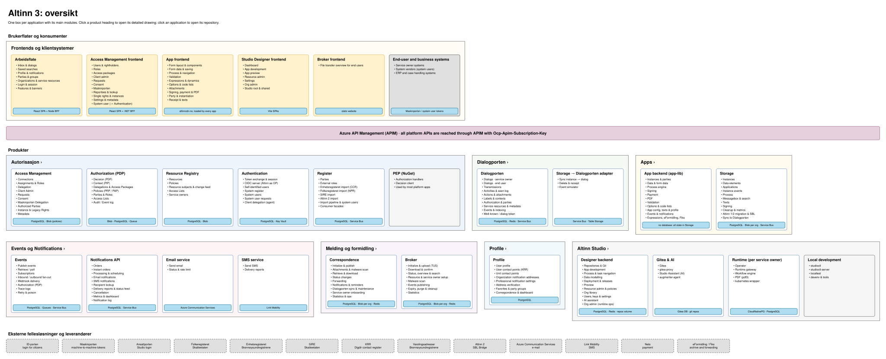
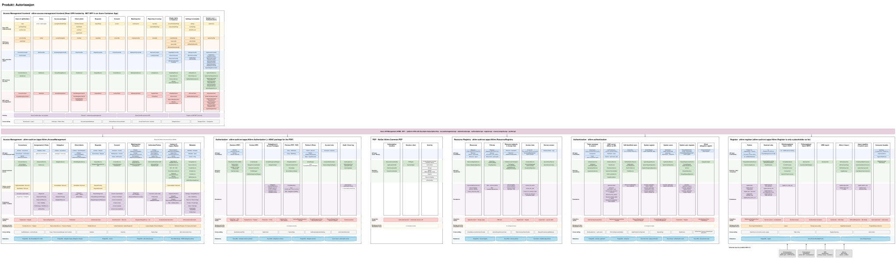
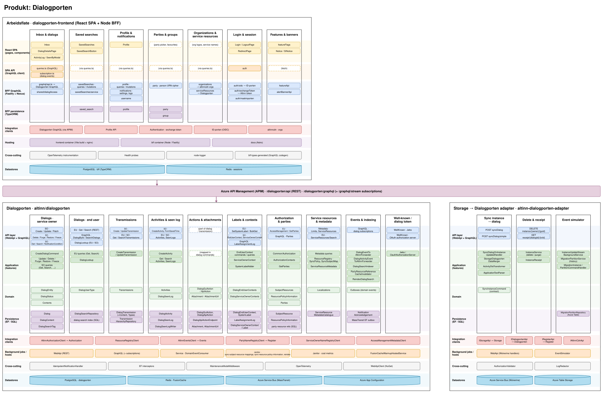
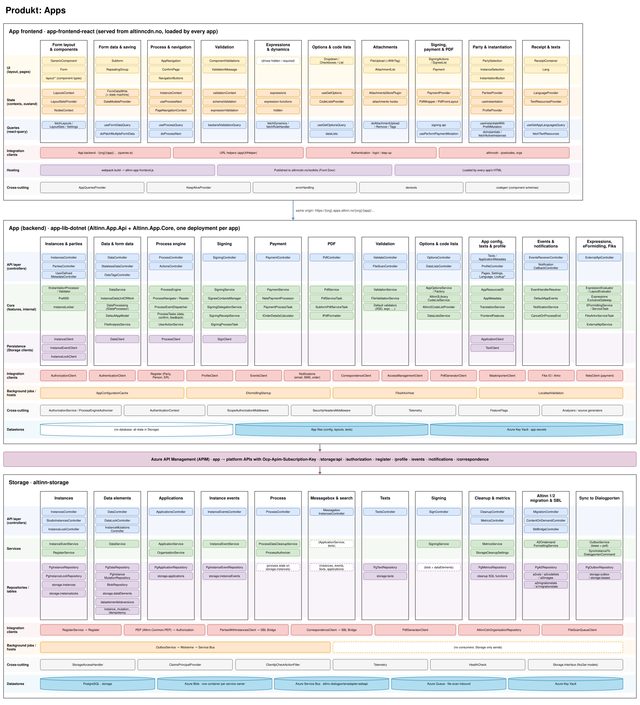
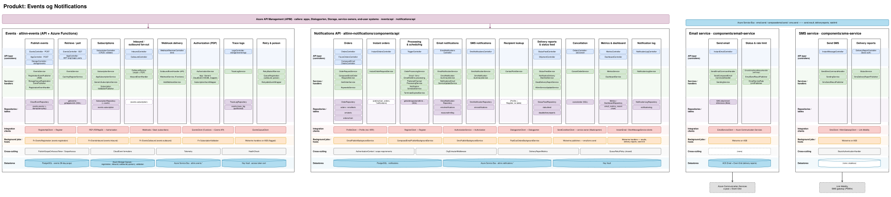
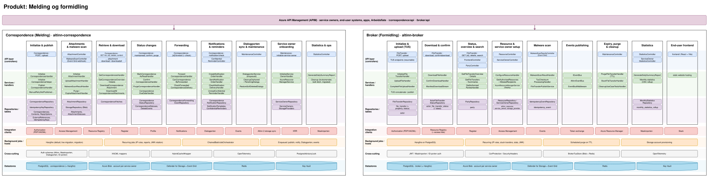
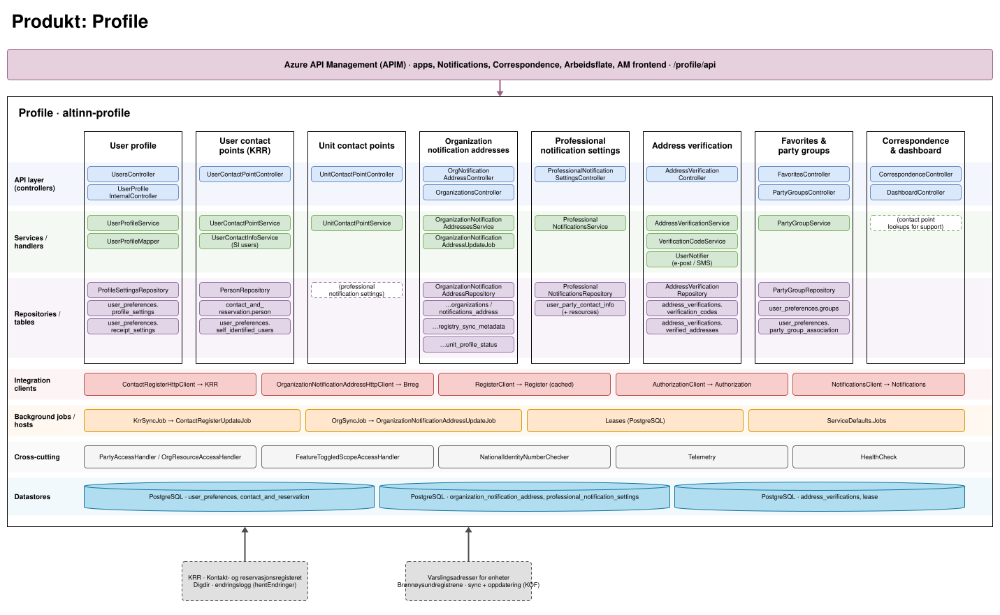
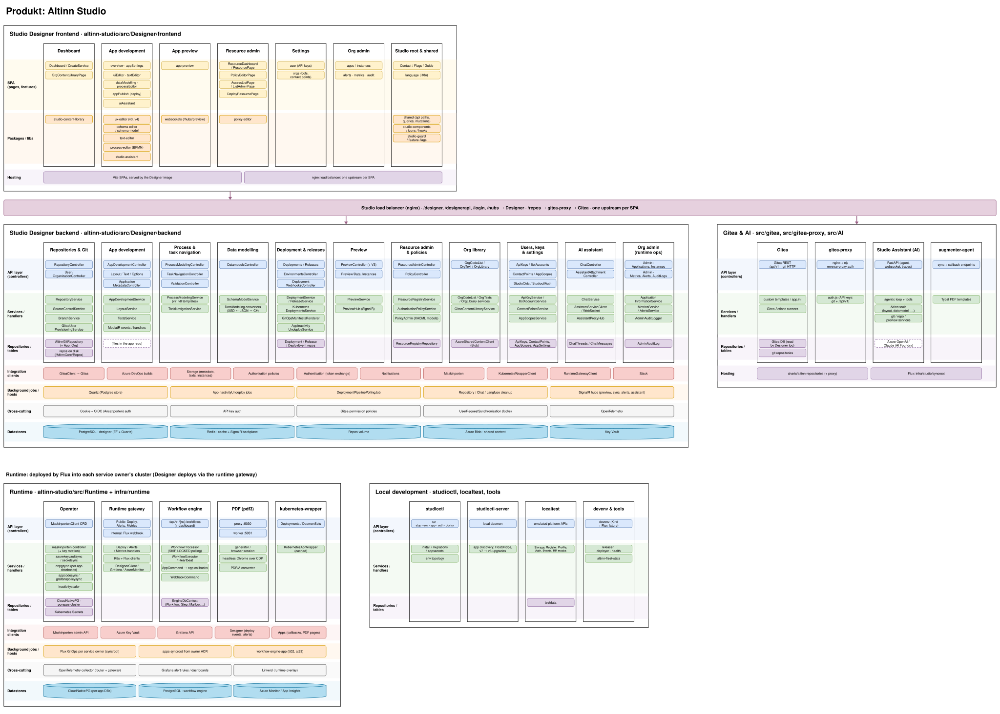

Tegningene på denne siden viser hvordan Altinn 3 er bygd, produkt for produkt. Hver ramme er én applikasjon eller tjeneste. Kolonnene er delmodulene, og radene er lagene fra API ned til lagring. Under kolonnene ligger felt for integrasjonsklienter, bakgrunnsjobber, tverrgående funksjoner og datalagre.

Tegningene er laget fra kildekoden på `main` i de aktuelle repoene. Hver boks lenker til filen eller mappen den beskriver.

Klikk på en tegning for å åpne den i full størrelse i en ny fane. Lenkene i tegningen virker bare når den er åpnet på denne måten.

Filene er draw.io-SVG-er og kan åpnes i [draw.io](https://app.diagrams.net/). Et skript i dette repoet lager tegningene fra kildekoden, så skriptet overskriver endringer du gjør for hånd neste gang noen kjører det. Se [README for skriptet](https://github.com/Altinn/altinn-studio-docs/blob/master/scripts/altinn-landscape/README.md) for hvordan du lager tegningene på nytt.

## Oversikt

Én boks per applikasjon med de viktigste modulene og datalagrene, gruppert per produkt. Brukerflatene ligger øverst, API Management i midten og eksterne fellesløsninger nederst. Klikk på en produktoverskrift i tegningen for å åpne den detaljerte tegningen for produktet.

## Autorisasjon

Access Management-frontenden, API Management, Access Management, Authorization, PEP-pakken, Ressursregisteret, Authentication og Register, med Folkeregisteret, Enhetsregisteret, SIRE og Altinn 2 som eksterne kilder.

## Dialogporten

Arbeidsflate (React-app og BFF), API Management, Dialogporten og adapteren som synkroniserer app-instanser fra Storage til dialoger.

## Apps

App-frontenden som lastes fra altinncdn.no, app-backend (app-lib, som nå ligger i altinn-studio-repoet), API Management og Storage.

## Events og Notifications

Events (API og Azure Functions), Notifications API og de to tjenestene som sender e-post og SMS, med Azure Communication Services og Link Mobility som eksterne leverandører.

## Melding og formidling

Correspondence (melding) og Broker (formidling), begge med Hangfire-jobber, egen bloblagring per tjenesteeier og virusskanning.

## Profile

Profile med brukerprofil, kontaktpunkter, varslingsadresser og adresseverifisering, med KRR og Brønnøysundregistrenes register for varslingsadresser som eksterne kilder.

## Altinn Studio

Studio Designer (frontend og backend), lastbalansereren, Gitea og AI-agentene, runtime-komponentene i klyngen til hver tjenesteeier, og verktøyene for lokal utvikling.

