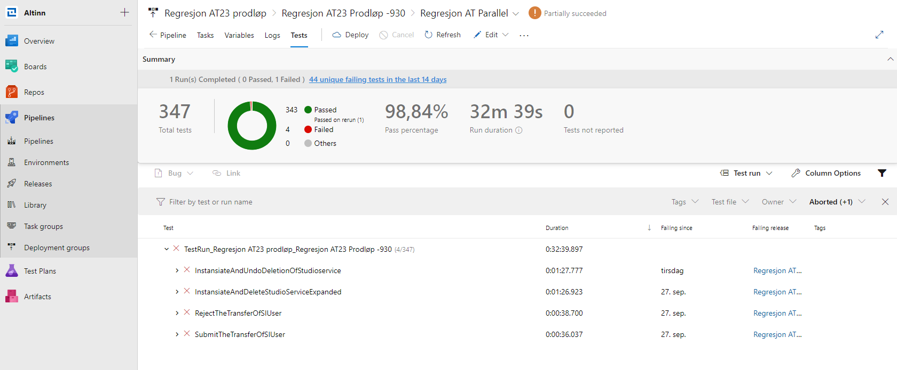

Below is a list of the capabilities with a short description and possible link to the different components providing that capability.

## Software Generation Capabilities

### Code & Config Writing Capability

Most of our code is written manually.

See [development application components](../../../components/application/nonsolutionspecific/development/)
to get an overview of our tools and applications.

### Software Defined Infrastructure Definition Enablement

We use Terraform to define infrastructure.

## Build & Integration Enablement Capabilities

### Software Compilation & Validation

The project uses .Net, Java, or Typescript compilers.

### Sofware Linking & Packaging

The project can build different software packages.

See development application components for details on how we do this.

### Build Orchestration

We use [Auzure Pipelines](https://azure.microsoft.com/en-us/services/devops/pipelines/) to build the source code for releases..

See [development application components](../../../components/application/nonsolutionspecific/development/) to get a overview over tools and application we use. 

### Continuous Integration Capabilities

Github Actions are used for Continuous Integration.

When a pull request is created a build is triggered that builds the code and run unit and integration tests.

This is setup for relevant GitHub repositories.

Examples

- [Altinn Resource Registry](https://github.com/Altinn/altinn-resource-registry/actions)
- [Altinn Events](https://github.com/Altinn/altinn-events/actions)

## Test Management Capabilities

### Test Case & Script Creation & Management

For Altinn 2 we have manual test scripts in TFS. 

For Altinn 3 there is no manual test scripts. 

- Test scripts are collected in [Github](https://github.com/Altinn/altinn-studio/tree/master/src/test).

### Test Execution Tracking & Reporting

For functionality, for Altinn 2 platform, the tracking is performed in TFS.

For automatic tests covering Altinn 3 functionality, this is tracked in Azure Pipelines.

### Test Data Creation & Management

- Test data for local testing and integration testing is kept in [Github](https://github.com/Altinn/altinn-studio).

## Test Execution & Automation Capabilities

### Functional Test

The DevOps team can perform automatic functional testing. Testing is done with the help of Cypress and runs from Azure DevOps pipelines.

### Unit Test

As part of the development, unit tests are created. The tests run for every pull request.

Sonarcloud verifies test coverage.

### Service & API Test

The teams use Postman for API testing.

### Performance Testing & Profiling


