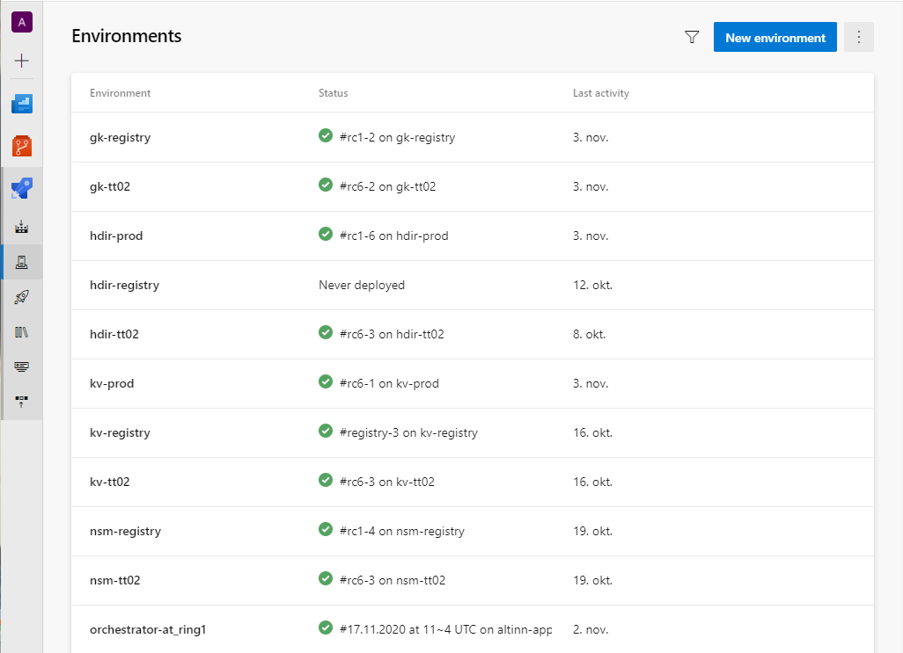
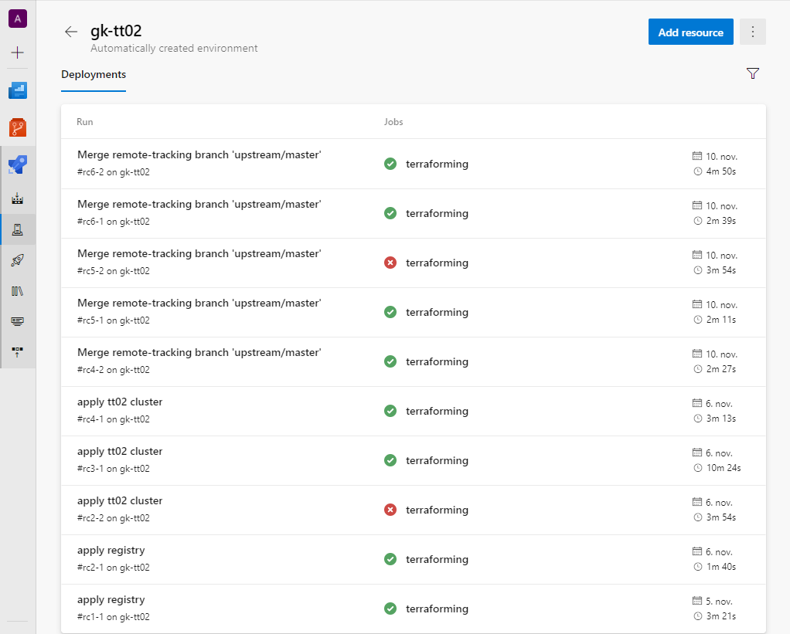

Over time it is expected that the Altinn 3 platform would consist of hundreds of Kubernetes clusters and other cloud resources.

To be able to manage and configure all these cloud resources the architecture that is selected has several capabilities enabled with help of various tools and processes.

## Infrastructure Configuration and management Capabilities

### Tools & components

For all solutions of Altinn 3 (Altinn Apps, Altinn Platform and Altinn Studio) we use some common tools to configure and manage infrastructure.

Currently all resources are located in [Microsoft Azure](https://azure.microsoft.com/).

We use [Terraform](https://www.terraform.io/) to define the [infrastructure as code](https://en.wikipedia.org/wiki/Infrastructure_as_code). Terraform allows to write declarative configuration files
defining the infrastructure we use in the different solutions.

Terraform follow the principle of "desired state". Configuration files describe to Terraform the components needed to run the different solutions in Altinn 3.

Terraform generates an execution plan describing what it will do to reach the desired state, and then executes it to build the described infrastructure.

As the configuration changes, Terraform is able to determine what changed and create incremental execution plans which can be applied.

This is crucial for the Altinn DevOps team to being able handle an infrastrucre at this scale.

We use the [Terraform Azure Provider](https://registry.terraform.io/providers/hashicorp/azurerm/latest) that allows lifecycle management of
Microsoft Azure using the Azure Resource Manager APIs. This is a provider maintained by the Azure team at Microsoft and the Terraform team at HashiCorp.

The resource ARM Apis are used to verify state of infrastucture and perform changes.

We use [Azure Devops Repos](https://azure.microsoft.com/services/devops/repos/) to store our Terraform scripts for the different solutions.
We use [Azure Devops Pipelines](https://azure.microsoft.com/services/devops/pipelines/) to run the Terraform scripts.

### Provision of new environments

#### Altinn Apps

Each org have their own Altinn Apps environment both for test and production. When a org sign up for using Altinn 3 the DevOps team
will provision a Altinn Apps environment for that organization.

- K8 Cluster with the defined set of nodes and node size
- Storage account for org used to store data from apps
- Container register for apps created in Altinn Studio
- KeyVault for secrets used by apps
- Network setup
- Kubernetes wrapper for monitoring status of the different applications in the apps cluster
- Traefik loadbalancer

#### Altinn Platform

Each Altinn 3 environment (production, performance test, test, acceptence test) has their own Altinn Platform solution.

This is based around a Kubernetes cluster and serveral components running in this.

The following cloud components is configured

- Kubernetes Cluster
- Network
- API managment
- Platform storage
- PostgresSQL server
- Cosmos DB
- Traefik loadbalancer

#### Altinn Studio

For altinn studio we currently have 3 environments. Staging, dev and production.

Each environments is set up with help of Terraform

### Updating environments

### Patching environments

Kured

## Running Terrafrom scripts

We run all Terraform scripts from [Azure DevOps Pipelines](https://docs.microsoft.com/en-us/azure/devops/pipelines/release/automate-terraform?view=azure-devops)

