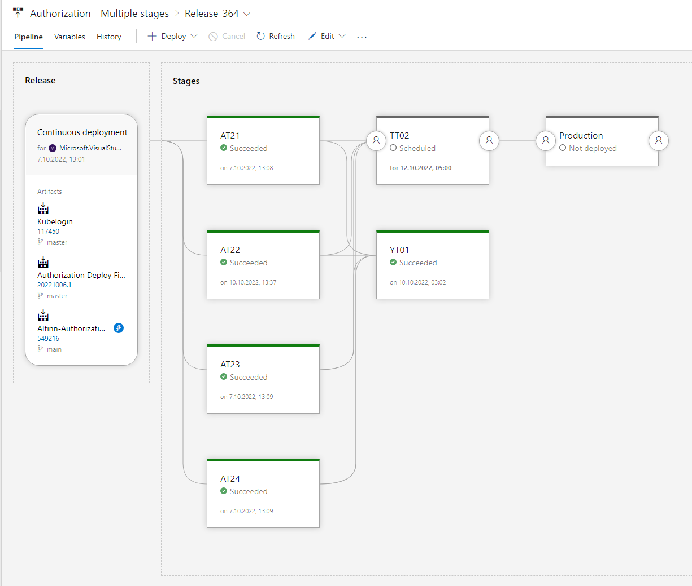
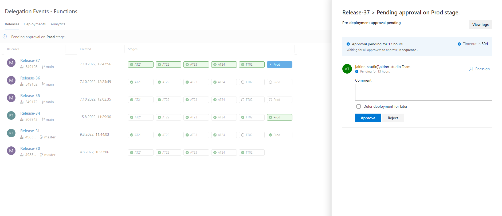

## Version, Release & Artefact Management Capabilities

### Version Management

Azure DevOps pipelines control the version of each component. Each build gets its version.
So the DevOps team can install an older component version at any time.
In addition, the published NuGet packages have different versions handled by NuGet.

### Software Configuration Management

We use value files in Azure DevOps for Helm Charts to control the different configurations for different environments. In addition, Azure Key vaults store configuration secrets.

### Release Management

Azure DevOps Release Pipelines control the different releases in different environments.

From the Release Pipeline Dashboard, the DevOps team can see releases. For example, in the below screenshot, you see info about release 364 of the Authorization component.

We also create releases in GitHub to map features with a given release deployed. There is no direct connection between the Azure DevOps release and the Github release.

### Continuous Del. Pipeline Management

The goal is to deliver continuously. For our AT environments, new code deploys automatically. For TT02 and production, there is currently a weekly deployment. Production deployment is on Tuesday, and TT02 is on Wednesday.

## Deployment Capabilities

### Deployment Orchestration Capabilities

Azure DevOps pipelines manage the orchestration of deploys. Both automatic deploys and deploys that require approvals by team members.

See [development application components](/technology/architecture/components/application/nonsolutionspecific/development/#deployment-orchestration) to get a overview over tools and application we use.


