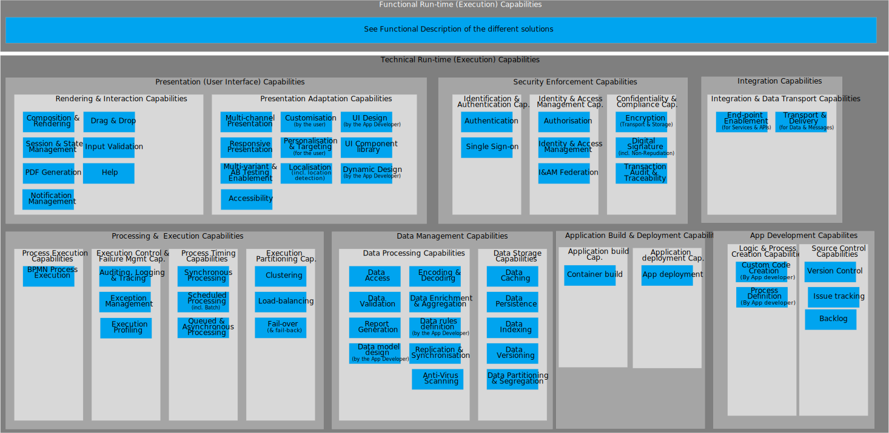

The Runtime (exceution) Architecture supports applications at run-time. 
It is a unified collection of run-time technology services, capabilities, control structures, and supporting infrastructure upon which application software runs.  

The below capability map shows the different runtime capabilities grouped by different areas. 

[Download as Visio](runtime_capabilities.vsdx)


