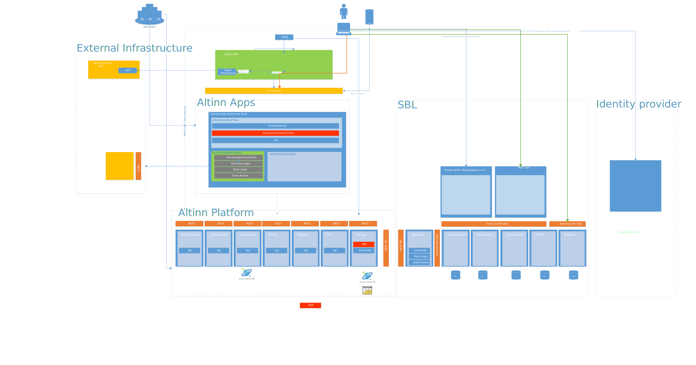

## Altinn Studio

### Developer authentication
The App Developer using Altinn Studio will authenticate with help of the build in account in Gitea. 

The designer part of Altinn Studio integrates with Gitea so it identifies the user logged in in Gitea. 

### Git repo authentication
When users tries to update the Git-repo where source files for the app is stored it needs to authenticate against the Git-repo.

This can be done through using a App Key generated in Gitea or using the username/password for the Gitea account. 

## Altinn Apps / Altinn Platform

In Altinn Platform and Altinn Apps there is deployed applications and components that need to be able to authenticate users and systems accessing them.

This is needed when resources requiring authentication and authorization is requested.

This will typical be API's that expose, or updates data owned by a specific party (person or organization).

## Overall Authentication architecture

There are several requirements to an authentication architecture for Altinn Apps / Altinn Platform. 
The most important is

- Needs to be supported by different types of [application frameworks](https://en.wikipedia.org/wiki/Application_framework)
- Needs to support end users accessing Altinn Apps / Altinn Platform through a web browser running the REACT application
- Needs to be safe against XSS attacks. 
- Needs to support scenarios where users are accessing through external systems or mobile apps
- Needs to support systems from org(s) that is authorized to perform application operations.
- Apps should not have access to secret so they can create their own token. 
- Needs to support passing the identity to api's that are consumed by Altinn Apps. 

Since Altinn Platform will in the future support applications created by different frameworks (Java/.NET/Node.js, ++) it is 
important that the authentication mechanisms are supported by different types of platforms.

[JSON Web Token](https://jwt.io/) are an open, industry standard [RFC 7519](https://tools.ietf.org/html/rfc7519) method for 
representing claims securely between two parties and are chosen as the bearer of information about users and systems.

The JWTToken is created in an asymmetric process where the Authentication component will use a private key from a 
certificate to sign the token, and the different apps and components that needs
to verify it will use the public key. See [JWT Format](jwt-format) for details on the algorithm used.

The illustration below show how JWT flows between the different parts of the solutions.

[Download as Visio](authentication_architecture.vsdx).

### End user using app frontend 
For end user accessing the app through browser that loads app frontend, the authentication mechanism is based on using a 
protected cookie containing a JWT Token. ( [HttpOnly](https://www.owasp.org/index.php/HttpOnly) and Secure)

The reason for putting the JWT token in the cookie for this scenarious is to protect 
against [XSS attacks](https://www.owasp.org/index.php/Cross-site_Scripting_(XSS)). 

If the REACT application stored the JWT token as part of browser memory (REDUX), XSS attacks could potential expose those tokens. 
When storing the tokens in secure cookies those tokens are not available to any [JavaScript](https://en.wikipedia.org/wiki/JavaScript) code running in the browser.

The cookie with the JWT token is created by Authentication component in the Altinn Platform solution. 

The React application would need to refresh the token at given interval or the token will expire. 
To refresh a cookie token, the token API in Platform needs to be called.

### Org systems accessing app and Platform APIs
Org (the entity owning the application) will have seperate API's in a spp to perform operations on.
They are authenticated with help of agency system id + password. A API in the authentication component
in Altinn creates a JWT token that can be used to authenticate the agency system when 
calling api's on apps running in Altinn Apps.

See [Authentication API](authentication-api) for details.

### End user systems accessing app APIs
This solutions is yet to be finalized. The assumption is that the either the organization that own
the system is authenticated and have a jwt token containing the organization number for that given 
organization or that the user using the system is authenticated and the systems send user token with request. 

This is analyzed in [#3291](https://github.com/Altinn/altinn-studio/issues/3291) and [#237](https://github.com/Altinn/altinn-studio/issues/237).

### Authentication of users in Altinn Apps against Altinn Platform
Applications hosted in a Altinn Apps solution would in many cases need to authenticate the end user against the different Altinn Platform components.

The solution for this is that the Apps would forward the JWT Token from the bearer token or JWT Cookie to the component that is called. This would
be forwarded as a bearer token in the Authorization header in the request against the component.

This makes it possible to configure JWTCookie authentication mechanismen to authenticate the end user also in the components.

#### Authentication of Altinn Studio against Altinn Platform
To make sure it is only allowed for a Altinn Studio environment to deploy and update applications the
calls from designer to platform is authenticated with a access token generated by Designer. 

See more details in [AccessToken](accesstoken).

### Authentication of Apps and components against Altinn Platform
Some components like Register and Profile is limited to be used only by the apps deployed to Altinn Apps or other components
in Altinn Platform

To be able to enforce this the platform components requires a Access Token identifying the app/component that is calling
the Platform component. Each org has their own certificate avaialble in their Kubernetes Cluster.

The apps deployed to this cluster has access to this certifcate and generates a JWT token with the needed claims. 
The platform components has access to the public part of the certificate and are able to validate it. 

See more details in [AccessToken](accesstoken).

