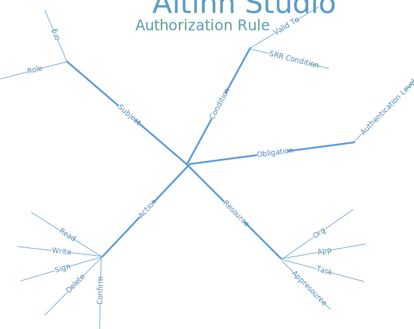
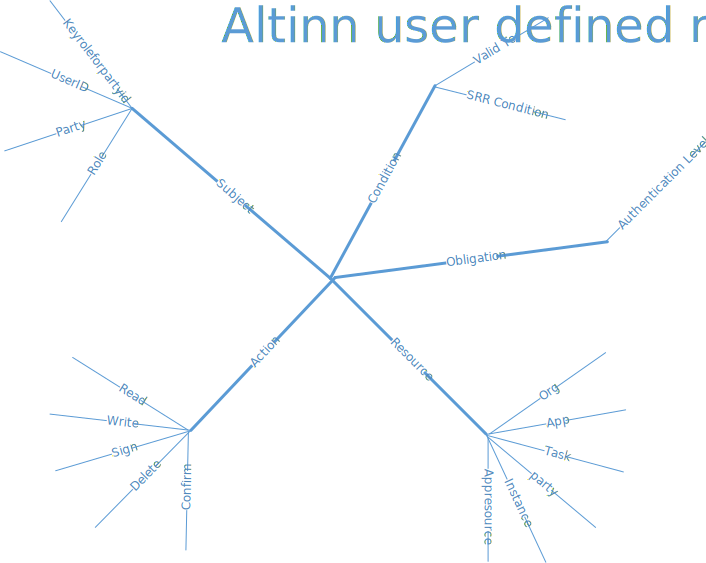

The [authorization](https://en.wikipedia.org/wiki/Authorization) capabilities are based on [ABAC](https://en.wikipedia.org/wiki/Attribute-based_access_control) (Attribute-Based Access Controls)
and use the [XACML 3.0 standard](https://docs.oasis-open.org/xacml/3.0/xacml-3.0-core-spec-os-en.html).

These capabilities include:

* The capability to define wide/narrow authorization policies for apps. Rules can be valid for the whole application or only for a subset of resources.
* The capability to evaluate policies  based on a request for a resource
* The capability to configure authorization policies for API endpoints
* The capability to enforce decision request (permit or deny)
* The capability to enrich decision requests with needed information
* The capability to retrieve context information from different sources for subject and resource.
* The capability to authorize based on API scopes

## Main Concept

The following concepts are important

### Authorization Components

The following solution components provide authorization capabilities

* PAP - Policy Administration Point: Where the authorization policies are defined
* PDP - Policy Decision Point:  Where the authorization request is evaluated
* PEP - Policy Enforcement Point: The component making sure the user/system is authorized before accessing resources
* PIP - Policy Information Point: Components giving information to PDP about resources and subjects
* PRP - Policy Retrieval Point:  Where the PDP can find the correct policy to use for a request
* Context Handler - Component adding context information to the decision request so PDP can evaluate a decision request correctly.

These components are described in detail under [solution components](/authorization/)

### Rights

In Altinn Apps/Platform a right is permission to act on a given resource.
The action performed can be one of some predefined options like read, write and sign but can also be any other action defined on a
custom API in the apps.
The resource is typical an app instance or part of it where data belongs to a given party (person or organization).

A user or system gets a right based on rules that describe permissions based on being a specific user or having a specific role.

### Policy

A policy defines one or many rules for a given set of resources. This policy is described as an XACML 3.0 Policy document.

#### Rule

An authorization rule in the Altinn Platform defines who has been given the right to perform actions on a given resource.
A rule consists of 5 elements

##### Resource

This describes which resource the rule applies for. Altinn Apps currently supports the following resource types in rules.

* Org - Unique identifier of the organization responsible for the app.
* App - Application identifier which is unique within an organization.
* Task - A specific task in the process defined for an app
* Appresource - A resource for an instance/app that is not mapped to a task. Example: events

Some of the resource types are meant to be used in combination. As an example, you can have been given the right for an app for a given reportee

##### Subject

The subject in an authorization rule identifies who the rules apply for. In Altinn Apps/Platform the resource can be the following.

* RoleType
* org

When delegating is supported this would be expanded with

* userid
* partyid
* keyroleforpartyid

##### Action

The Action part of the rule defines what type of action that the subject can perform on the resource.

Currently, the actions relevant for Altinn Apps and Altinn Platform are listed below. This list will increase over time.

* Read
* Write
* Sign
* Confirm
* Delete

##### Condition

The condition part of the rule is extra conditions that need to be fulfilled for the rule to be valid. In Altinn Studio
we have the following types of conditions.

* Valid To

##### Obligation

An obligation is an obligation that needs to be followed if the user is permitted or denied.
In Altinn Apps/Platform this is used to define the minimum authentication level.

#### Creation of policies

The policies in Altinn Studio Apps is defined when the app developer defines the rules for the app.
The policy is deployed together with the App to a given Altinn Studio App environment.
See details in [Policy Administration Point in Altinn Studio](/technology/solutions/altinn-studio/designer/build-app/authorization-rules/).

In Altinn II end users can also create policies/rules. This happens when:

* When the user creates a local role that contains rights that users have through other roles
* When delegating single rights to a user or organization.

The rules is slightly different since rules defined by the end user have different subjects and can be defined for a
more limited resource.

This will be supported in Altinn 3. See [Github issue 1258](https://github.com/Altinn/altinn-studio/issues/1258)

##### Altinn Studio policy/rules

##### User defined policy/rules

### Roles

Altinn Studio Apps will retrieve roles from Altinn II Administration. This will later could be expanded to other sources for roles.

### Scopes

API Scopes are used in the solutions in some uses cases where organizations are authenticated through the external ID-Provider "MaskinPorten"
or when end users are accessing the apps through end-user-systems.

The scopes are used to control what the user can do on behalf of the user/organization.

Scopes are always used together with the authorization rules for the specific app.

#### Defined Scopes

* altinn:instances.read : Give system the right to access API for reading instances
* altinn:instances.write : Give system the right to access API for writing to instances
* altinn:serviceowner/instances.read : Give orgs the right to access API for reading instances
* altinn:serviceowner/instances.write  : Give orgs the right to access API for writing to instances

## The Future

The below show the future of Authorization Component. [Work in progress](/authorization/)

