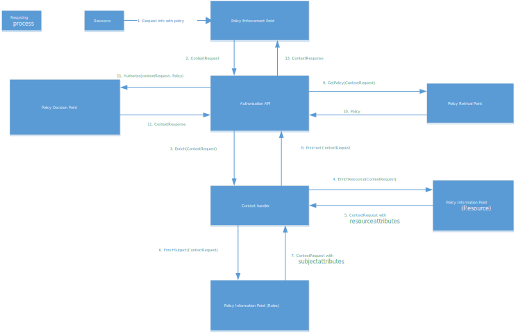

The authorization component consists of several solution components.

For a functional description see details in [application solution components](/technology/architecture/components/application/solution/altinn-platform/authorization/).

The diagram below shows where the different solution components are located

The Authorization component is constructed as a asp.net MVC application exposing API. The API communicates with the different solution components

The below diagram shows the data flow including PEP.

## Decision API

The decision API is the API that orchestrates the decision process.

The API supports both XACML XML and XACML Json Profile request.

See [Decision Controller](https://github.com/Altinn/altinn-studio/blob/master/src/Altinn.Platform/Altinn.Platform.Authorization/Authorization/Controllers/DecisionController.cs) for code details

## Policy Decision Point - PDP

This is implemented as a separate class [library](https://github.com/Altinn/altinn-studio/tree/master/src/Altinn.Platform/Altinn.Platform.Authorization/Altinn.Authorization.ABAC
) [This is published to Nuget](https://www.nuget.org/packages/Altinn.Authorization.ABAC/).

This library contains all models defined for XAMCL XML/JSON and utility methods to handle XACML documents.

The Policy Decision Point is implemented in this [class](https://github.com/Altinn/altinn-studio/blob/master/src/Altinn.Platform/Altinn.Platform.Authorization/Altinn.Authorization.ABAC/PolicyDecisionPoint.cs).

It expects both decision request and policy to be inputed.

## Policy Retrieval Point - PRP

Policy Retrieval Point component that stores authorization policies for applications.

The policies are stored as XACML (xml) documents in a blob storage.

When an authorization request is received to PDP, PRP identifies the correct policy document in the policy storage.

[See code](https://github.com/Altinn/altinn-studio/blob/master/src/Altinn.Platform/Altinn.Platform.Authorization/Authorization/Services/Implementation/PolicyRetrievalPoint.cs).

PRP is configured as a service in the Authorization Component and can easily be replaced with other implementation.

## Context Handler

Context handler enriches the authorization request with information about the user and the resource requested.
Roles are retrieved from SBL Brigde while resource information is retrieved from Instances in storage. 

[See code](https://github.com/Altinn/altinn-studio/blob/master/src/Altinn.Platform/Altinn.Platform.Authorization/Authorization/Services/Implementation/ContextHandler.cs).

Context Handler is configured as a service in Authorization Component and can easily be replaced with other implementation.

## Policy Information Point - Roles

PIP for roles, calls SBL bridge to get the rules a user or system has for a resource party.

This is implemented as a service. [See implementation](https://github.com/Altinn/altinn-studio/blob/master/src/Altinn.Platform/Altinn.Platform.Authorization/Authorization/Services/Implementation/RolesWrapper.cs)

This can easily be replaced with other implementation.

## Policy Information Point - Party

This is implemented as a service. [See implementation](https://github.com/Altinn/altinn-studio/blob/master/src/Altinn.Platform/Altinn.Platform.Authorization/Authorization/Services/Implementation/PartiesWrapper.cs)

This can easily be replaced with other implementation.

## Policy Information Point - Resources

PIP for resoruces checks storage for instance information.

This is implemented as a service. [See implementation](https://github.com/Altinn/altinn-studio/blob/master/src/Altinn.Platform/Altinn.Platform.Authorization/Authorization/Repositories/PolicyInformationRepository.cs)

This can easily be replaced with other implementation.

## Api controllers

- [Decision](https://github.com/Altinn/altinn-studio/blob/master/src/Altinn.Platform/Altinn.Platform.Authorization/Authorization/Controllers/DecisionController.cs)
- [Policy](https://github.com/Altinn/altinn-studio/blob/master/src/Altinn.Platform/Altinn.Platform.Authorization/Authorization/Controllers/PolicyController.cs)
- [Roles](https://github.com/Altinn/altinn-studio/blob/master/src/Altinn.Platform/Altinn.Platform.Authorization/Authorization/Controllers/RolesController.cs)
- [Parties](https://github.com/Altinn/altinn-studio/blob/master/src/Altinn.Platform/Altinn.Platform.Authorization/Authorization/Controllers/PartiesController.cs)

## Dependencies

See [csproj](https://github.com/Altinn/altinn-studio/blob/master/src/Altinn.Platform/Altinn.Platform.Authorization/Authorization/Altinn.Platform.Authorization.csproj).

## How to use Altinn Platform Authorization in your setup

The PDP does not contain any Altinn specific functionality. What you need to implement in your setup is

### Context Handler

You would need to write your own context handler functionality that undestand your domain. Meaning it would need to understand what
kind of enrichment that is needed. It the simplest scenarious this does not need to do anything if the authorization request contains all
information needed by PDP

### PRP

You need to implement funcionality to identify the correct XACML Policy. In Altinn we have different policies for the different apps, but in
some simple scenarios you would only need to reference a static XACML Policy.

### PIP

If context handler need to enrich


