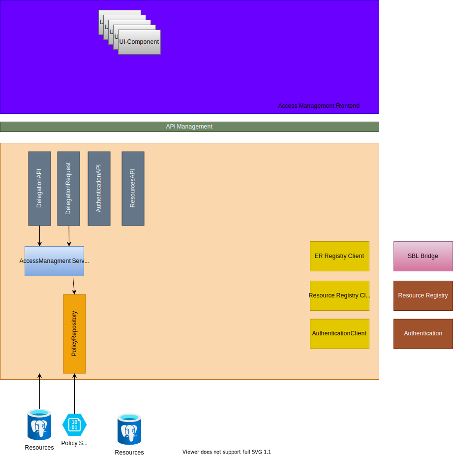

See [solutions](/technology/solutions/altinn-platform/authorization/accessmanagement/) for details about the functionality provided by this component.




## Frontend

The frontend is created with REACT as a standalone REACT application.

It uses the following frameworks

- Axios : For 
- Redux :
- Redux Toolkit :
- Redux Query :

### Build & Deploy

We use GitHub Actions and Azure DevOps to build Frontend applications. 
The code is located in [altinn-access-mangement-frontend](https://github.com/Altinn/altinn-access-management-frontend) repo

- [Github Action](https://github.com/Altinn/altinn-access-management-frontend/actions)
- Azure DevOps Pipeline

### Hosting

The backend hosts the compiled frontend application.
Files is located in [wwwroot](https://github.com/Altinn/altinn-access-management/tree/main/backend/src/Altinn.Authorizationadmin/Altinn.Authorizationadmin/wwwroot/AuthorizationAdmin) folder in the backend. 

## Backend

### API

The following API  controllers is available in component

- [DelegationAPI](https://github.com/Altinn/altinn-access-management/blob/main/src/Altinn.AccessManagement/Controllers/DelegationsController.cs)
- [DelegationRequestAPI](https://github.com/Altinn/altinn-access-management/blob/main/src/Altinn.AccessManagement/Controllers/DelegationRequestsController.cs)
- DelegationResourcesAPI
- AuthenticationAPI

#### API structure

The below structure 

##### Rights

Rights API List rights between two parties. (organizations/users/persons)

/accessmanagement/api/v1/rights/{resource}/offeredto/{recevingParty}/from/{offeringParty}/
/accessmanagement/api/v1/rights/{resource}/offeredby/{recevingParty}/from/{offeredToparty}/

```json
[
    {
        "PolicyId": "skd/flyttemelding",
        "RuleId" : "asdfasdfsdaf",
        "OfferedByPartyId": "234234",
        "CoveredBy"[
            {
                "id": "urn:altinn:role",
                "value": "dagl"
            }
        ],
        "Subject"[
            {
                "id": "urn:altinn:role",
                "value": "dagl"
            }
        ],
        "Resource"[
            {
                "id": "urn:altinn:role",
                "value": "dagl"
            }
        ],
        "Action":
            {
                "id": "urn:altinn:role",
                "value": "dagl"
            }
        ,
        "RightSourceType":"Role",
        "HasPermit": true
    }
]


/accessmanagement/api/v1/rights/offered/


/accessmanagement/api/v1/rights/delegated


##### Delegations


##### Access Groups


### Security

#### Authentication

Apis are protected and require an authenticated user or organization.

The token is provided through a cookie for users using the React frontend or through a bearer token header.

Altinn Access Management has configured the JWTCookie authentication method created for Altinn. This support validation of both JWTCookie and JTW bearer token.

Needs to be clarified: Do we support Maskinporten tokens directly?

#### CSRF protection

The API endpoints will have CSRF protection.

#### API Management subscription

Some functionality will require a specific API management subscription.
This requires external consumers to follow SLA and have an agreement for API usage. 

### Authorization

The API exposed will require authorization for the usage of different levels.

Some APIs will require general access to a resource. This will be processed by the standard Policy Enforcement Point or a possible custom enforcement point.

In addition, the APIS will often have its internal logic to filter data based on business rules. These are custom implementations

### Db Repository
Access Manamgent owns the delegated rights. 

- PostgreSQL is used to store information about a delegated policy
- Azure Blob Storage is used 

See [migration scripts](https://github.com/Altinn/altinn-access-management/tree/main/backend/src/Altinn.Authorizationadmin/Altinn.Authorizationadmin/Migration) for table structure and stored procedures.


## Build & Deploy

- Build and Code analysis are done by an [Github action](https://github.com/Altinn/altinn-resource-registry/actions)
- Build of the image is done in [Azure Devops](https://dev.azure.com/brreg/altinn-studio/_build?definitionId=385)
- Deploy of the Image is done in [Azure Devops](https://dev.azure.com/brreg/altinn-studio/_release?_a=releases&view=all&definitionId=36)