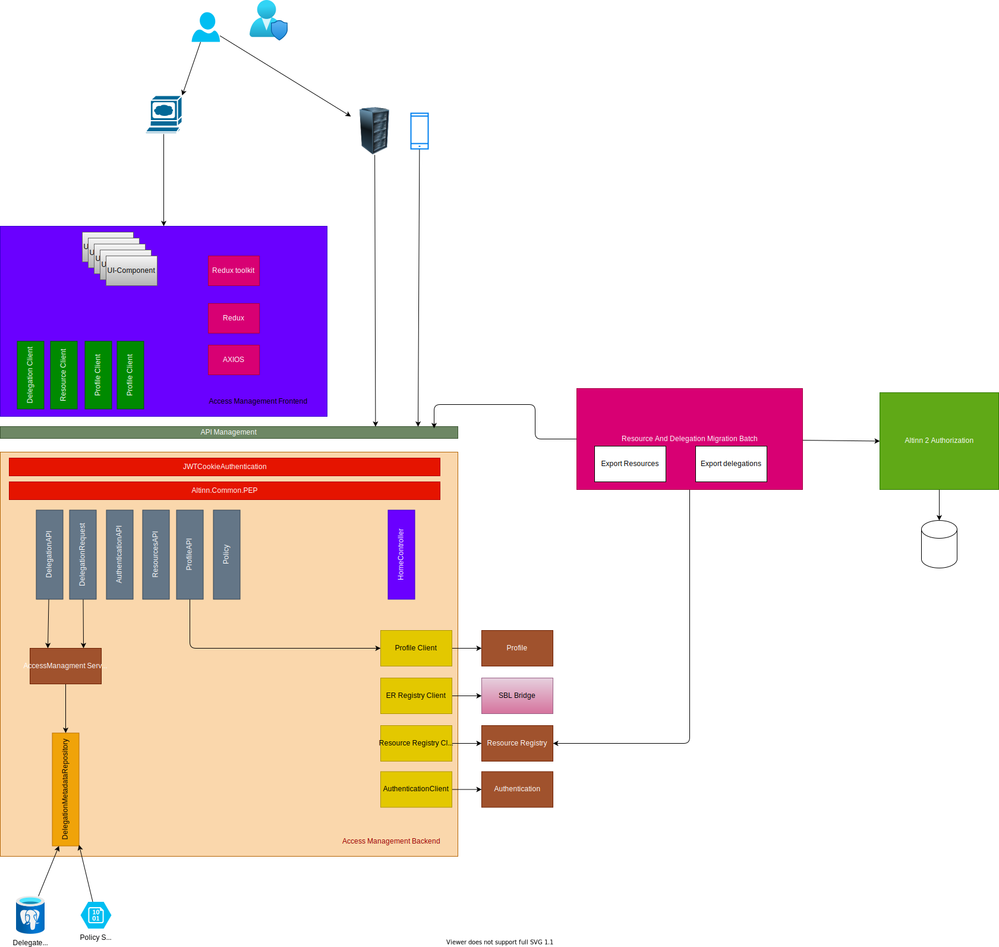

See [solutions](/technology/solutions/altinn-platform/authorization/accessmanagement/) for details about functionality provided by this component.

## Frontend

The frontend is created with REACT as a standalone REACT application.

It uses the following frameworks

- Axios : For 
- Redux :
- Redux Toolkit :
- Redux Query :

### Build & Deploy

We use GitHub Actions and Azure Devops to build Frontend applications.

- [Github Action]()
- Azure DevOps Pipeline

### Hosting

The backend hosts the compiled frontend application.
Files is located in [wwwroot](https://github.com/Altinn/altinn-access-management/tree/main/backend/src/Altinn.Authorizationadmin/Altinn.Authorizationadmin/wwwroot/AuthorizationAdmin) folder in the backend. 

## Backend

### API

The following API is available in component

- [DelegationAPI](https://github.com/Altinn/altinn-access-management/blob/main/backend/src/Altinn.Authorizationadmin/Altinn.Authorizationadmin/Controllers/DelegationsController.cs)
- [DelegationRequestAPI](https://github.com/Altinn/altinn-access-management/blob/main/backend/src/Altinn.Authorizationadmin/Altinn.Authorizationadmin/Controllers/DelegationRequestsController.cs)
- DelegationResourcesAPI
- AuthenticationAPI

### Security

#### Authentication

Apis are protected and required a authenticated user or organization.

The token is provied through cookie for users using the React frontend

#### CSRF protection

The API endpoints will have CSRF protection.

#### API Management subscription

Some functionality will require specific API management subscription

### Db Repository
Access Manamgent owns the delegated rights. 

- PostgreSQL is used to store information about a delegated policy
- Azure Blob Storage is used 

See [migration scripts](https://github.com/Altinn/altinn-access-management/tree/main/backend/src/Altinn.Authorizationadmin/Altinn.Authorizationadmin/Migration) for table structure and stored procedures.

## Build & Deploy

- Build and Code analysis are done by an [Github action](https://github.com/Altinn/altinn-resource-registry/actions)
- Build of the image is done in [Azure Devops](https://dev.azure.com/brreg/altinn-studio/_build?definitionId=385)
- Deploy of the Image is done in [Azure Devops](https://dev.azure.com/brreg/altinn-studio/_release?_a=releases&view=all&definitionId=36)