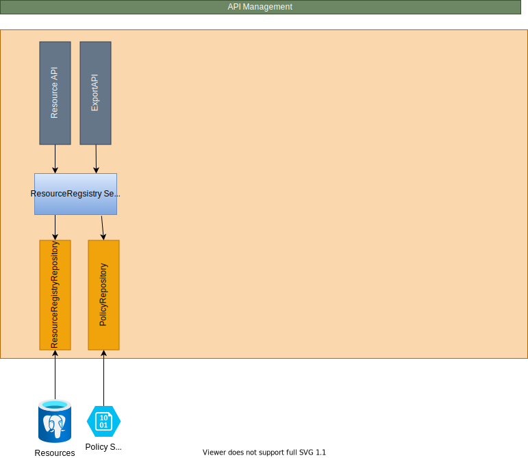

Also see [solution components](/technology/architecture/components/application/solution/altinn-platform/authorization/resourceregistry/) for details about functionality.

## API

The following API is available in component

- [ResourceRegistryAPI](https://github.com/Altinn/altinn-resource-registry/blob/main/src/ResourceRegistry/Controllers/ResourceController.cs)
- [ExportAPI](https://github.com/Altinn/altinn-resource-registry/blob/main/src/ResourceRegistry/Controllers/ExportController.cs)

## Repository

The resources is stored as json in a posgree database PostgreSQL. 

- [Table Setup](https://github.com/Altinn/altinn-resource-registry/blob/main/src/ResourceRegistry/Migration/v0.00-resource-registry/01-setup-tables.sql)

The policies are stored as XML documents in Azure Blob storage

## Build & Deploy

- Build and Code analysis are done by an [Github action](https://github.com/Altinn/altinn-resource-registry/actions)
- Build of image is done in [Azure Devops](https://dev.azure.com/brreg/altinn-studio/_build?definitionId=385)
- Deploy of Image is done in [Azure Devops](https://dev.azure.com/brreg/altinn-studio/_release?_a=releases&view=all&definitionId=36)