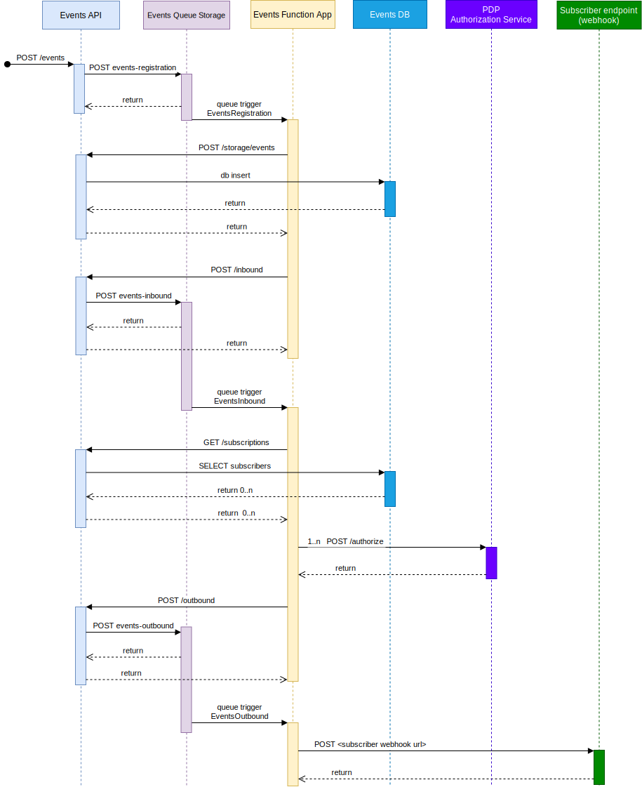

The Events components expose public REST APIs for publishing, retrieving and subscribing to events. 

[Azure Functions](https://docs.microsoft.com/en-us/azure/azure-functions/) are used internally to process and forward incoming cloud events to subscriber webhooks. 

The following diagram illustrates the overall data flow.


When a publish request is posted to the `/app` endpoint, the event will first be saved in the `events-registration` queue for operational resilience and flexibility. 

When an event retrieval request is received, it will respond with results from the internal relational database used for events persistence.

### Public API

The following API controllers are defined

- [AppController](https://github.com/Altinn/altinn-events/blob/main/src/Events/Controllers/AppController.cs) : publish (store and forward) and retrieve app events

- [SubscriptionController](https://github.com/Altinn/altinn-events/blob/main/src/Events/Controllers/SubscriptionController.cs) : create, retrieve, validate and delete event subscriptions

### Internal API

The following endpoints are intended for internal use only.

- [StorageController](https://github.com/Altinn/altinn-events/blob/main/src/Events/Controllers/StorageController.cs) : save incoming events to persistent storage (database)
  
- [InboundController](https://github.com/Altinn/altinn-events/blob/main/src/Events/Controllers/InboundController.cs) : store events in `events-inbound` queue

- [OutboundController](https://github.com/Altinn/altinn-events/blob/main/src/Events/Controllers/OutboundController.cs) : forward events to authorized subscriber webhook endpoints, via `events-outbound` queue

### Processing events

_processing a single incoming event_



## Controller details
Base API url: **/events/api/v1**

### AppController

The [AppController](https://github.com/Altinn/altinn-events/blob/main/src/Events/Controllers/AppController.cs) in the Events component is the one receiving events from Apps and other sources. 

It verifies that the app is authorized to publish events for the given source before saving the event in a database for at least 90 days.

It also exposes API to search for events and to get events. 

The access is controlled by the XACML Policy for the given App that is the source for an given event.

The [AuthorizationHelper](https://github.com/Altinn/altinn-events/blob/main/src/Events/Authorization/AuthorizationHelper.cs)
is responsible for creating and performing the request to the [Policy Decision Point](../../../../../../solutions/altinn-platform/authorization/pdp/).


### SubscriptionController


The [SubscriptionController](https://github.com/Altinn/altinn-events/blob/main/src/Events/Controllers/SubscriptionController.cs) exposes API to 

- Add subscriptions
- Delete subscriptions
- Get subscriptions
- Validate subscriptions


### InboundController

_Internal API_

Thin client to `events-inbound` queue storage, minimal processing logic.

### OutboundController (previously PushController)

[OutboundController](https://github.com/Altinn/altinn-events/blob/main/src/Events/Controllers/OutboundController.cs) is called by the  [EventsInbound](https://github.com/Altinn/altinn-events/blob/main/src/Events.Functions/EventsInbound.cs) function. 

Based on details from the Event it will identify matching subscriptions. 

For each match it will authorize the subscriber using the Policy Authorization Point.

The [AuthorizationHelper](https://github.com/Altinn/altinn-events/blob/main/src/Events/Authorization/AuthorizationHelper.cs)
is responsible for creating and performing the request to the [Policy Decision Point](../../../../../../solutions/altinn-platform/authorization/pdp/).

The access is controlled by the XACML Policy for the given App that is the source for an given event.

If the subscriber is Authorized, the event will be added to the "events-outbound" queue and picked up by the EventsOutbound function. (see below)


## Event storage

To be able to get the search capability needed for the Events component we have choosen to use  [PostgreSQL](https://www.postgresql.org/).

Using [PostgreSQL](https://www.postgresql.org/) makes is possible to sort the events based on a primary key and also makes it possible to search
over all events based on subject or source. 

The table structure 

```sql
CREATE TABLE IF NOT EXISTS events.events
(
    sequenceno BIGSERIAL,
    id character varying COLLATE pg_catalog."default" NOT NULL,
    source character varying COLLATE pg_catalog."default" NOT NULL,
    subject character varying COLLATE pg_catalog."default" NOT NULL,
    "time" timestamptz  NOT NULL,
    type character varying COLLATE pg_catalog."default" NOT NULL,
    cloudevent text COLLATE pg_catalog."default" NOT NULL,
    CONSTRAINT events_pkey PRIMARY KEY (sequenceno)
)
```

```sql
CREATE TABLE IF NOT EXISTS events.subscription
(
    id BIGSERIAL,
    sourcefilter character varying COLLATE pg_catalog."default",
    subjectfilter character varying COLLATE pg_catalog."default",
    typefilter character varying COLLATE pg_catalog."default",
    consumer character varying COLLATE pg_catalog."default" NOT NULL,
    endpointurl character varying COLLATE pg_catalog."default" NOT NULL,
    createdby character varying COLLATE pg_catalog."default" NOT NULL,
    validated BOOLEAN NOT NULL,
    "time" timestamptz  NOT NULL,
    CONSTRAINT eventssubscription_pkey PRIMARY KEY (id)
)

```

Stored procedures is used to add, delete and query data from the above tables. 
See all stored procedures [here](https://github.com/Altinn/altinn-events/tree/main/src/Events/Migration).

#### Event sequencing

Events will be sequenced by the field `sequenceno`, which is also the primary key of the Events table. 

### Indexing

The events table has indexes on the columns _subject_, _time_, _sourcefilter_.

## Functions

As part of the Events Component there is a single Azure Function App with four functions involved in processing cloud events at various stages (Azure Queue Storage). Click on name for code.

 - [EventsRegistration](https://github.com/Altinn/altinn-events/blob/main/src/Events.Functions/EventsRegistration.cs)
   - dequeue from `events-registration`
   - store to database
   - forward to `events-inbound` queue
 - [EventsInbound](https://github.com/Altinn/altinn-events/blob/main/src/Events.Functions/EventsInbound.cs)
   - dequeue from `events-inbound`
   - find valid subscriptions with filters that match event
   - forward a copy of event to `events-outbound` queue for each matching subscription
 - [EventsOutbound](https://github.com/Altinn/altinn-events/blob/main/src/Events.Functions/EventsOutbound.cs) 
   - dequeue from `events-outbound`
   - POST cloud event to target webhook endpoint, retry as necessary
 - [ValidateSubscription](https://github.com/Altinn/altinn-events/blob/main/src/Events.Functions/SubscriptionValidation.cs) 
   - check that the user-defined webhook endpoint is ready to receive data

### EventsInbound

The [EventsInbound](https://github.com/Altinn/altinn-events/blob/main/src/Events.Functions/EventsInbound.cs) function is executed automatically by the Azure Function runtime when new events are posted to the `events-inbound` queue.

This function does not have 
It just forward the event to the PushController through the [pushEventService](https://github.com/Altinn/altinn-events/blob/main/src/Events.Functions/Services/PushEventsService.cs).

The Function uses Platform Access token to authenticate itself for the PushController

It uses standard mechanismen for retry, if the call for pushcontroller fails.

### EventsOutbound

The [EventsOutbound](https://github.com/Altinn/altinn-events/blob/main/src/Events.Functions/EventsInbound.cs) function is triggered byQueueStorage changes in the "events-outbound" queue.

It will try to push the event to given subscription endpoint given in the [CloudEventEnvelope](https://github.com/Altinn/altinn-events/blob/main/src/Events.Functions/Models/CloudEventEnvelope.cs)
that is put on the queue and containing the event.

This function is configured with [CustomQueueProcessorFactory](https://github.com/Altinn/altinn-events/blob/main/src/Events.Functions/Factories/CustomQueueProcessorFactory.cs) to handle retry if it is not possible to push event to the endpoint.

It will try send the event right away, but if the request to webhook fails  (Http status != 200) it will put the cloudevent back on the queue with a
defined wait time.
1. retries after 10 seconds
2. retries after 30 seconds
3. retries after 1 minute
4. retries after 5 minutes
5. retries after 10 minutes
6. retries after 30 minutes
7. retries after 1 hour
8. retries after 3 hours
9. retries after 6 hours
10. retries after 12 hours
11. retries after 12 hours

If it fails the 12. time it will put the event in the dead letter queue and will not try again.

### SubscriptionValidation

The [SubscriptionValidation](https://github.com/Altinn/altinn-events/blob/main/src/Events.Functions/SubscriptionValidation.cs) function is triggered byQueueStorage changes in the "subscription-validation" queue.

It will try to validate the endpoing given in the [Subscription](https://github.com/Altinn/altinn-events/blob/main/src/Events.Functions/Models/Subscription.cs)
that is put on the queue.

This function is configured with [CustomQueueProcessorFactory](https://github.com/Altinn/altinn-events/blob/main/src/Events.Functions/Factories/CustomQueueProcessorFactory.cs) to handle retry if it is not possible to push event to the endpoint.

It will try send the event right away, but if the request to webhook fails (Http status != 200) it will put the cloudevent back on the queue with a
defined wait time.
1. retries after 10 seconds
2. retries after 30 seconds
3. retries after 1 minute
4. retries after 5 minutes
5. retries after 10 minutes
6. retries after 30 minutes
7. retries after 1 hour
8. retries after 3 hours
9. retries after 6 hours
10. retries after 12 hours
11. retries after 12 hours

If it fails the 12. time it will put the event in the dead letter queue and will not try again.

If endpoint responds with 200OK it will then set the subscription status to valid with calling the [validate](https://github.com/Altinn/altinn-events/blob/main/src/Events/Controllers/SubscriptionController.cs#L111) endpoint in the Subscription API.
