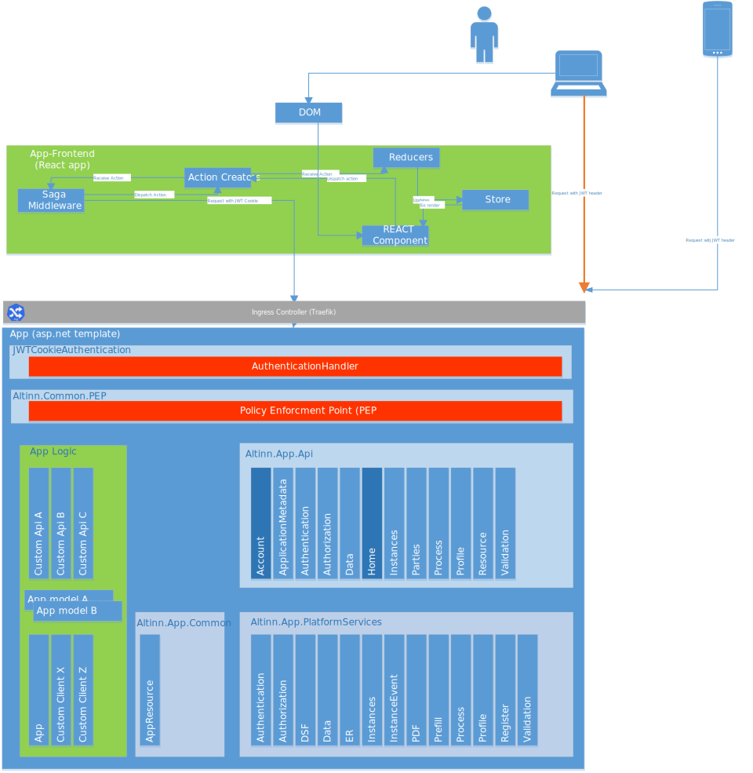

The App developed in Altinn Studio is currently based on a
[ASP.NET application template](/technology/solutions/app-template/apptemplates/asp.net/) that contains backend and frontend components.

The app developer modifies and enhances the app
with changing code and configuration in Altinn Studio or external devlopment tools like [Visual Studio Code](https://code.visualstudio.com/). 

The application is built and deployed as a Docker container in a Kubernetes Pod to a Kubernetes cluster.
See [deployment architecture](/technology/architecture/capabilities/runtime/appdeploy) for deployment details.

In the future Altinn Studio will support apps based on different templates. Currently we support the below template(s).


