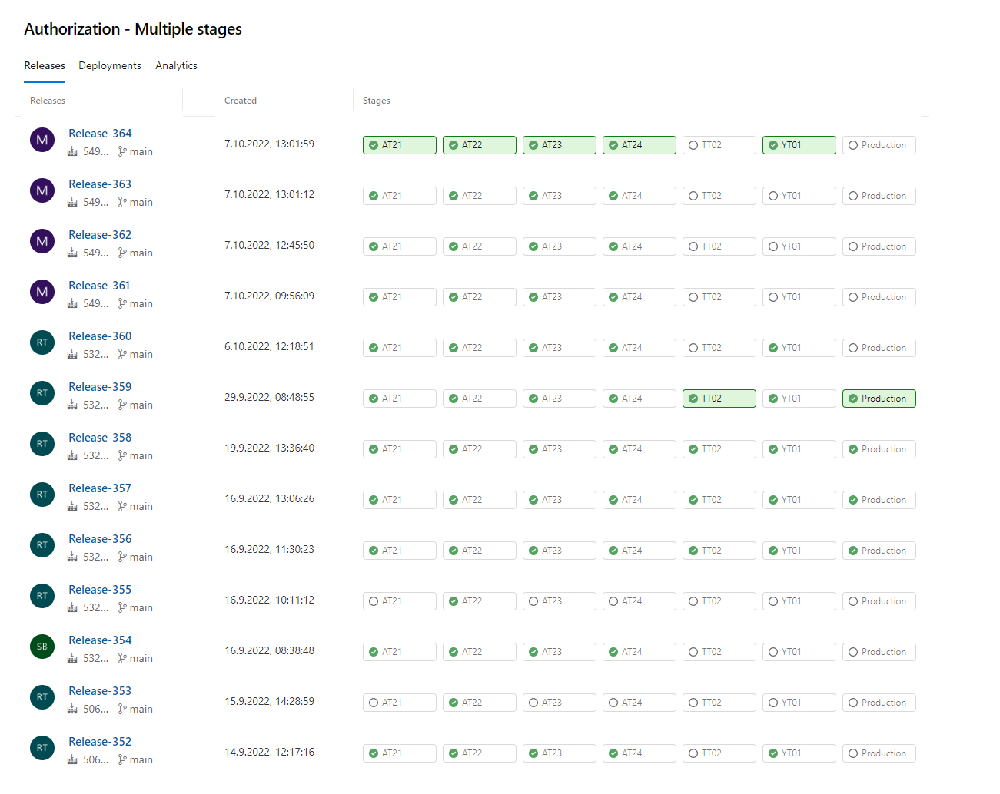

## Application Lifecycle Management Applications

### Requirement & Release Management

Use cases are [defined in Github](https://github.com/Altinn/altinn-studio/issues?q=is%3Aopen+is%3Aissue+label%3Akind%2Fuser-story).
We have defined differen types of template to support creation of user stories.

Releases are managed on Github. 

[See releases here](https://github.com/Altinn/altinn-studio/releases).

### Manual & Automated Test Tools

#### Functional Test
- Automated browser testing and WCAG testing using [Cypress](https://www.cypress.io/).

#### Unit Test
- [Jest](https://jestjs.io/) framework used for unit testing front-end. More details [here](../../../../../../community/contributing/handbook/test/unit-testing/).
- [xunit](https://xunit.net/) used for unit testing back-end.

#### Service & API Test

- API testing is done using Postman. More details [here](../../../../../../community/contributing/handbook/test/postman/).
- Integration testing of services done using [standard Microsoft frameworks](https://docs.microsoft.com/en-us/aspnet/core/test/integration-tests?view=aspnetcore-3.1).

#### Performance Testing & Profiling
We will use [K6](https://k6.io/) for performance testing.

### Testmanagement
- [Azure Test Plans](https://azure.microsoft.com/en-us/services/devops/test-plans/) in [Azure Devops](https://azure.microsoft.com/en-us/services/devops/) is usted for execution tracking
- Defects reported as issues in [Github](https://github.com/Altinn/altinn-studio/issues), using the _Bug_ template. 

## DevSecOps Applications

### UX Design
We use Figma for prototypes. 

[See our Figma Guidlines](/app/design/prototype).

### Artefact & Code Repository
Github is uses for all Open Source code. 
[See our GitHub repository](https://github.com/Altinn/altinn-studio).

[Azure Repos](https://azure.microsoft.com/en-us/services/devops/repos/) in Azure DevopsServices is used for other artefacts

### Architecture Design
Application design is created using MarkDown and published on this site. Visio is used for application drawings.

### IDE 
The project uses [Visual Studio Code](https://code.visualstudio.com/) and [Visual Studio](https://visualstudio.microsoft.com/) as IDE.

### Build Tools
The project uses different build tools based the framework.

#### .NET packages & applications
We use .Net build to build .Net packages and applications. 

With help of Nuget packages we can easyly re-use modules accross applicatons in the different solution.

#### Javascript Packages & applications
Node is the main tool to build our javascript pacakges and applications

Lerna is used to ...

#### Java packages & application
We use Maven to build our java applications.

#### Docker containers
All applications is built as Docker Containers using [Docker Build](https://docs.docker.com/engine/reference/commandline/build/)

Se Docker files for Altinn Platform

- [Authentication component](https://github.com/Altinn/altinn-studio/blob/master/src/Altinn.Platform/Altinn.Platform.Authentication/Authentication/Dockerfile) 
- [Authorization component](https://github.com/Altinn/altinn-studio/blob/master/src/Altinn.Platform/Altinn.Platform.Authorization/Authorization/Dockerfile)
- [PDF Component](https://github.com/Altinn/altinn-studio/blob/master/src/Altinn.Platform/Altinn.Platform.PDF/Dockerfile)
- [Profile Component](https://github.com/Altinn/altinn-studio/blob/master/src/Altinn.Platform/Altinn.Platform.Profile/Profile/Dockerfile)
- [Receipt Component](https://github.com/Altinn/altinn-studio/blob/master/src/Altinn.Platform/Altinn.Platform.Receipt/Receipt/Dockerfile)
- [Register Component](https://github.com/Altinn/altinn-studio/blob/master/src/Altinn.Platform/Altinn.Platform.Register/Register/Dockerfile)
- [Storage Component](https://github.com/Altinn/altinn-studio/blob/master/src/Altinn.Platform/Altinn.Platform.Storage/Storage/Dockerfile)

See docker files for Altinn Studio

- [Designer])(https://github.com/Altinn/altinn-studio/blob/master/src/AltinnCore/Designer/Dockerfile)

### Artefact & Container Registry

#### .NET Packages

.NET packages som part of the codes are [published as Nuget Packages](https://www.nuget.org/profiles/altinn). 
This process is manual and performed by developer.

.Net packes used are also retrived from .Net

#### Javascript packages

The project uses NPM for javascript packages. 

In the future we will publish NPM packages for parts of the solutions.

#### Docker Containers
Dockers containers are published to [Azure Container Registry](https://azure.microsoft.com/en-us/services/container-registry/)

There is a shared Altinn Container Registry for the different Environments for Altinn Studio and Altinn Platform.

Note as part of the runtime capabilityes we also use Azure Container Registry for apps created in Altinn Studio. See solution components

### Deployment Orchestration

We use Azure Pipelines for deployment orchestration of the different components in the different solutions. 

The deploy process consist of 3 types of pipelines

- Publish Build artifacts to Azure Pipelines: Deploy Helm chart from Azure Devops repos to Azure Devops pipelines
- Build Docker Image : Build Docker Images and publish to Container Registry
- Release pipeline: Deploy a given container version from Azure Container Registry to a Kubernetes Cluster

The deploy pipelines has typical support for deployment to different environments (Stages). 

Helm is used to set environments variables for the different environments. 

#### Piplines

The following build pipelines is defined

The following release pipelines is defined

- [Altinn Studio - Designer](https://dev.azure.com/brreg/altinn-studio/_release?_a=releases&view=mine&definitionId=18)
- [Altinn Studio - Repositories](https://dev.azure.com/brreg/altinn-studio/_release?_a=releases&view=mine&definitionId=5)
- [Altinn Studio - Loadbalancer](https://dev.azure.com/brreg/altinn-studio/_release?_a=releases&view=all&definitionId=28)
- [Altinn Studio - Kubernetswrapper](https://dev.azure.com/brreg/altinn-studio/_release?_a=releases&view=all&definitionId=32)
- [Altinn Authorization](https://dev.azure.com/brreg/altinn-studio/_release?_a=releases&view=mine&definitionId=20)
- [Altinn Authentication](https://dev.azure.com/brreg/altinn-studio/_release?_a=releases&view=mine&definitionId=20)
- [Altinn PDF](https://dev.azure.com/brreg/altinn-studio/_release?_a=releases&view=mine&definitionId=21)
- [Altinn Profile](https://dev.azure.com/brreg/altinn-studio/_release?_a=releases&view=mine&definitionId=17)
- [Altinn Receipt](https://dev.azure.com/brreg/altinn-studio/_release?_a=releases&view=mine&definitionId=16)
- [Altinn Register](https://dev.azure.com/brreg/altinn-studio/_release?_a=releases&view=mine&definitionId=19)
- [Altinn Storage](https://dev.azure.com/brreg/altinn-studio/_release?_a=releases&view=mine&definitionId=22)
- [Altinn Events](https://dev.azure.com/brreg/altinn-studio/_release?_a=releases&view=all&definitionId=27)
- [Altinn Notifications](https://dev.azure.com/brreg/altinn-studio/_release?_a=releases&view=all&definitionId=34)
- [Altinn Access Management](https://dev.azure.com/brreg/altinn-studio/_release?_a=releases&view=all&definitionId=37)
- [Altinn Resource Registry](https://dev.azure.com/brreg/altinn-studio/_release?_a=releases&view=all&definitionId=36)
- [Kubernets Wrapper](https://dev.azure.com/brreg/altinn-studio/_release?_a=releases&view=all&definitionId=31)
  