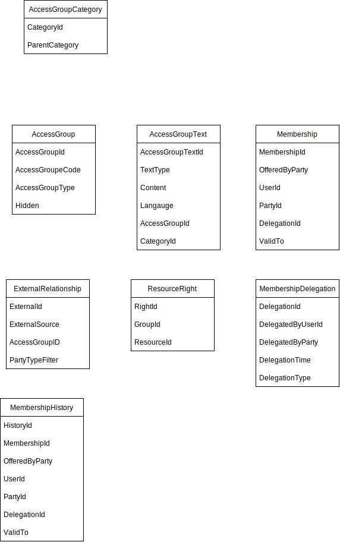
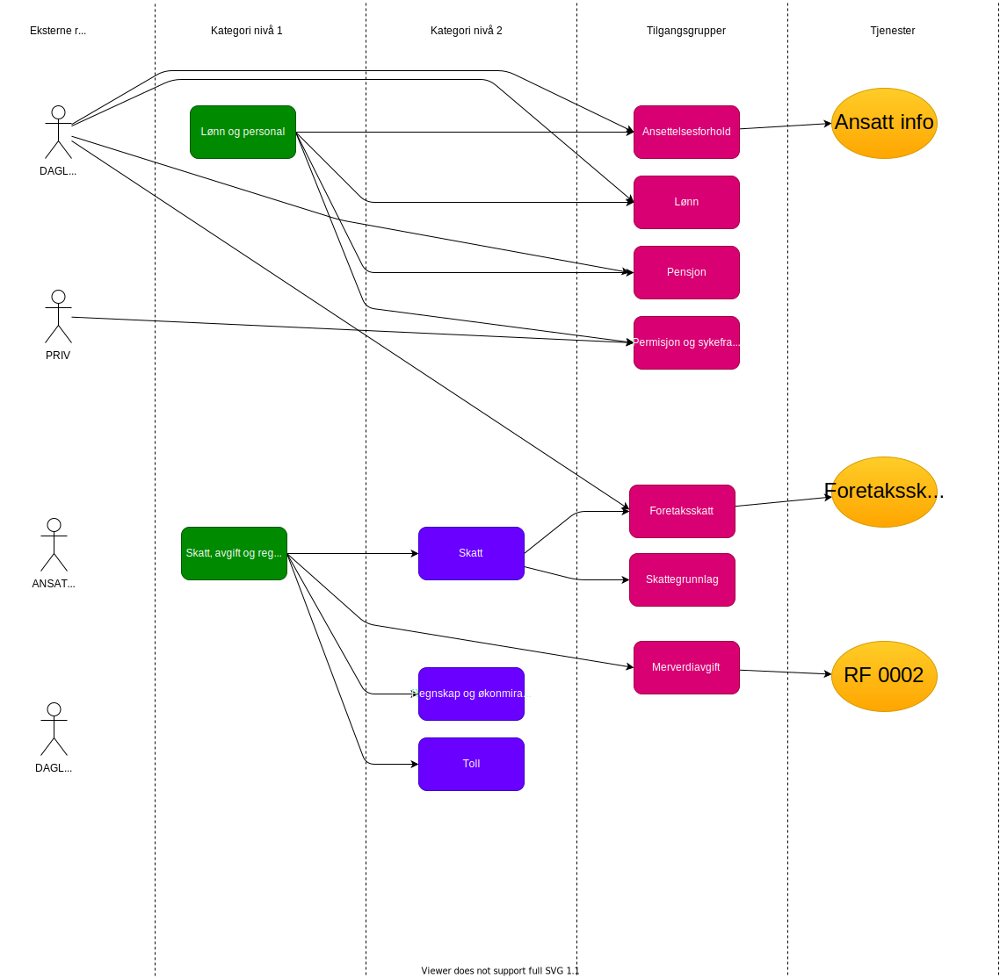


This is work in progress


Access registry contains information about the centrally  [defined access groups](https://github.com/altinn/docs/blob/master/content/utviklingsguider/styring-av-tilgang/for-tjenesteeier/forslag-tilgangsgrupper.md). 

See [Github #25](https://github.com/Altinn/altinn-authorization/issues/25)

The Access groups are grouped in one or more category trees. 

The category trees will be used to present the access groups in UI.

## Data model

### Category

This model describes a category. This category could be of a different type

Example

- Sector category
- Business type category
- Business size category
- ServiceOwner type category

This to support presenting the access groups as part of different trees. 

The properties
- Categoryid
- CategoryType

### Category relationship

  - Parent Category
  - Child Category

### AccessGroup defintion

- Name of group in different languges
- AccessGroup identifier

### External Relationship

- ExternalSource (Like ER) 
- ExternalID (Example DAGL, LEDE)
- PartyTypeFilter(AS, ENK)
- AccessGroupdID 

### AccessGroup Membership

- MembershipID
- CoveredBy UserId
- Covered
- OfferedByParty
- AccessGroupId
- ValidTo?

### AccessGroup Delegation

- DelegatedByParty
- DelegatedByUserId
- DelegationType
- DelegatetDateTime

### AccessGroup History

- DelegatedBy
- AccessGroupID
- OfferedBy
- CoveredByUserId
- CoveredByPartyId
- ChangeType (created, deleted)

### 

## API

See details of API in [Github issue 25](https://github.com/Altinn/altinn-authorization/issues/25)

