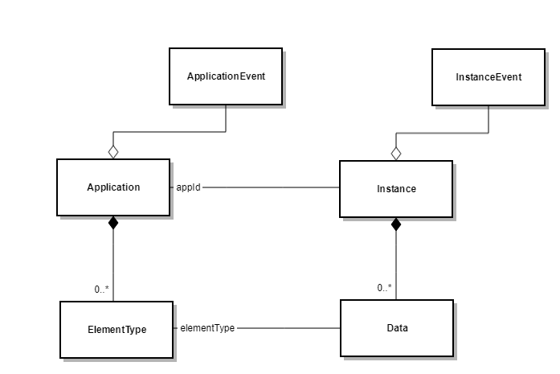

The Storage component exposes a REST-API to Altinn Apps.

Storage is mostly used by the app-backend to store information about *instances* and their *data* elements.
It provides a registry of all *applications* metadata, data types and events. It is also intended to be used by organisations and other clients to read data.

Resources: Instance, Application, DataType, ApplicationLogic, InstanceEvent, ApplicationEvent, MessageBoxInstance, ProcessHistory.



## Instance

An application instance is created when a instance owner (reportee) starts a process in an Altinn application.
An instance replaces Altinn2 Message.
An instanceOwner is a person/company that reports information via Altinn.
An appId refers to the application information element which defines the metadata about the application.

```json
{
    "id": "60238/762011d1-d341-4c0a-8641-d8a104e83d30",
    "appId": "test/sailor",
    "org": "test",
    "instanceOwner": {
        "partyId": "60238"
    },
    "created": "2019-03-06T13:46:48.6882148+01:00",
    "createdBy": "user32",
    "lastChanged": "2019-03-07T23:59:49+01:00",
    "lastChangedBy": "user34",
    "dueBefore": "2019-06-10T00:00:00.00Z",
    "visibleAfter": null,
    "title": {
        "nb": "Færder påmelding 2019",
        "en": "Fearder Race Registration 2019"
    },
    "process": {
        "started": "2019-09-25T09:32:44.20Z",
        "currentTask": {
            "started": "2019-10-10T32:22.00Z",
            "elementId": "Data_1",
            "name": "Fyll ut",
            "altinnTaskType": "data",
            "validated": {
                "timestamp": "2019-10-04T12:00.00Z",
                "canCompleteTask": true
            }
        }
    },
    "status": {
        "softDeleted": null,
        "archived": "2019-12-20T20:30:33.233Z",
        "hardDelete": null,
        "readStatus": "Read",
        "substatus":{
            "label":"substatus.accepted.label",
            "description":"substatus.accepted.description"
        }
    },
    "data": [
        {
            "id": "692ee7df-82a9-4bba-b2f2-c8c4dac69aff",
            "dataType": "boatdata",
            "contentType": "application/json",
            "blobStoragePath": "test/sailor/60238/762011d1-d341-4c0a-8641-d8a104e83d30/data/692ee7df-82a9-4bba-b2f2-c8c4dac69aff.json",
            "filename": "davidsyacht.json",
            "created": "2019-03-06T15:00:23+01:00",
            "createdBy": "XXX",
            "size": 2003,
            "locked": true
        },
        {
            "id": "999911d1-d341-4c0a-8641-d8a104e83d30",
            "dataType": "crewlist",
            "contentType": "text/xml",
            "blobStoragePath": "test/sailor/60238/762011d1-d341-4c0a-8641-d8a104e83d30/data/999911d1-d341-4c0a-8641-d8a104e83d30",
            "filename": "crewLIst.xml",
            "created": "2019-03-07T23:59:49+01:00",
            "createdBy": "XXX",
            "lastChanged": "2019-03-10T23:59:49+01:00",
            "lastChangedBy": "XXX"
        }
    ]
}
```

### Instance type

| Attribute                 | Type                                                | Description                                                             | User | Owner | App | Storage |
| --------------------------|-----------------------------------------------------| ------------------------------------------------------------------------| ---- | ----- | --- | ------- |
| id                        | string                                              | unique id                                                               |      |       |     | C       |
| appId                     | string                                              | application id                                                          |      |       |     | C       |
| instanceOwner.partyId     | integer                                             | id of instance owner                                                    | C    | C     |     |         |
| create                    | dateTime                                            | creation time                                                           |      |       |     | C       |
| createdBy                 | string                                              | user id                                                                 |      |       |     | C       |
| lastChanged               | dateTime?                                           | last changed time                                                       |      |       |     | C       |
| lastChangedBy             | string                                              | user id                                                                 |      |       |     | C       |
| dueBefore                 | dateTime?                                           | deadline for submit                                                     |      | CU    |     |         |
| visibleAfter              | dateTime?                                           | when visible for user                                                   |      | CU    |     |         |
| process                   | [ProcessState](/api/models/instance#processstate)   | process state info                                                      |      |       | U   |         |
| status                    | [InstanceStatus](#instancestatus)                   | instance status info                                                    |      |       | U   | C       |
| data                      | List<DataElement>                                   | data elements                                                           |      |       | CU  |         |
| completeConfirmations     | List<[CompleteConfirmation](#completeconfirmation)> | List of stakeholders that are done with their processing the instance   |      |       | C   |         |

C - creation time, U - can be updated

#### InstanceStatus

[Model](https://github.com/Altinn/altinn-studio/blob/master/src/Altinn.Platform/Altinn.Platform.Storage/Storage.Interface/Models/InstanceStatus.cs)
The instance status holds data on delete, archive, read, and substate of the instance.
Setting the archive and read state of the instance is handled by the application itself.
By default, both the end user and app owner can set the delete state of an instance.
Only app owner is able to set the substatus of an instance.

| Attribute | Type | Description |
| --------- | ---- | ----------- |
| Archived    | DateTime?                                  | Date and time for when the instance was archived. Null if instance is active. |
| SoftDeleted | DateTime?                                  | Date and time for when the instance was soft deleted. Null if instance is not deleted.|
| HardDeleted | DateTime?                                  | Date and time for when the instance was hard deleted. Null if instance is not deleted.|
| ReadStatus  | [ReadStatus](https://tinyurl.com/y2bdhqs7) | An enum reflecting if the instance is unred, read og updated since last review. |
| SubStatus   | [Substatus](https://tinyurl.com/yygqr9px)  | Substatus of the instance. Label & description should be text keys in order to enable language support. |

#### CompleteConfirmation

[Model](https://github.com/Altinn/altinn-studio/blob/master/src/Altinn.Platform/Altinn.Platform.Storage/Storage.Interface/Models/CompleteConfirmation.cs)

The complete confirmation is used to inform Altinn about when a given stakeholder considers 
their own process as complete with regards to an instance.

| Attribute     | Type   | Description                                                   |
| ------------- | ------ | ------------------------------------------------------------- |
| StakeholderId | string |  Unique identifier for a stakeholder.                         |
| ConfirmedOn | DateTime |  Date and time for when the complete confirmation was created.|

### Operations

Create a new instance of an app for a given instance owner. 
Post with query params that identifies the appId and the instance owner. 
An instance object can be sent as json data to set certian values.

```http
POST /instances?appId=test/sailor
{ "instanceOwner": { "partyId": "60238" }}
```

Get information about one instance.

```http
GET /instances/{instanceId}
```

Get (query) all instances that an instance owner has

```http
GET /instances/{instanceOwnerPartyId}
```

Query all instances of an application owner's organisation

```http
GET /instances?org={org}
```

Delete a specific instance (also deletes its data).

```http
DELETE /instances/{instanceId}
```

Update read status of an instance. UpdatedState can hold values: "read", "unread", "updatedSinceLastReview"

```http
PUT /instances/{instanceId}/readstatus?status={updatedState}
```

Update substatus of an instance.

```http
PUT /instances/{instanceId}/substatus
```

### Data service

A data element is a file that contains a specific form element of an instance.
It may be structured file, e.g. json, xml, or it may be a binary file, e.g. pdf.
The application metadata restricts the types of form elements that are allowed {dataType}.

Get a specific data element

```http
GET /instances/{instanceId}/data/{dataId}
```

Post to create a specific data element. Content a file (as MultipartContent).
After success the instance's data section is updated, with the appropriate dataId guid
that is used to identify the specific data element

```http
POST /instances/{instanceId}/data?dataType={dataType}
```

Put to replace a specific data element. Delete to remove data element.

```http
PUT /instances/{instanceId}/data/{dataId}
```

Notice that PDFs, such as receipts or simmilar, is handled the same way as data elements.

## Application

Application metadata used to validate data element types in instances. And to provide application events.

Resource: /applications/test/sailor

```json
{
    "id": "test/sailor",
    "versionId": "v32.23-xyp",
    "org": "test",
    "app": "sailor",
    "created": "2019-03-06T13:46:48.6882148+01:00",
    "createdBy": "XXX",
    "title": { "nb": "Testapplikasjon", "en": "Test Application" },
    "processId": "standard",
    "validFrom": "2019-04-01T12:14:22+01:00",
    "validTo": null,
    "maxSize": null,
    "dataTypes": [
        {
            "id": "boatdata",
            "description": {"nb": "Båtdata", "en": "Boat data"},
            "allowedContentTypes": ["application/json"],
            "taskId": "Task_1",
            "appLogic": {
                "autoCreate": true,
                "classRef": "Skjema",
                "schemaRef": "schemas/boatname"
            },
            "maxSize": 200000,
            "maxCount": 1
        },
        {
            "id": "crewlist",
            "allowedContentTypes": ["application/xml"],
            "taskId": "Task_2",
            "appLogic": {
                "autoCreate": false,
                "classRef": "CrewList",
                "schemaRef": "schemas/crewlist"
            },
            "maxSize": null,
            "minCount": 1,
            "maxCount": 3
        },
        {
            "id": "certificate",
            "allowedContentType": ["application/pdf"],
            "appLogic": null,
            "maxSize": null,
            "maxCount": 1
        }
    ]
}
```

### Application type

| Property  | Type             | Description                                                                     |
| --------- | ---------------- | ------------------------------------------------------------------------------- |
| id        | string           | application id                                                                  |
| versionId | string           | release or commit id                                                            |
| processId | string           | application process id                                                          |
| title     | LanguageString[] | application title in different languages                                        |
| validFrom | dateTime         | when the application is valid from                                              |
| validTo   | dateTime?        | when the application is valid to                                                |
| dataTypes | DataType[]       | Metadata about data requirements in the application. See [DataType](#datatype). |
| maxSize   | integer          | the maximum number of bytes that the data elements can have                     |

### DataType

The DataType model represents data requirements for an application for different process tasks.

| Property            | Type             | Description                                                                                                                                                |
| ------------------- | ---------------- | ---------------------------------------------------------------------------------------------------------------------------------------------------------- |
| id                  | string           | Required. Id of the data type.                                                                                                                             |
| description         | LanguageString[] | A short description of the data type. Language support.                                                                                                    |
| allowedContentTypes | string[]         | A list of allowed content types.                                                                                                                           |
| allowedContributers | string[]         | A list of allowed contributers. On the format '{keyword}:{value}' Approved keywords are: _org_ and _orgno_.                                                |
| taskId              | string           | Required. Associated task from the process definition. Defines that the data is required to progress to next task in a process.                            |
| appLogic            | ApplicationLogic | Data object that connect data to application models. This should be null for data types describing attachments. See [ApplicationLogic](#applicationlogic). |
| maxSize             | int              | Maximum allowed size of a data item of this type. Undefined means that the limit is unbounded.                                                             |
| maxCount            | int              | Maximum allowed data item count of this type. Zero or below indicate unbounded.                                                                            |
| minCount            | int              | Minimum number of data items of this type. Zero or below indicate that the data type is optional.                                                          |

#### Example

```json
{
    "id": "receipt",
    "allowedContentTypes": ["image/jpeg", "image/png"],
    "taskId": "Task_1",
    "appLogic": null,
    "maxSize": 20,
    "minCount": 1,
    "maxCount": 3
}
```
In order to complete process task **Task_1** the user must upload at least one image. It can be either a jpg or png below 20 MB. The user is allowed to upload additional 2 images. The application does not have any business logic associated with the data type. 

### ApplicationLogic
The ApplicationLogic model describes the connection between a data type and a corresponding data model in the application. This is required for all data types associated with an XSD or JSON Schema. In most cases it also implies that there is a UI with a form the user can fill in. 

| Property   | Type   | Description                                                                                                             |
| ---------- | ------ | ----------------------------------------------------------------------------------------------------------------------- |
| autoCreate | bool   | Indicate that the application should automatically create a data item of this type with every new application instance. |
| classRef   | string | Reference to the class definition representing the data model.                                                          |
| schemaRef  | string | Reference to the XSD or JSON schema.                                                                                    |

### Operations

Get a list of all Applications

```http
GET /applications
```

Get metadata about a specific application

```http
GET /applications/{appId}
```

Get application events.

```http
GET /applications/{appId}/events
```

## InstanceEvent

User actions on an instance trigger instance events such as _created_, _saved_, _submitted, _deleted_, and _undeleted_.
The events are associated with an instance, a user and an instance owner and generated by the application and stored in CosmosDB.

Format of the JSON object stored in the database.

```json
{
    "id":"6dff32bc-0928-4ae8-937c-b362d6941c89",
    "instanceId": "60238/5c6b1a71-2e1f-447a-ae2f-d1807dcffbfb",
    "eventType": "deleted",
    "created": "2019-05-02T13:08:21.981476Z",
    "instanceOwnerPartyId": "60238",
    "user": {
        "userId": 3,
        "authenticationLevel": 1,
        "enduserSystemId": 2
    }
}
```

### Instance Event type
| Attribute                | Type         | Description                                                                                                                                                                                                    |
| ------------------------ | ------------ | -------------------------------------------------------------------------------------------------------------------------------------------------------------------------------------------------------------- |
| id                       | Guid?        | Id set by CosmosDB when the instance event is stored                                                                                                                                                           |
| instanceId               | string       | {instanceOwnerPartyId}/{instanceGuid}                                                                                                                                                                          |
| dataId                   | string       | Id of data element if event is related to a data element.                                                                                                                                                      |
| created                  | DateTime?    | DateTime set by CosmosDB when the event is stored                                                                                                                                                              |
| eventType                | string       | the event type. Available instance event types are listed [here](https://github.com/Altinn/altinn-studio/blob/master/src/Altinn.Platform/Altinn.Platform.Storage/Storage.Interface/Enums/InstanceEventType.cs) |
| instanceOwnerPartyId     | string       | the instance owner id                                                                                                                                                                                          |
| user.userId              | int?         | the user who triggered the event                                                                                                                                                                               |
| user.authenticationLevel | int          | the authentication level for the user or system that triggered the event                                                                                                                                       |
| user.endUserSystemId     | int?         | the end user system that triggered the event                                                                                                                                                                   |
| process                  | ProcessState | the process step during which the event occured                                                                                                                                                                |

### Operations

```http
GET /instances/{instanceId}/events
```

Create an event. POST with body. 
**Note** id and createDateTime is set by the system and should not be included in the json object.

```http
POST /instances/{instanceId}/events
```

Get all instance events for a specific instance.

```http
GET /instances/{instanceId}/events
```

Get all instance events for a specific instance filtered by event types

```http
GET /instances/{instanceId}/events?eventTypes={eventTypeA},{eventTypeB}
```

Get all instance events for a specific instance within a time frame
The times are strings defined in UTC-format. E.g. "2019-05-03T12:55:23"

```http
GET /instances/{instanceId}/events?from={fromtime}&to={totime}
```

Get all instance events for a specific instance within a time frame filtered by event types

```http
GET /instances/{instanceId}/events?from={fromtime}&to={totime}&eventTypes={eventTypeA},{eventTypeB}
```

Delete all instance events for a specific instance. DELETE request.

```http
DELETE /instances/{instanceId}/events
```

## MessageBoxInstance

A message box instance is a compressed instance object stripped for data that is
not relevant for the Altinn II message box. In addition some properties from the application
metadata such as application title are included in the object.

### MessageBoxInstance type

| Attribute          | Type               | Description                                                 |
| ------------------ | ------------------ | ----------------------------------------------------------- |
| id                 | string             | unique id (corrresponds to instance guid)                   |
| instanceOwnerId    | integer            | id of instance owner                                        |
| org                | string             | Application owner for the app                               |
| appName            | string             | name of the application                                     |
| title              | string             | title of the application in language defined in the request |
| processCurrentTask | string             | current task in the process state                           |
| createDateTime     | dateTime           | creation time                                               |
| lastChangedBy      | string             | user id of the user who last changed the instance           |
| lastChangedBy      | string             | user id                                                     |
| dueDateTime        | dateTime?          | deadline for submit                                         |
| bool               | allowDelete        | is current user allowed to delete instance                  |
| bool               | authorizedForWrite | is current user allowed to write to edit the instance       |
| deletedDateTime    | dateTime?          | date the instance was deleted                               |
| archivedDateTime   | dateTime?          | date the instance was archived                              |

### Operations
Get a single instance in message box instance format in (optional) preffered language. Default lanugage is norsk bokmål (nb).
Available language specifications: en, nb, nn-NO.

```http
GET /sbl/instances/{instanceOwnerPartyId}/{instanceId}?language={languageId}
```

Get list of all instances for an instance owner in a specific state, with a visible dateTime that has passed and (optional) preffered language.
Available states: active, deleted, archived.
Available language specifications: en, nb, nn-NO.

```http
GET /sbl/instances/{instanceOwnerPartyId}?state={instanceState}&language={languageId}
```

Search instances based on query parameters
All query parameters are optional. 

```http
GET /sbl/instances/search?instanceOwner.partyId={instanceOwnerPartyId}&language={languageId}&appId={applicationId}
```

Mark an instance for deletion in storage. Set parameter hard equal to true or false to indicate soft or hard deletion.
Calling this endpoint will not the delete the instance from Storage, simply mark is as deleted. 

```http
DELETE /sbl/instances/{instanceOwnerPartyId}/{instanceId}?hard={true/false}
```

Restore a soft deleted instance.

```http
PUT /sbl/instances/{instanceOwnerPartyId}/{instanceId}/undelete
```

## ProcessHistory

The process history is a list comprised of process history events for a given instance.

### ProcessHistoryItem type

| Attribute | Type      | Description                                                                                                                                                                                                                              |
| --------- | --------- | ---------------------------------------------------------------------------------------------------------------------------------------------------------------------------------------------------------------------------------------- |
| EventType | string    | the event type. Available process event types are listed [here](https://github.com/Altinn/altinn-studio/blob/master/src/Altinn.Platform/Altinn.Platform.Storage/Storage.Interface/Enums/InstanceEventType.cs) with the prefix _process__ |
| ElementId | string    | element id for the process flow step                                                                                                                                                                                                     |
| Occured   | DateTime? | event occurence time                                                                                                                                                                                                                     |
| Started   | DateTime? | task start time                                                                                                                                                                                                                          |
| Ended     | DateTime? | task end time                                                                                                                                                                                                                            |


### Operations
Get process history for a given instance

```http
GET /instances/{instanceOwnerPartyId}/{instanceId}/process/history
```

## Texts

Represents text resources for an application. 

### Text type

| Property  | Type           | Description                                                                            |
| --------- | -------------- | -------------------------------------------------------------------------------------- |
| id        | string         | text id {org-app-language}. Only used internally for storage purposes. Auto generated. |
| language  | string         | the language. Two letter ISO name.                                                     |
| org       | string         | the org. Only used internally for storage purposes. Auto generated.                    |
| resources | TextResource[] | list of text resources                                                                 |

The `id` and `org` fields are generated by the system, and should not be included when using POST the text resource object.
Example of an text element that should be sent during a POST:

````json
{
    "language": "nb",
    "resources:": [
        {"id": "some_id", "value": "some value"},
        {"id": "some_other_id", "value": "some other value"},
        {"id": "yet_another_id", "value": "Text containing two variables: {0} and {1}.",
         "variables":[
            {
            "key": "dataSouce.TextKey_1",
            "dataSource": "dataModel.dataModelName"
            },
            {
            "key": "dataSouce.TextKey_2",
            "dataSource": "dataModel.dataModelName"
            }]
        }
    ]
}
````

### TextResource type

| Property  | Type                        | Description                                      |
| --------- | --------------------------- | ------------------------------------------------ |
| id        | string                      | text resource id (for instance schema.postplace) |
| value     | string                      | the value                                        |
| variables | list\<TextResourceVariable> | list of text resource variables.                 |

### TextResourceVariable type
| Property   | Type   | Description                                                                |
| ---------- | ------ | -------------------------------------------------------------------------- |
| key        | string | the key for the text resource variable                                     |
| dataSource | string | the datasource for the text resource variable. Allowed prefix: "dataModel" |


### Operations

Create a new text resource for an application.

```http
POST /applications/{appId}/texts
```
Get a specific text resource for an application.

```http
GET /applications/{appId}/texts/{language}
```

Update a specific text resource for an application.

```http
PUT /applications/{appId}/texts/{language}
```

Delete a specific text resource for an application.

```http
DELETE /applications/{appId}/texts/{language}
```
