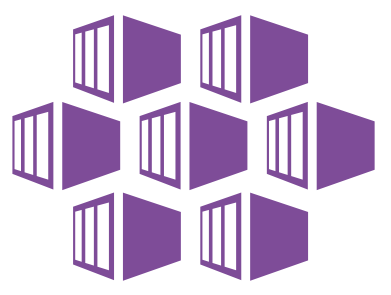
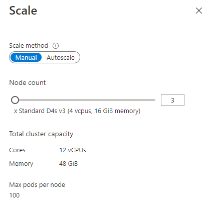

## Azure Kubernetes Services

Altinn 3 uses [Kubernetes](https://kubernetes.io/docs/concepts/overview/what-is-kubernetes/) to manage all our containerized applications.

[Azure Kubernetes Services](https://azure.microsoft.com/nb-no/services/kubernetes-service/) (AKS) is a fully managed Kubernetes used by Altinn 3.

For each environment (Production, Application Test, Performance Test, and Integration Test) there is AKS cluster for Altinn Platform and the
orgs set up for that specific environment.

The [Kubernetes masters](https://kubernetes.io/docs/concepts/overview/components/#kube-controller-manager) are managed by Azure. 
Our DevOps team only manages and maintains the agent nodes. As a managed Kubernetes service,
AKS is free - Microsoft only charges for the agent nodes within your clusters, not for the masters.

With more than 50 orgs hosting services in Altinn 2 it is expected that Altinn 3 will have several hundreds of 
AKS clusters managed by the DevOps team. 

[See org setup for current status on environments](https://github.com/Altinn/altinn-cdn/blob/master/orgs/altinn-orgs.json)

### Nodes

Each AKS cluster has one [Node Pool](https://docs.microsoft.com/en-us/azure/aks/use-multiple-node-pools)

For each Node Pool there is a set of nodes.

The size of the node pool varies depends on the type of cluster.

Currently, we use [Dsv3-series](https://docs.microsoft.com/en-us/azure/virtual-machines/dv3-dsv3-series#dsv3-series)

- Standard_D2s_v3 is the current standard for org clusters
- Standard_D4s_v3 is used on a medium cluster
- Standard_D8s_v3 is used on the clusters with the highest requirements.

The number of nodes can vary between the different clusters. Microsoft recommends not to have less than three nodes in
a single system node pool.

### Supported Kubernetes Versions

The Kubernetes community releases minor versions roughly every three months.
These releases include new features and improvements. Patch releases are more frequent (sometimes weekly) and are intended for 
critical bug fixes within a minor version. These patch releases include fixes for security vulnerabilities or major bugs.

AKS supports the latest versions of Kubernetes.  

See a [list](https://docs.microsoft.com/en-us/azure/aks/supported-kubernetes-versions) of Supported Kubernetes Versions.

The Altinn DevOps team [upgrades](https://docs.microsoft.com/nb-no/azure/aks/upgrade-cluster) the different Kubernetes Clusters. 

## Azure Functions Apps

Azure Functions is a serverless solution that allows you to write less code, maintain less infrastructure, and save on costs. 
Instead of worrying about deploying and maintaining servers, the cloud infrastructure provides all the up-to-date servers needed to keep your applications running.

In Altinn 3 we use Azure Function Apps to the following

- [Data Cleanup](https://github.com/Altinn/altinn-storage/tree/main/src/DataCleanup) : A application for cleaning up data
- [CosmosBackup](https://github.com/Altinn/altinn-storage/tree/main/src/CosmosBackup)  : A application that backup data for cosmos DB in to a blob storage.
- [Events Inbound](https://github.com/Altinn/altinn-events/blob/main/src/Events.Functions/EventsInbound.cs): Responsible for triggering processing of incomming events in Altinn Events
- [Events Outbound](https://github.com/Altinn/altinn-events/blob/main/src/Events.Functions/EventsOutbound.cs): Responsible for pushing events to consumer endpoints
- [Subscription Validation](https://github.com/Altinn/altinn-events/blob/main/src/Events.Functions/SubscriptionValidation.cs): Responsible for validation of subscription endpoints
- [Delegation Events](https://github.com/Altinn/altinn-authorization/blob/main/src/Functions/DelegationEvents.cs): Pushing information about rights delegation in Altinn 3 to Altinn 2

## Azure Container Apps

[Azure Container Apps](https://azure.microsoft.com/en-us/products/container-apps#overview) are fully managed serverless container service for building and deploying modern apps at scale that
we use to run some services. 

In Altinn 3 we use Azure Container Apps for the following.

- [Access Management BFF](https://github.com/Altinn/altinn-access-management-frontend/tree/main/backend/src/Altinn.AccessManagement.UI)
- Security Log (TODO)

We are looking into moving other components from Azure Kubernetes Services to reduce cost of management of clusters. 

## Virtual machines

### Developer machines

Our developer machines are hosted as virtual machines in Azure.

