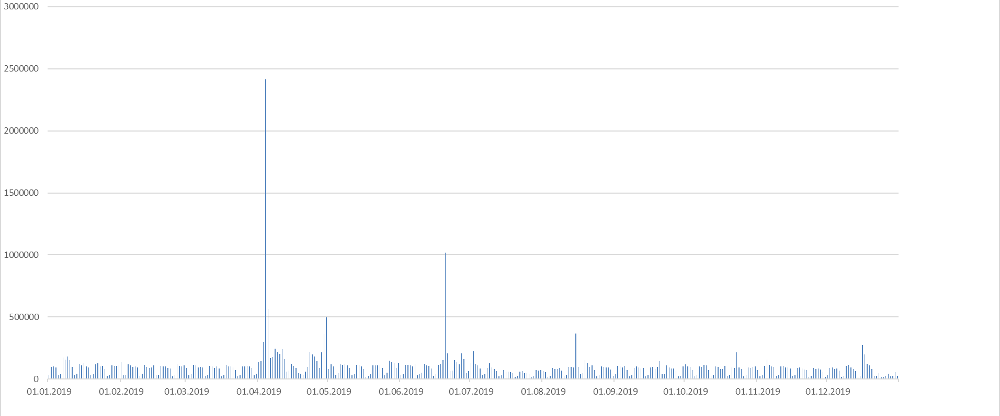
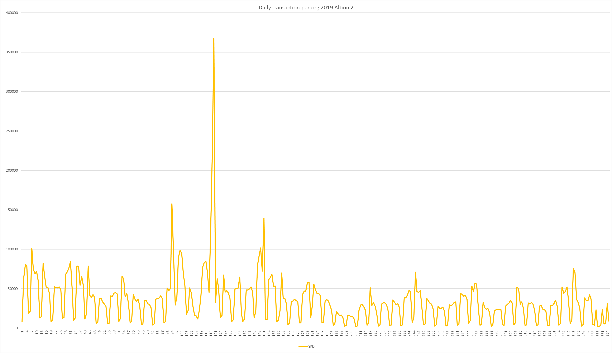
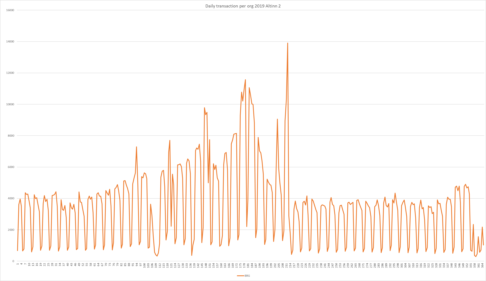
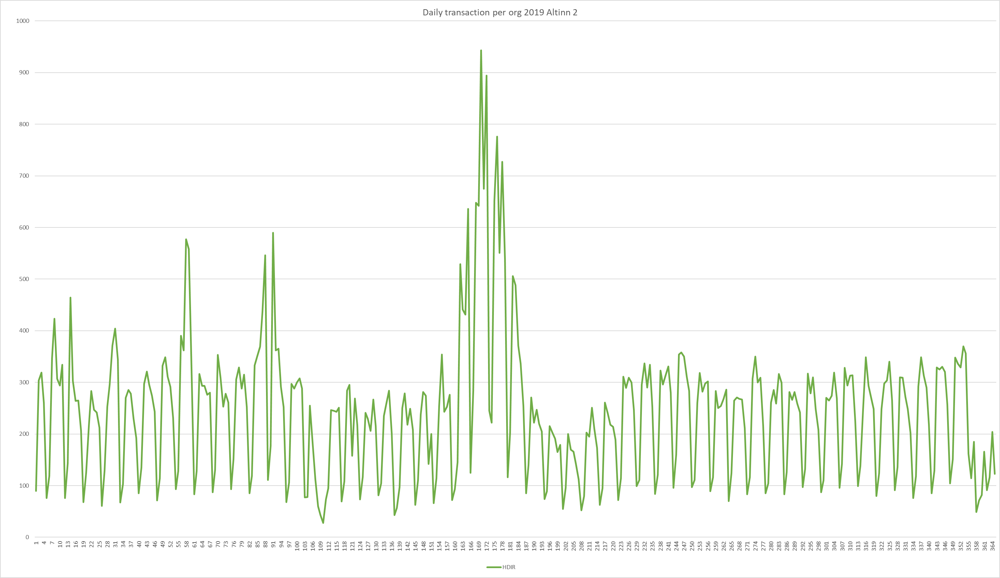

The below diagram shows how the number of unique users logged in to Altinn 2 varied through 2019.



Altinn 2 is a monolith where all digital services run on the same servers. This means that days like the tax day when 
there is this enormous spike in traffic will require that all servers are scaled up. It is also an on-prem solution where scaling needs to be planned weeks ahead.

For Altinn 3 the story is completely different. Every organization has its separate Kubernetes cluster. Each of these 
clusters can be scaled independently.

## Cluster Autoscaler

Azure Kubernetes Services does support autoscaling of nodes and pods. Read more about [cluster autoscaling.](https://docs.microsoft.com/en-us/azure/aks/cluster-autoscaler)

This is currently not been enabled.

## Resource Reservations in Azure Kubernetes Services

Node resources are utilized by AKS to make the node function as part of your cluster. This usage creates a discrepancy between the node's total resources and 
the resources allocatable when used in AKS. This information is important to note when setting requests and limits for user deployed pods.

For Altinn 3 this means the following

- Standard_D2s_v3: 100 millicores reserved per node, 1900 millicores to use
- Standard_D4s_v3: 140 millicores reserved per node, 3860 millicores to use
- Standard_D8s_v3: 180 millicores reserved per node, 7820 millicores to use

Read more about [resource reservations](https://docs.microsoft.com/en-us/azure/aks/concepts-clusters-workloads#resource-reservations)

### Resource limitations

In Kubernetes, it is possible to set resource limitations for each pod deployed to a Kubernetes cluster.
In addition, we can define the number of minimum resources required for the pod.

. Below there is a general example where the minimum CPU is set to 100milliCPU and maximum to 250milliCPU.

```yml
kind: Pod
apiVersion: v1
metadata:   
  name: mypod
spec:
  containers:
  - name: mypod
    image: mcr.microsoft.com/oss/nginx/nginx:1.15.5-alpine
    resources:
      requests:
        cpu: 100m
        memory: 128Mi
      limits:
        cpu: 250m
        memory: 256Mi
```

Read about best practice for [managing resources in Azure Kubernetes Services](https://docs.microsoft.com/en-us/azure/aks/developer-best-practices-resource-management)

## Scaling org clusters

There are currently [more than 50 orgs](https://www.altinn.no/en/about-altinn/the-altinn-co-operation/) hosting digital services 
in the Altinn 2 platform. 

They range from Tax Department, Police, the Civil Aviation Authority, and many more. Some have digital services used by 
millions of citizens every year, while
others have digital services used only by 1 person during a year. Some have many digital services while others just 1.

This means that the compute requirements for the different cluster vary a lot between the different orgs.

To exemplify this we shown the transaction statistics from three different orgs for 2019 in Altinn 2.

At the current time, we don't know what kind of CPU usage an average transaction requires. 

In this example, we assume that 1000 transactions require 1 CPU. (1000 milliCPU)

This is probably not correct.

### Org 1

SKD is the largest org in Altinn 2. Daily transactions vary between 2500 and 365.000.

That would mean that SKD would need up to 192 nodes of  Standard_D2s_v3 



### Org 2

BRG is one of the larger orgs in Altinn.  Daily transactions vary between 300 and 14.000.

That would mean that BRG would need up to 8 nodes of  Standard_D2s_v3 



### Org 3

HDIR is a medium org in Altinn. Daily transactions vary between 300 and 950.

That would mean that HDIR would never need more than 3 nodes of  Standard_D2s_v3 



We have not yet decided how we will be doing scaling of org clusters. We have identified some approaches.

### Scaling option 1

The first option is manually scale both pods and nodes.

This means that the Altinn Devops team would manually need to increase or decrease the number of nodes based on obeserved/expected usage.

The number of pods for a specific application would also be manually set.

#### Cons

- Unknown of LoadBalancer is able to [distribute traffic correctly](https://docs.microsoft.com/en-us/azure/load-balancer/load-balancer-distribution-mode)

### Scaling option 2

