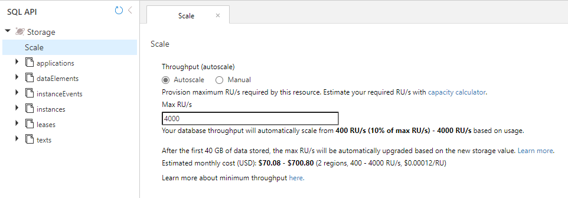
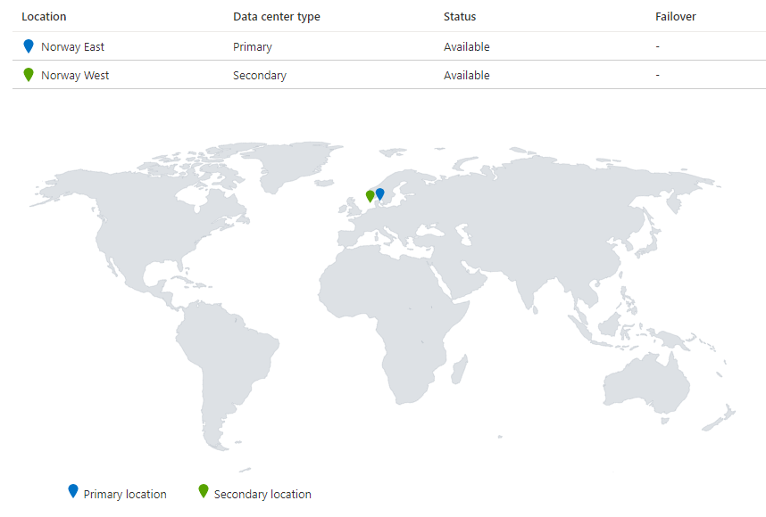
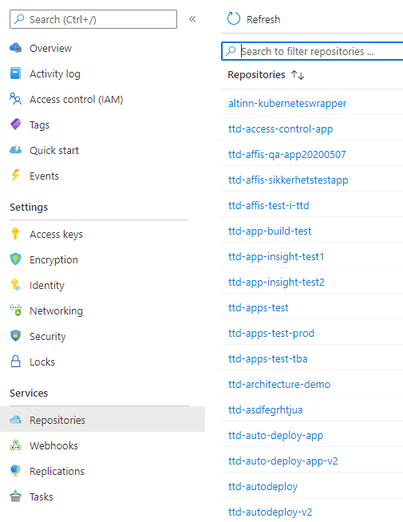

## Cosmos DB

Azure Cosmos DB is a fully managed NoSQL database for modern app development. Single-digit millisecond response times, and automatic and instant scalability, guarantee speed at any scale. 
Business continuity is assured with SLA-backed availability and enterprise-grade security. 

Altinn 3 uses Cosmos DB to store metadata about data in Altinn.

- applications: applications
- dataElements: data elements
- instanceEvents: instance events
- instances: instance information
- leases: used by Azure Functions
- texts: Applications texts

Azure CosmosDB is configured with one Write Region and one read region. This for redundancy.

Azure CosmosDB provides automatic backup of the database. This is in additon to our custom backup.

We use autoscale to adjust the number of assigned RU.

[Read more about Azure Cosmos DB](https://docs.microsoft.com/en-us/azure/cosmos-db/introduction)
  
## PostgreSQL

PostgreSQL is used at a relational database for Altinn Platform Events and for Altinn Repository.

## Azure Blob storage

All data stored in Altinn Platform Storage for Apps are stored in a Azure Blob storage. This include formdata and all binary attachments.

The data is georeplicated between Norway East and Norway West

## Azure Disks

The Kubernetes Cluster uses disks for volumes

We use [Azure Disk](https://azure.microsoft.com/en-us/services/storage/disks/) for storage in Kubernetes Cluster

## Azure Container Registries

Azure Container Registry is a managed, private Docker registry service based on the open-source Docker Registry 2.0. 
Create and maintain Azure container registries to store and manage your private Docker container images and related artifacts.

In Altinn 3 each org has their own Azure Container Registry where the images build of their applications are stored.

In addition the platform itself has their own container registry

[Read more about Azure Container Registry](https://docs.microsoft.com/en-us/azure/container-registry/)

## Azure Key Vaults

Azure Key Vault is a cloud service for securely storing and accessing secrets. A secret is anything that you want to tightly control access to, 
such as API keys, passwords, certificates, or cryptographic keys. Key Vault service supports 
two types of containers: vaults and managed HSM pools. Vaults support storing software and HSM-backed keys, secrets, and certificates.

Every organization cluster has two keyvaults. One is target for secrets for applications. Secrets are added by the app developers as self services.

The other is targetet for secrets needed to be shared with Altinn Platform. Access token to storage accounts is one example