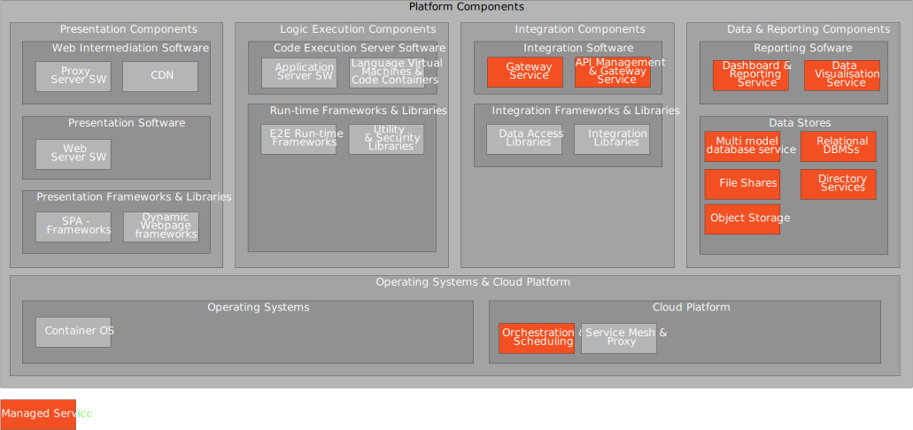

The platform components can be structured in to different areas.
The diagram below show the different areas and the platform components involved in Altinn Studio, Altinn Apps and Altinn Platform solutions.

[Download as Visio](platform_components.vsdx)


