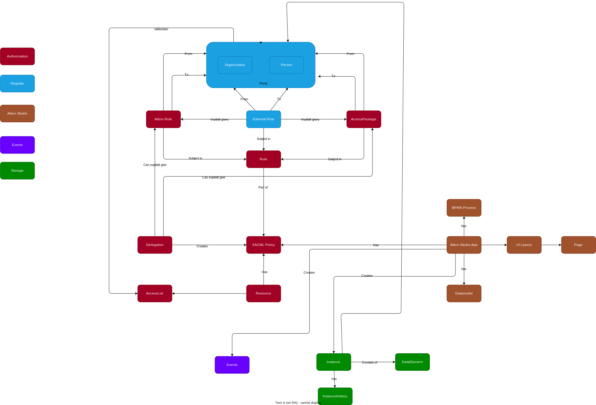

[Full scree](informationmodel.drawio.svg)

## Altinn Authorization

| Term| Description |
|-----|------|
|Role | A Altinn role is a relationship betweens organizations and organizations, organizations and persons and persons and persons. The relationships either existr |