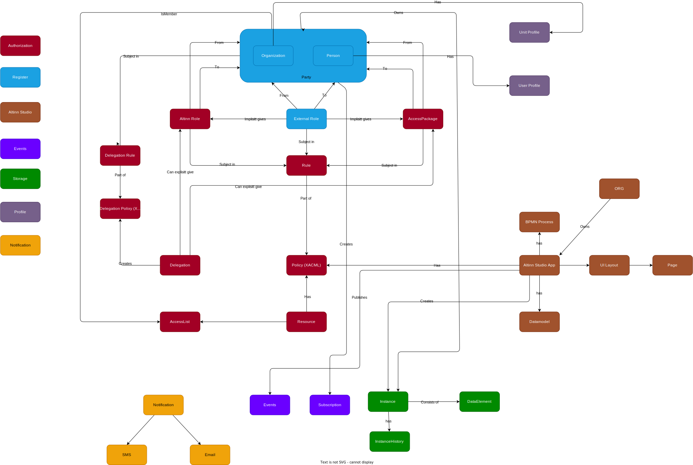

[Full screen](informationmodel.drawio.svg)

## Altinn Authorization

| Term| Description |
|-----|------|
| Altin Role | A Altinn role is a relationship betweens organizations and organizations, organizations and persons and persons and persons. The relationships either exist because it is implisitt given throug ER roles.   |
| Policy  |  A policy containes rules for accesssing a app or a resource. Defined by the app developer / resource owner.  |
| Rule  | A rule defines different operations on resources / apps.   |
| Delegation | A delegation is when a user gives rights to a person, system or organization. A delegation gives rights throug delegated roles, delegated accessPacakges or delegated single rights throug a delegation policy |
| Delegation Policy |  A policy created by end user when they delegates rigts to other users/organizations  | 
| Resource | A resource is metadata about a digital or analog service that a resource owner wants to use [Altinn Authorization](/authorization/modules/pdp/) for access control. When defining a service in [Altinn Resource Registry](/authorization/modules/resourceregistry/) with a policy Altinn PDP can be used to controll access |
| Access List | A access list defines entites that can access a resource if resource requires access list access |

## Altinn Register

| Term| Description |
|-----|------|
| Party | Can be a organization, person or self identifed entiy. Identifed by PartyUid or PartyId. Defined by Altinn |
| Organization | Organization from entity register.  Organizations offers roles to persons and other organizations.  |
| Person | Person from folkeregister. |
| SelfIdentifedUser | Created in Altinn by user that does not have a identity number in Norway. |

## Altinn Studio

| Term| Description |
|-----|------|
| App | An application is created in Altinn Studio.  |
| App Repository | App Repository |

## Altinn Events

| Term| Description |
|-----|------|
| Events |  |

## Altinn Storage

| Term| Description |
|-----|------|
| Instance | An instance works as a form of envelope or folder where data can be collected and exchanged between the user and owner of the application. The instance document is a way for Altinn and external parties to track the state of one specific data exchange.  |
| Data element | The data element model is the main model for metadata related to a specific data element. A data element can be any data associated with an instance. The two most common type of data is the actual form data and attachments. |

### Altinn Notifications

| Term| Description |
|-----|------|
| Events |  |