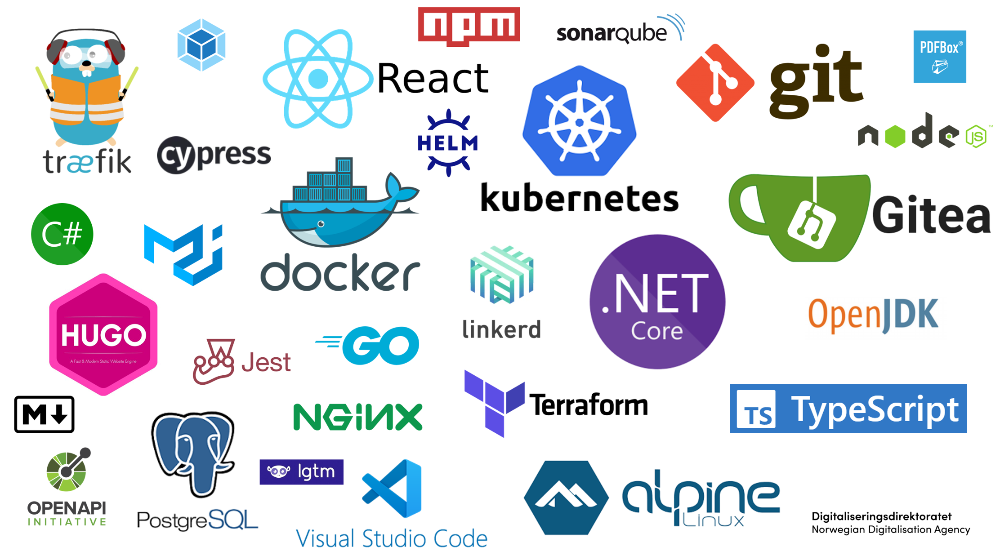

The following architecture principles has been defined for the solutions. 
The principles are document as suggested by [TOGAF](https://pubs.opengroup.org/architecture/togaf8-doc/arch/chap29.html). 

The architecture principles below is described like TOGAF recommends.

## Free and open-source software

**Principle** 

The components and solutions in Altinn 3 are [Free and Open Source](https://en.wikipedia.org/wiki/Free_and_open-source_software).  

**Rationale**

Possibility to share the platform as Open Source. The possibility to create an Open Source community around the platform.

**Implications** 

- Code developed is [shared on GitHub](https://github.com/Altinn/altinn-studio). [See License](https://github.com/Altinn/altinn-studio/blob/master/LICENSE.md).
- We also have our [backlog](https://github.com/Altinn/altinn-studio/issues) on GitHub.
- Can't use closed source products in the platform
- Can't use products with licensing limiting use and modifications
- Others can easily reuse, modify and improve our components and solutions

## Web Standards

**Principle** 

Use [Web Standards](https://en.wikipedia.org/wiki/Web_standards).

**Rationale**

Can use standard tools and developers does not need to have special skills to develop components in the platform or applications
to run on the platform.

**Implications** 

- Formats and frameworks used need to follow standards
- We use [JWT](http://jwt.io/) in authentication cookies

## Build with modern and popular frameworks

**Principle**

When choosing between different technology with similar capabilites, select the most modern and popular framework.

**Rationale**

The project is open source and it is a big advantage to build the solution on open source technology that developers love to use.
This gives better access to resources with the needed competency. 

**Implications** 

- We build the frontend using React and ASP.NET Core, the [2 most loved web frameworks](https://insights.stackoverflow.com/survey/2020#technology-most-loved-dreaded-and-wanted-web-frameworks-loved2).
- We use .NET Core, the [framework that developers love the most](https://insights.stackoverflow.com/survey/2020#technology-most-loved-dreaded-and-wanted-other-frameworks-libraries-and-tools-loved3)
- We use Linux and Docker containers in Kubernetes, [the 3 most loved platforms](https://insights.stackoverflow.com/survey/2020#technology-most-loved-dreaded-and-wanted-platforms-loved5).
- We use Visual Studio Code, the [most loved development environment](https://insights.stackoverflow.com/survey/2019#technology-_-most-popular-development-environments).

## Favor standards over custom

**Principle**

Whenever we need to store information we favor standard formats for that information over creating a custom format.

**Rationale**

Standard formats are documented and is some cases it exists 3. party tools to edit information.

**Implications**

- We use [BPMN 2.0 to](https://www.omg.org/spec/BPMN/2.0/) define the process for applications
- We use [XACML 3.0](http://docs.oasis-open.org/xacml/3.0/xacml-3.0-core-spec-os-en.html) to define authorization policies for applications
- We use [JSON](https://en.wikipedia.org/wiki/JSON) as general format.

## Isolation

**Principle**
We should try isolate application and data own by one organization from others.

**Rationale**

Reduce risk for one organization affecting service for another organization.

**Implications**

- Seperate Kubernetes Clusters for each organization
- Seperate data store for each organization

## Design and build for Public Cloud

**Principle**

The solutions should be deployed to a public cloud solution. The architecture need to support that.

**Rationale**

Using public cloud infrastructure from one of the big vendors gives cost savings, the team can be more agile
and the solutions can take scale.

**Implications**

- Additional security measures
- Need to build knowledge about cloud solutions

## Limit cloud lock-in 

**Principle**

The architecture should try to avoid technology that locks the platform to a specific public cloud vendor.
But not for all costs. In many cases it would still make sense to choose a managed service only available
in a given public cloud.

**Rationale**

The goal with this principle is that it should be possible to move the solution to a different cloud provider
without needing to build everything from scratch.

**Implications**

- Docker and Kubernetes is used for containers and orhecstration of containers.
- We use document databases and BLOBS for storing data.
- Everything talks through APIs.

## Build as microservices

**Principle**

The platform is built as microservices. Related functionality is grouped in to seperate applications and deployed as containers.
Apps created in Altinn Studio will be deployed as microservices/apps.

**Rationale**

The different components can be scaled differently, it can be deployed independently. Reduced deploy time. 
Different teams can be responsible for different microservices/apps. 

**Implications**

- Functionality in Altinn Platform is seperated in Authentication, Authorization, Profile, Storage, Pdf and Register components
- Applications created in Altinn Studio is deployed as microapps to Altinn Apps

## Design for automation

**Principle**

The component should be created in a way that they support automation in development, deployment and operations.

**Rationale**

Reduce the required effort to develop and operate the platform. 

**Implications**

- We use [Continuous integration](https://en.wikipedia.org/wiki/Continuous_integration)
- We use [Continuous deployment](https://en.wikipedia.org/wiki/Continuous_deployment)
- We build [Infrastructure as code](https://en.wikipedia.org/wiki/Infrastructure_as_code)
- We use [Automatic scaling](https://en.wikipedia.org/wiki/Autoscaling)
- We monitor and do automatic recovery of components

## Favor managed services

**Principle**

We should use manages cloud services when possible.

**Rationale**

Reduce effort needed to host and scale the platform. 

**Implications**

- Use [managed PostgreSQL](https://azure.microsoft.com/en-us/services/postgresql/) in Azure for Gitea
- Use [managed CosmosDB](https://azure.microsoft.com/en-us/services/cosmos-db/) as document database
- Use [Azure blob storage](https://azure.microsoft.com/en-us/services/storage/blobs/) for storing data
- Use [Azure Kubernets Services](https://azure.microsoft.com/en-us/free/kubernetes-service/search/) to manage the Kubernetes Clusters
- Use [Azure Api Management](https://azure.microsoft.com/en-us/services/api-management/) as API-management platform

## Security in depth

**Principle** 

All components should authenticate and authorize requests.

**Rationale**

We can't trust other components. 

**Implications**

- Components in Altinn Platform authenticates and authorize end user even if the request comes throug a application that also require the same
- We use API management to control traffic between Altinn Apps and Altinn Platform. 

## Cross-platform

**Principle**

The components in the platform should be cross platform and can run on [Microsoft Windows](https://en.wikipedia.org/wiki/Microsoft_Windows),
[Linux](https://en.wikipedia.org/wiki/Linux) and [MacOs](https://en.wikipedia.org/wiki/MacOS).

**Rationale**

Developers should be able to create applications on any platform, and our platform should never be locked to a single operating system or processor-architecture.

**Implications**

- We use .NET Core or Java to build components.

## Container technology

**Principle**

Applications should be deployed as containers.

**Rationale**

The rationale to use containers is that we get a consistent runtime environment that can run anywhere.
Isolate runtime environment. Consistency. 

**Implications**

- Deploy and run applications/components in docker containers.
