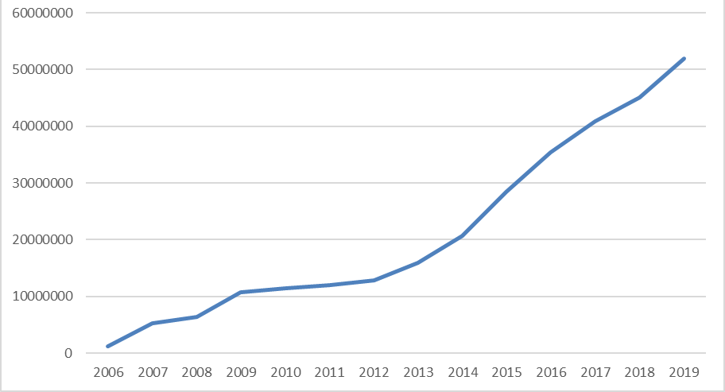

## Architectural Concerns

Architecture Concerns are categories of Non-Functional Requirements (NFRs) of a system that 
has been important defining this architecture. These are sometimes referred to as 
cross-cutting concerns or "the -ilities" because most of the words end with "-ility."

### Performance

#### Scalability

The platform need to be highly scalable. 
The traffic in this types of solutions involves a large part of the countries citizens and the traffic is often concentrated around a few dates.

The traffic also grows every year and the architecture should be able to 

**Requirement:**
The platform should be able to scale up and down to support this type of usage patterns.

#### Response Time

The solution need to have a performance to support a user friendly experience.

**Requirement:** Page load should be less than 1 second

#### Capacity

The different solutions have different capacity requirements. 

The Altinn Platform would need to support the combined traffic from all applications running in Altinn Apps. 

The usage of Altinn is growing each year. 

### Reliability

Reliablity requirements says something about how often users will experience system errors. 

Altinn have users in every age group and for most age groups more than 90% of the citizens use Altinn every year.

The requirement is that less than 1% of the users will experience errors. 

#### Availability

The solutions need to be available 24/7.

**Requirement:** The architecture itself needs to be able to support high availability. It can't require reqular downtime
or other maintainence that makes it not available. 

#### Recoverability

Based on the important of the solution the plattform needs to be recovorable also disaster events. 

**Requirement:** It should be possible to setup the solutions from scratch in xx hours (will be specificed)

### Security

Building a platform to host applications for different governmental agencies will involve sensitive data for citizens and businesses in the country. 

This makes security one of the most important architecture concern in the solutions. 

#### Authentication

Only authenticated users or systems can access data in the platform. 

**Requirements**

- Use a standardized

#### Authorization

#### Single sign on

#### Isolation

#### Personel security

### Maintainability
The solutions will be open source and involve a large amount of developers. It is important that the different components are highly maintainable 
to support effective development

### Operability
The solutions will de operated by a small devops team and need to be highly operable. 
It needs to support automatic monitoring. 

### Usability

#### Accessibility
Both Altinn Studio and Application created in Altinn Studio and deployed to Altinn Apps need to follow 
WCAG 2.1 requirements by law.

See details about the WCAG 2.1 requirements that applies [here](https://uu.difi.no/krav-og-regelverk/webdirektivet-og-wcag-21/wcag-21-standarden). 

#### Localisation
The data needs to be stored inside the Norwegian boarder.

### Portability
The technology architecture should not make it impossible to move to different cloud providers. 

## Other Non-Functional requirements

### System location
The Altinn solution needs to be located inside Norwegian borders.
This requires that we only can choose amongst the cloud providers providing cloud services inside Norway. 