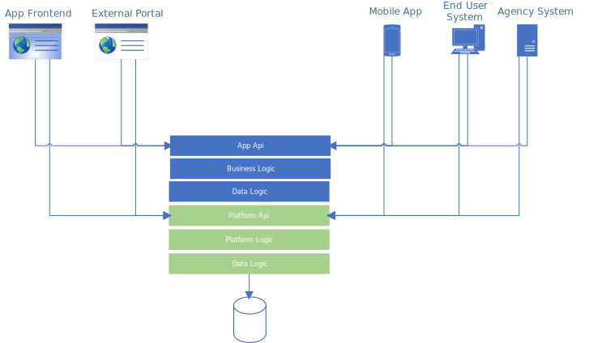

{}
NOTE: Work in progress. Stuff will change.
{}

API's have always been important to the Altinn platform. About 50% of all data going throug Altinn to organisations are coming 
from end user systems implementing Altinn APIs's (SOAP and REST).

More than 100 different vendors of different types of applications integrates with Altinn's APIs and submits data for different apps. 

In addition mobile apps and external governmental portal consumes Altinn APIs to allow users to use services outside the Altinn Portal.

Organisations also have seperate APIs to interact with the apps. The below figure shows the different consumers of the API's and show that consumers both
interact with the app APIs and the shared platform APIs.

[Download as Visio](api-concept.vsdx).


