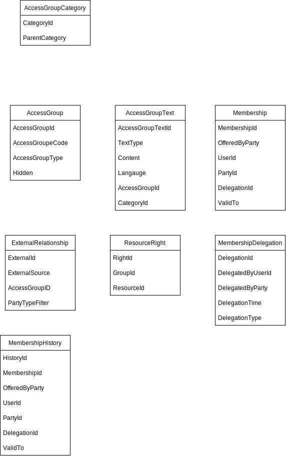
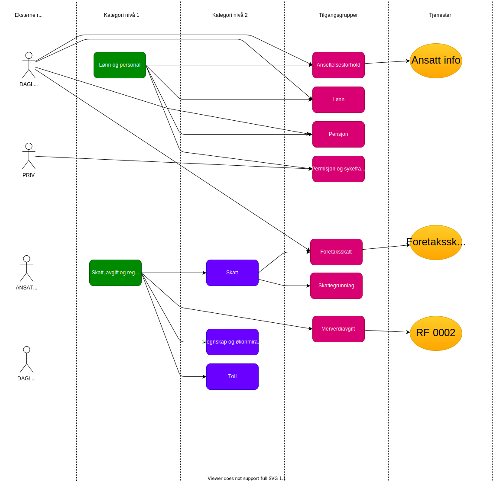


This is work in progress


Access registry contains information about the centrally  [defined access groups](https://github.com/altinn/docs/blob/master/content/utviklingsguider/styring-av-tilgang/for-tjenesteeier/forslag-tilgangsgrupper.md). 

See [Github #25](https://github.com/Altinn/altinn-authorization/issues/25)

The Access groups are grouped in one or more category trees. 

The category trees will be used to present the access groups in UI.

## Data model

### AccessGroupCategory

This model describes a category. A category can have a parent category. If no parent is present, it is assumed to be a top category.

The category will be used by ui to present the access group category hierky.

The properties
- Categoryid
- ParentCategory

### AccessGroup texts

Texts for access groups or AccessGroupsCategory

- CategoryId
- AccessGroupdId
- Langauge
- TextType
- Text

### AccessGroupCategory

Contains the reference between access groups and a category

### AccessGroup defintion

- Name of group in different languges
- AccessGroup identifier

### External Relationship

- ExternalSource (Like ER) 
- ExternalID (Example DAGL, LEDE)
- PartyTypeFilter(AS, ENK)
- AccessGroupdID 

### AccessGroup Membership

- MembershipID
- CoveredBy UserId
- Covered
- OfferedByParty
- AccessGroupId
- ValidTo?

### AccessGroup Delegation

- DelegatedByParty
- DelegatedByUserId
- DelegationType
- DelegatetDateTime

### AccessGroup History

- DelegatedBy
- AccessGroupID
- OfferedBy
- CoveredByUserId
- CoveredByPartyId
- ChangeType (created, deleted)

### 

