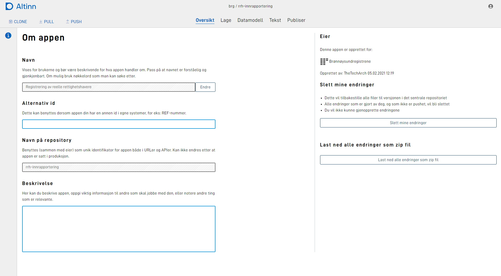

You can configure the different parameters either in Altinn Studio UI or by modifying the configuration files in the application repository.

See the complete overview of different configurations in the [application development handbook.](../../../../../../app/development/configuration/)