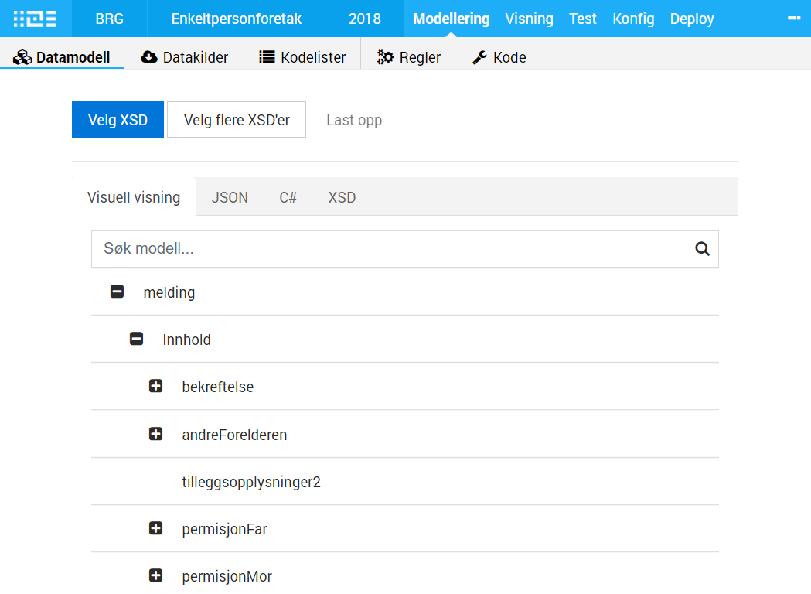

The data model for an app typically defines the data format either sent to the app owner or presented in the app for the user. Therefore, the data model is essential for a consistent and formal data definition, and the application will use a data model for validation from UI and external systems.

Read all about the data modeling tool in the [Application development handbook.](../../../../../../app/development/data/data-model/)