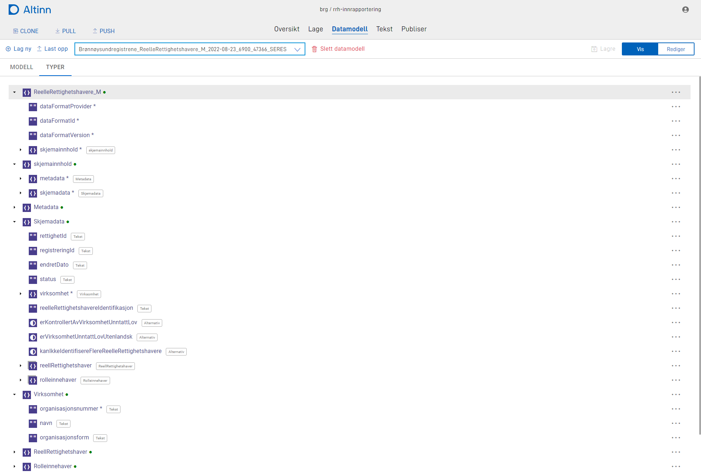

The data model for an app typical defines the format of the data either sent to the app owner or presented in the app
for the user. The data model is important for a consistent and formal definition of the data. It will
be used for validation both from UI and for external systems.

Read all about data the data modelling tool in the [Application development handbook.](../../../../../../app/development/data/data-model/)