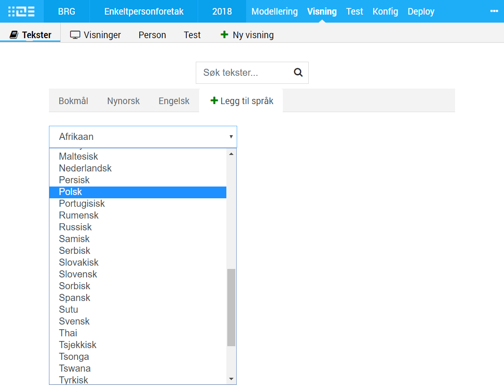

## Text editing and translations

Easy and efficient text processing and translation are important in an app development solution. The possibility to reuse texts across
multiple apps are especially important.

Texts in the editor are written in a ini-file that is converted to a simple JSON-file and presented as an API. In that way
the user could work directly in the code editor or convert the text into other formats supported by external translation tools. 
Meaning that Altinn Studio supports any language that is added, not just languages supported by the Altinn portal.

- Definition of texts using hierarchical and readable keys
- Reusable texts, internal across different pages and on the levels above the solution
- Possibility to add other languages

