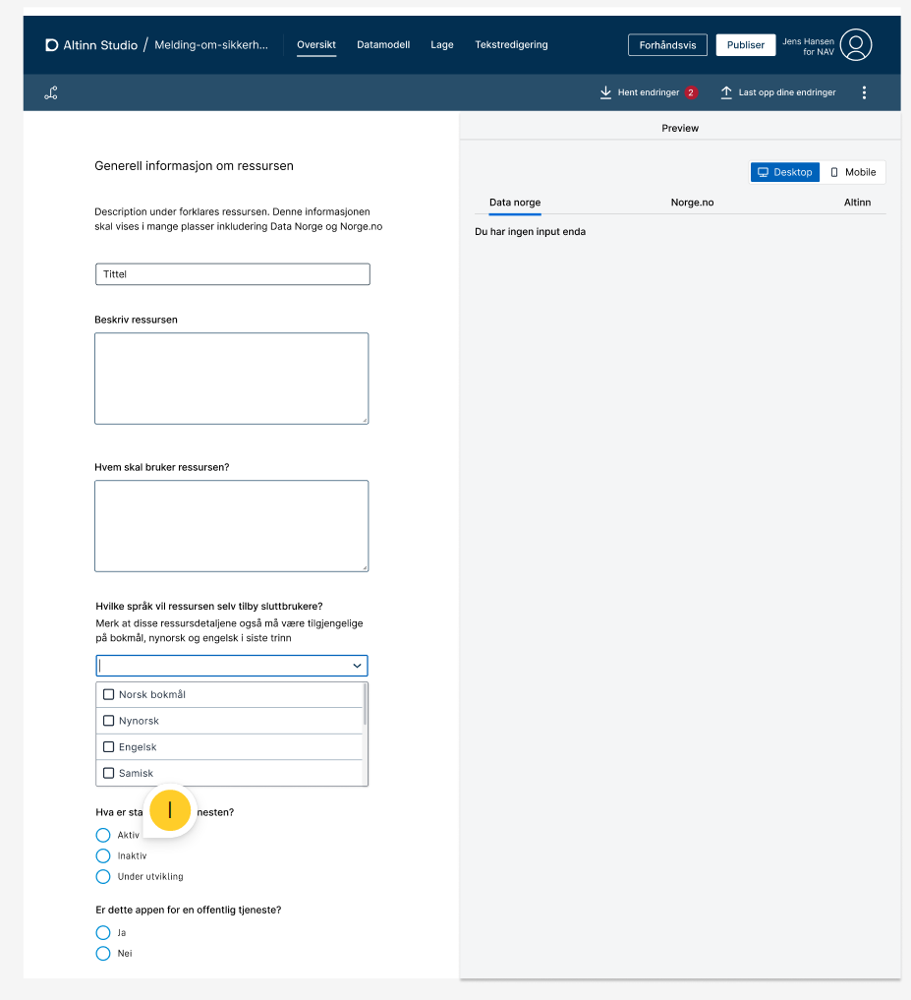
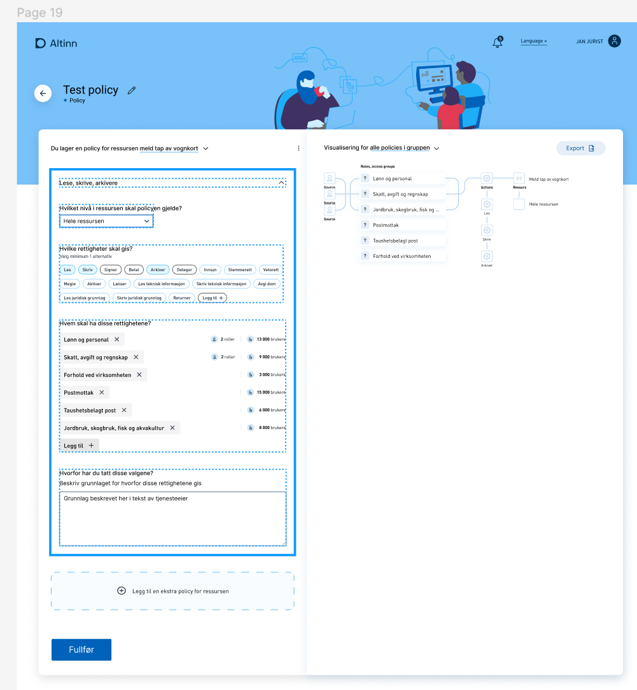


This is work in progress


## What is a resource in this context?

A resource in this context is a JSON document describing a typical service or event that is made accessible for citizens or businesses.
The resource document contains the title, description, and other relevant metadata about that service.

## Functionality in Altinn Studio Designer Standalone Resource

In Altinn Studio the service owners can do the following for standalone Resource

- List their resources.
- Create new and update existing resources and register all relevant [attributes](../../../altinn-platform/authorization/resourceregistry/#resource-attributes) for that resource.
- Set and update the authorization policy with the various required rules for each resource
- Validate resources metadata and authorization policy if they follow the required standards
- Publish new resources to TT02 or the production environment
- Update existing resources in TT02 or the production environment

## Functionality in Altinn Studio Designer for Resource metadata for App created in Altinn Studio

- Create new and update existing all relevant [attributes](../../../altinn-platform/authorization/resourceregistry/#resource-attributes) for that resource.
- Set and update the authorization policy with the various required rules for each resource
- Validate resources metadata and authorization policy if they follow the required standards
- Publish new resources to TT02 or the production environment
- Update existing resources in TT02 or the production environment

## Sketches

Below are some early sketches from [Figma Designs](https://www.figma.com/file/rHsPcwfeg5W45yMUk7cT7o/Auth-Team-B?node-id=2-48&t=PjdRHRORYCn3dtNj-0).

