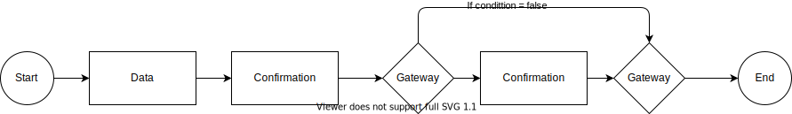

The template follows the BPMN 2.0 standard

## Supported process elements

### Data Task

A data task is a task in the process where the user / system accessing the digital service throug UI or API can read, write and modify data related to an digital service.

A data task requires that all data for a given task is valid and all required data elements is added.

This is part of the standard logic in the template. Application developers can add custom validation for each data element and the task itself.

The rules who is allowed to perform read/write is defined in XACML policy for the service.

### Confirmation Task

Confirmation task is a task in the process where the end user accessing the application through browser or system through api
can confirm data that has been added or modified earlier in the process.

### Feedback Task

### Exclusive Gateways

## Process Examples

## Process configuration

All configuration of process is done as part of the application configuration in Altinn Studio.

[Read our development handbook for details](../../../../app/development/configuration/process/)