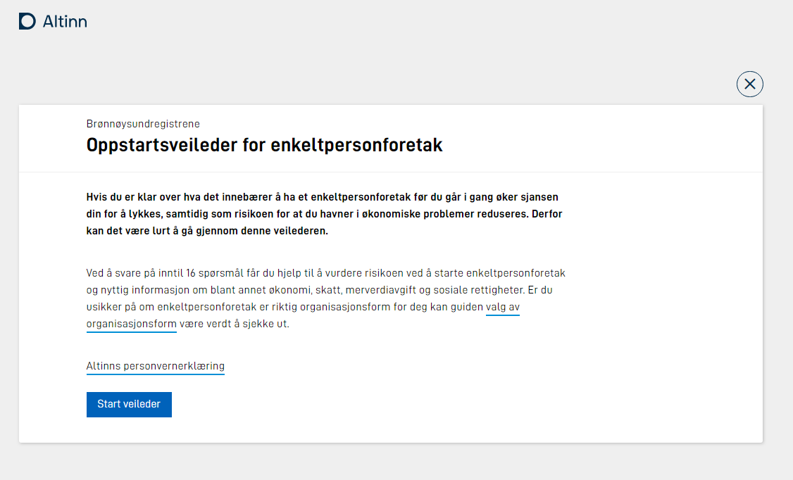

For digital services targeting API consumers strictly, there is no need for the front end.

The application developer configures the UI in Altinn Studio UI-designer.

The configuration files are deployed together with the application.

## UI rendering

The UI-Render functionality in App Frontend renders the UI based on the configuration set in Altinn Studio when users access the digital service. 

### Process views

The App template front end has default support for the supported task types in the application. Therefore, the front end has a default behavior for each supported task.

#### Data Views

The default view for the data task is to present the configured UI components mapped to the application data models.

#### Confirmation View

The default view for confirmation allows the user to look at data, return to data for modification or confirm data by pressing a button.

#### Feedback View

The view for the feedback task shows default information about the instance that is awaiting external feedback.

### UI-Components

The list of supported UI components is growing. This list includes UI components developed by the core Altinn team and components from the open-source community. A noncomplete list of UI components includes: 

- Input
- Textarea
- Datepicker
- Map
- Multiple select
- Dropdown list
- Image
- Repeating group
- Label
- Heading
- Paragraph

You can find UI-component documentation [here.](../../../../app/development/ux/components/)

### Dynamics

Configuring dynamics that manipulate the UI based on data and other aspects is possible. Dynamics is configurd in Altinn Studio or added as javascript to the template.

[Read how in the Application Developer handbook.](../../../../app/development/logic/dynamic/)

### Page Navigation

[Read how to configure page navigation](../../../../app/development/ux/pages/navigation/)

### Language support

In the future the App will support having multiple languages in a App
[See issue for this on Github](https://github.com/Altinn/altinn-studio/issues/2115)

### Pages
In the future the App will support having ui over multiple pages
[See issue for this on Github](https://github.com/Altinn/altinn-studio/issues/1265)

[On Github you can find all issues related to App-Frontend](https://github.com/Altinn/altinn-studio/labels/solution%2Fapp-frontend).

## Custom Frontend
In the future it is possible that Altinn Studio will support having a frontend that is costum application created by 
the developer. This could be a frontend based on any javascript based frameworks like Angular, 

[See Github for issue](https://github.com/Altinn/altinn-studio/issues/2142)

