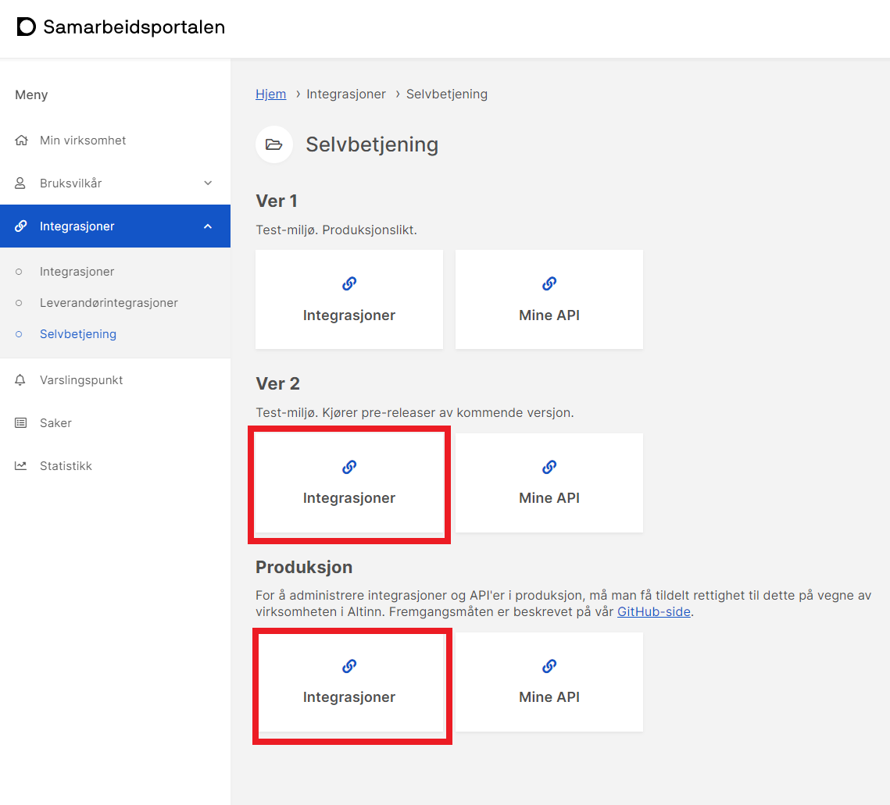
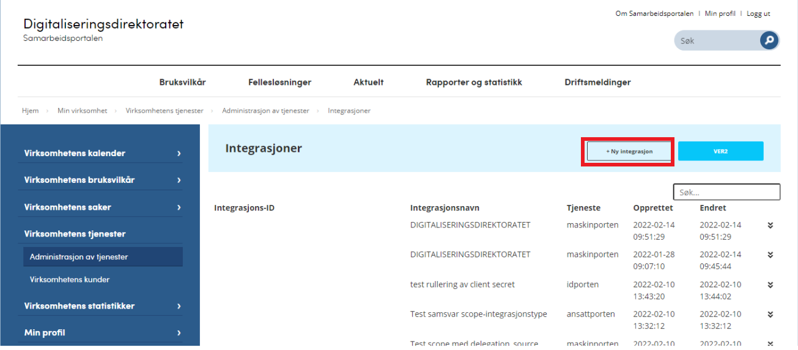
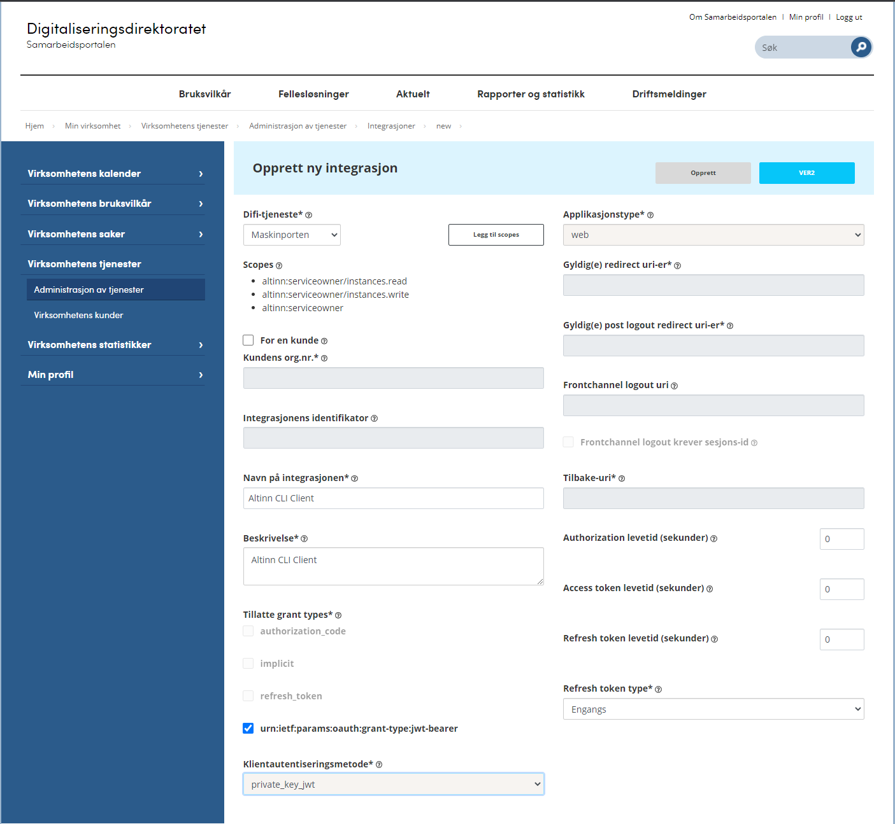
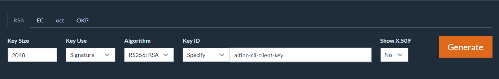
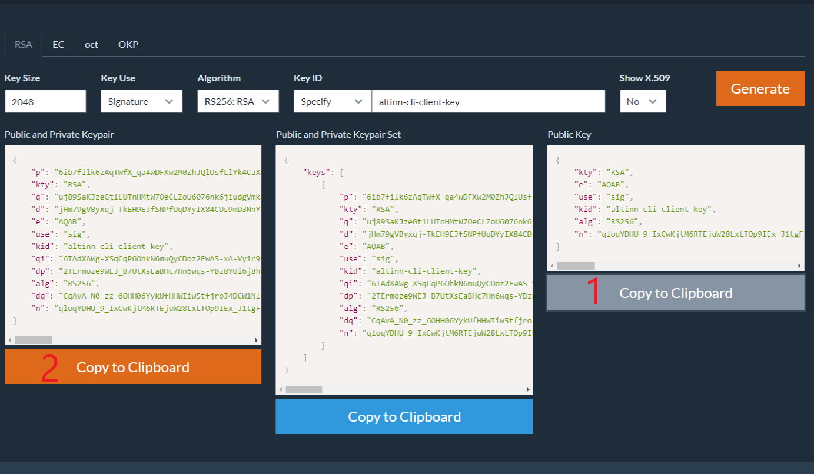
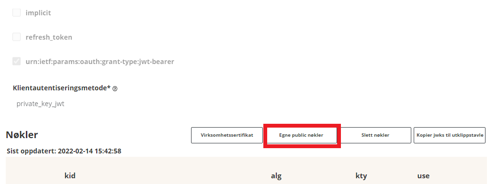
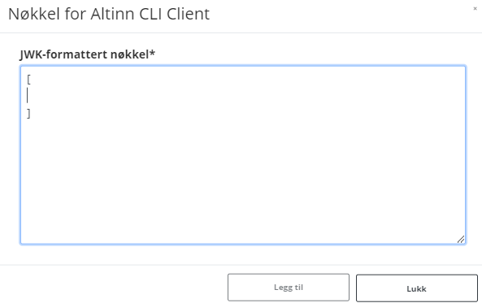
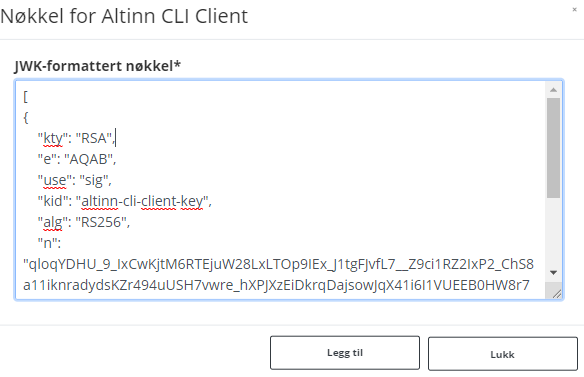

## Setting up a maskinporten client with a custom key

To follow this guide you must have a user in `Samarbeidsportalen` with access to `Selvbetjening`.  
[Read more about creating user in Samarbeidsportalen here.](https://docs.digdir.no/docs/Maskinporten/maskinporten_sjolvbetjening_web#opprette-bruker)

Login to [Samarbeidsportalen](https://samarbeid.digdir.no/).  
Choose `Selvbetjening` -> `Integrasjoner` for the environment you want.  
`Ver2` is test and `Produksjon` is production.

Choose `Ny integrasjon`. 

Fill in the scheme like below and then `Opprett`. We has named our example-client Altinn CLI Client.  
The tree scopes you need is `altinn:serviceowner`, `altinn:serviceowner/instances.read` and `altinn:serviceowner/instances.write`

The value of `Integrasjonens identifikator` value will be the `CLientId` in `appsettings.json` for Altinn CLI.

Now we can add own public keys. First we must generate a new JSON Web Key.
In this example we use [mkjwk.org](https://mkjwk.org/).
Fill in values like the example below and `Generate`.

Then you will get keys like this.

This public key we will add to our client in Samarbeidsportalen.
Press `Egne public nøkler`

The key must be stored in an array so add [].

Copy the public key from the JSON Web key (marked 1 in the picture) and paste this into the array. Press `Legg til`.

Now the client in maskinporten is complete.

The last part will be to use the public and private keypair in the Altinn CLI application.
Copy this (marked 2 in the picture) and Base64 encode it. [Base64encode.org](https://www.base64encode.org/) can be used for encoding. 
Then use this value as `EncodedJwk` in `appsettings.json`. 
