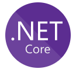

.NET is the cross-platform and open source development framework used in Altinn 3 for backend APIs.

We've also published [a few packages](https://www.nuget.org/profiles/altinn) on nuget.org.

Altinn ❤️ dotnet.

## Links

- [Documentation](https://docs.microsoft.com/dotnet/core/)
- [Download](https://dot.net)
- [License](https://github.com/dotnet/runtime/blob/master/LICENSE.TXT)
- [Roadmap](https://github.com/dotnet/core/blob/master/roadmap.md)
- [Docker Hub](https://hub.docker.com/_/microsoft-dotnet-core)
- [Runtime](https://github.com/dotnet/runtime)
- [ASP.NET](https://github.com/dotnet/aspnetcore)
