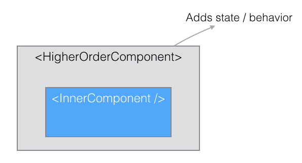
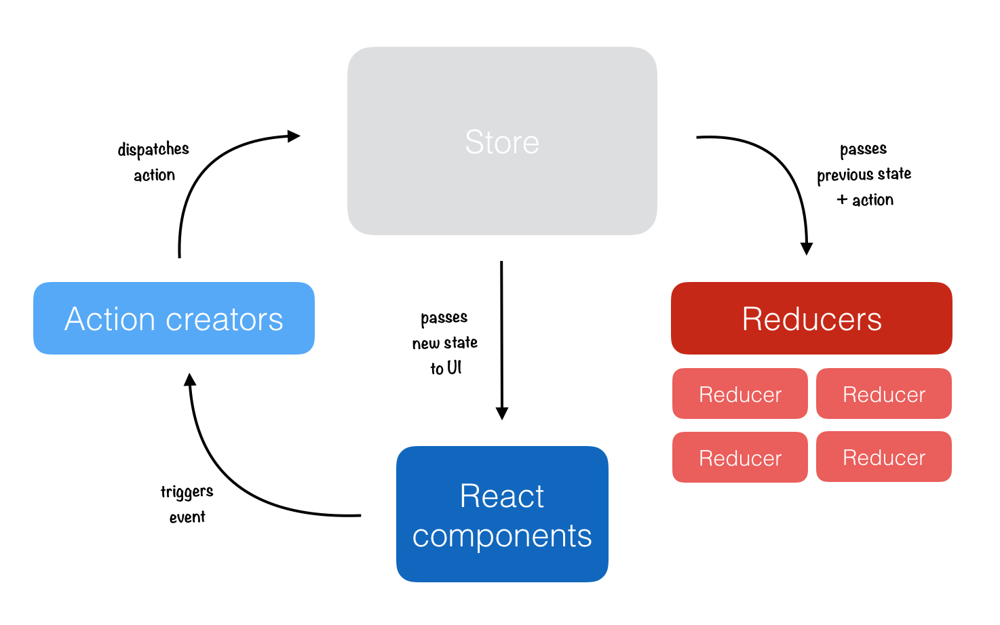

- Modulært rammeverk for å utvikle UI komponenter som kan gjenbrukes flere steder i løsningen.
- Hvert React komponent har en tilstand som gir den data i henhold til hvor i applikasjonen brukeren er og hvilke handlinger som foretas.
- Vedlikeholdt av Facebook, under MIT lisens.

## Slik React blir brukt

### Uten redux
- Ved bruk av higher order components kan tilstand sendes fra rot-komponenten nedover i komponent-hierarkiet.
- Rot-komponenten håndterer alt av state, og sender callbacks ned i komponentene, slik at det er mulig og legge til, fjerne og endre komponeter.

### Med redux
- Ved bruk av redux vil vi ikke være like avhengig av higher order components, da alle komponenenter kan kobles til redux-state av appen,
  og kunne håndtere det å legge til, fjerne eller endre komponenter selv.
- Håndtering av state skjer igjennom Actions og Reducers, som Redux arkitektur anbefaler.

## Links

- https://reactjs.org 
- https://github.com/facebook/react


